# Low-Power Sub-1 GHz RF Transceiver

## Applications

- *Ultra low-power wireless applications operating in the 315/433/868/915 MHz ISM/SRD bands*
- *Wireless alarm and security systems*
- *Industrial monitoring and control*
- *Wireless sensor networks*
- *AMR – Automatic Meter Reading*
- *Home and building automation*
- *Wireless MBUS*

## Product Description

CC1101 is a low-cost sub-1 GHz transceiver designed for very low-power wireless applications. The circuit is mainly intended for the ISM (Industrial, Scientific and Medical) and SRD (Short Range Device) frequency bands at 315, 433, 868, and 915 MHz, but can easily be programmed for operation at other frequencies in the 300–348 MHz, 387–464 MHz and 779–928 MHz bands.

The RF transceiver is integrated with a highly configurable baseband modem. The modem supports various modulation formats and has a configurable data rate up to 600 kbps.

CC1101 provides extensive hardware support for packet handling, data buffering, burst transmissions, clear channel assessment, link quality indication, and wake-on-radio.

The main operating parameters and the 64-byte transmit/receive FIFOs of CC1101 can be controlled via an SPI interface. In a typical system, the CC1101 will be used together with a microcontroller and a few additional passive components.

The CC1190 850–950 MHz range extender [\[21\]](#ref_21) can be used with CC1101 in long range applications for improved sensitivity and higher output power.

### Key Features

### RF Performance

- High sensitivity
  - -116 dBm at 0.6 kBaud, 433 MHz, 1% packet error rate
  - -112 dBm at 1.2 kBaud, 868 MHz, 1% packet error rate
- Low current consumption (14.7 mA in RX, 1.2 kBaud, 868 MHz)
- Programmable output power up to +12 dBm for all supported frequencies
- Excellent receiver selectivity and blocking performance
- Programmable data rate from 0.6 to 600 kbps
- Frequency bands: 300–348 MHz, 387–464 MHz and 779–928 MHz

### Analog Features

- 2-FSK, 4-FSK, GFSK, and MSK supported as well as OOK and flexible ASK shaping
- Suitable for frequency hopping systems due to a fast settling frequency synthesizer; 75 μs settling time
- Automatic Frequency Compensation (AFC) can be used to align the frequency synthesizer to the received signal centre frequency
- Integrated analog temperature sensor

### Digital Features

- Flexible support for packet oriented systems; On-chip support for sync word detection, address check, flexible packet length, and automatic CRC handling
- Efficient SPI interface; All registers can be programmed with one "burst" transfer
- Digital RSSI output
- Programmable channel filter bandwidth
- Programmable Carrier Sense (CS) indicator
- Programmable Preamble Quality Indicator (PQI) for improved protection against false sync word detection in random noise
- Support for automatic Clear Channel Assessment (CCA) before transmitting (for listen-before-talk systems)
- Support for per-package Link Quality Indication (LQI)
- Optional automatic whitening and dewhitening of data

### Low-Power Features

- 200 nA sleep mode current consumption
- Fast startup time; 240 μs from sleep to RX or TX mode (measured on EM reference designs [\[1\]](#ref_1) and [\[2\]](#ref_2)).
- Wake-on-radio functionality for automatic low-power RX polling
- Separate 64-byte RX and TX data FIFOs (enables burst mode data transmission)

### General

- Few external components; Completely on‑chip frequency synthesizer; no external filters or RF switch needed
- Green package: RoHS compliant and no antimony or bromine
- Small size (QLP 4x4 mm package, 20 pins)
- Suited for systems targeting compliance with EN 300 220 (Europe) and FCC CFR Part 15 (US)
- Suited for systems targeting compliance with the Wireless MBUS standard EN 13757-4:2005
- Support for asynchronous and synchronous serial receive/transmit mode for backwards compatibility with existing radio communication protocols

### Improved Range using CC1190

- The CC1190 [\[21\]](#ref_21) is a range extender for 850–950 MHz and is an ideal fit for CC1101 to enhance RF performance
- High sensitivity
  - -118 dBm at 1.2 kBaud, 868 MHz, 1% packet error rate
  - -120 dBm at 1.2 kBaud, 915 MHz, 1% packet error rate
- +20 dBm output power at 868 MHz
- +27 dBm output power at 915 MHz
- Refer to AN094 [\[22\]](#ref_22) and AN096 [\[23\]](#ref_23) for more performance figures of the CC1101 + CC1190 combination

### Reduced Battery Current using TPS62730

- The TPS62730 [\[26\]](#ref_26) is a step-down converter with bypass mode for ultra low power wireless applications.
- In RX, the current drawn from a 3.6 V battery is typically less than 11 mA when the TPS62730 output voltage is 2.1 V. When connecting CC1101 directly to a 3.6 V battery the current drawn is typically 17 mA (see [Figure 1](#fig_1)).
- In TX, at maximum output power (+12 dBm), the current drawn from a 3.6 V battery is typically 22 mA when the TPS62730 output voltage is 2.1 V. When connecting CC1101 directly to a 3.6 V battery the current drawn is typically 34 mA (see [Figure 2](#fig_2)).
- When CC1101 enters SLEEP mode, the TPS62730 can be put in bypass mode for very low power-down current.
- The typical TPS62730 current consumption is 30 nA in bypass mode.
- The CC1101 is connected to the battery via an integrated 2.1 Ω (typical) switch in bypass mode.

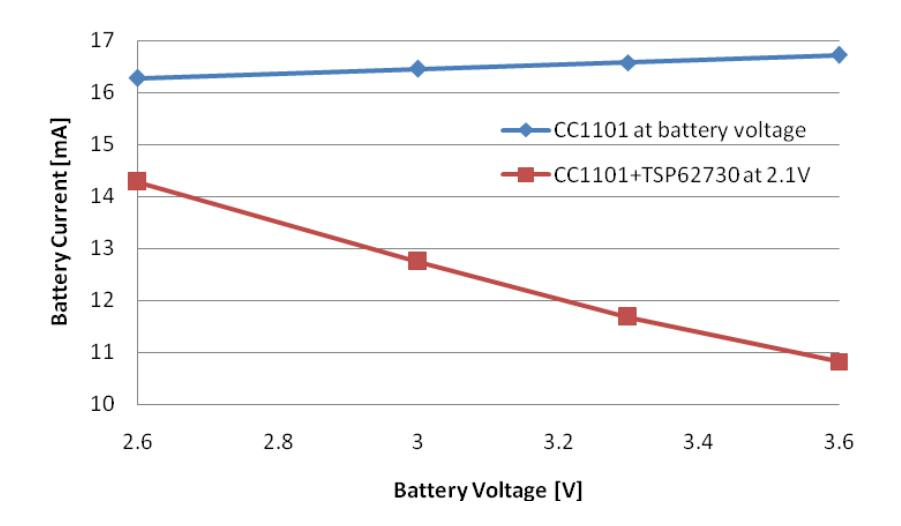
<span id="fig_1">**Figure 1:** Typical RX Battery Current vs Battery Voltage</span>


<span id="fig_2">**Figure 2:** Typical TX Battery Current vs Battery Voltage at Maximum CC1101 Output Power (+12 dBm)</span>

## Abbreviations

Abbreviations used in this data sheet are described below.

| Abbr. | Description |
|-|-|
| 2-FSK | Binary Frequency Shift Keying |
| 4-FSK | Quaternary Frequency Shift Keying |
| ACP | Adjacent Channel Power |
| ADC | Analog to Digital Converter |
| AFC | Automatic Frequency Compensation |
| AGC | Automatic Gain Control |
| AMR | Automatic Meter Reading |
| ASK | Amplitude Shift Keying |
| BER | Bit Error Rate |
| BT | Bandwidth-Time product |
| CCA | Clear Channel Assessment |
| CFR | Code of Federal Regulations |
| CRC | Cyclic Redundancy Check |
| CS | Carrier Sense |
| CW | Continuous Wave (Unmodulated Carrier)  |
| DC | Direct Current |
| DVGA  | Digital Variable Gain Amplifier |
| ESR | Equivalent Series Resistance |
| FCC | Federal Communications Commission |
| FEC | Forward Error Correction |
| FIFO  | First-In-First-Out |
| FHSS  | Frequency Hopping Spread Spectrum |
| FS | Frequency Synthesizer |
| GFSK  | Gaussian shaped Frequency Shift Keying |
| IF | Intermediate Frequency |
| I/Q | In-Phase/Quadrature |
| ISM | Industrial, Scientific, Medical |
| LC | Inductor-Capacitor |
| LNA | Low Noise Amplifier |
| LO | Local Oscillator |
| LSB | Least Significant Bit |
| LQI | Link Quality Indicator |
| MCU | Microcontroller Unit |
| MSB  | Most Significant Bit |
| MSK  | Minimum Shift Keying |
| N/A  | Not Applicable |
| NRZ  | Non Return to Zero (Coding) |
| OOK  | On-Off Keying |
| PA | Power Amplifier |
| PCB  | Printed Circuit Board |
| PD | Power Down |
| PER  | Packet Error Rate |
| PLL  | Phase Locked Loop |
| POR  | Power-On Reset |
| PQI  | Preamble Quality Indicator |
| PQT  | Preamble Quality Threshold |
| PTAT | Proportional To Absolute Temperature |
| QLP  | Quad Leadless Package |
| QPSK | Quadrature Phase Shift Keying |
| RC | Resistor-Capacitor |
| RF | Radio Frequency |
| RSSI | Received Signal Strength Indicator |
| RX | Receive, Receive Mode |
| SAW  | Surface Aqustic Wave |
| SMD  | Surface Mount Device |
| SNR  | Signal to Noise Ratio |
| SPI  | Serial Peripheral Interface |
| SRD  | Short Range Devices |
| TBD  | To Be Defined |
| T/R  | Transmit/Receive |
| TX | Transmit, Transmit Mode |
| UHF  | Ultra High frequency |
| VCO  | Voltage Controlled Oscillator |
| WOR  | Wake on Radio, Low power polling |
| XOSC | Crystal Oscillator |
| XTAL | Crystal |

## Table of Contents

- [Low-Power Sub-1 GHz RF Transceiver](#low-power-sub-1-ghz-rf-transceiver)
  - [Applications](#applications)
  - [Product Description](#product-description)
    - [Key Features](#key-features)
    - [RF Performance](#rf-performance)
    - [Analog Features](#analog-features)
    - [Digital Features](#digital-features)
    - [Low-Power Features](#low-power-features)
    - [General](#general)
    - [Improved Range using CC1190](#improved-range-using-cc1190)
    - [Reduced Battery Current using TPS62730](#reduced-battery-current-using-tps62730)
  - [Abbreviations](#abbreviations)
  - [Table of Contents](#table-of-contents)
  - [1 Absolute Maximum Ratings](#1-absolute-maximum-ratings)
  - [2 Operating Conditions](#2-operating-conditions)
  - [3 General Characteristics](#3-general-characteristics)
  - [4 Electrical Specifications](#4-electrical-specifications)
    - [4.1 Current Consumption](#41-current-consumption)
    - [4.2 RF Receive Section](#42-rf-receive-section)
      - [315 MHz](#315-mhz)
      - [433 MHz](#433-mhz)
      - [868/915 MHz](#868915-mhz)
  - [4.3 RF Transmit Section](#43-rf-transmit-section)
    - [4.4 Crystal Oscillator](#44-crystal-oscillator)
    - [4.5 Low Power RC Oscillator](#45-low-power-rc-oscillator)
    - [4.6 Frequency Synthesizer Characteristics](#46-frequency-synthesizer-characteristics)
    - [4.7 Analog Temperature Sensor](#47-analog-temperature-sensor)
    - [4.8 DC Characteristics](#48-dc-characteristics)
    - [4.9 Power-On Reset](#49-power-on-reset)
  - [5 Pin Configuration](#5-pin-configuration)
  - [6 Circuit Description](#6-circuit-description)
  - [7 Application Circuit](#7-application-circuit)
    - [7.1 Bias Resistor](#71-bias-resistor)
    - [7.2 Balun and RF Matching](#72-balun-and-rf-matching)
    - [7.3 Crystal](#73-crystal)
    - [7.4 Reference Signal](#74-reference-signal)
    - [7.5 Additional Filtering](#75-additional-filtering)
    - [7.6 Power Supply Decoupling](#76-power-supply-decoupling)
    - [7.7 Antenna Considerations](#77-antenna-considerations)
    - [7.8 PCB Layout Recommendations](#78-pcb-layout-recommendations)
  - [8 Configuration Overview](#8-configuration-overview)
  - [9 Configuration Software](#9-configuration-software)
  - [10 4-wire Serial Configuration and Data Interface](#10-4-wire-serial-configuration-and-data-interface)
    - [10.1 Chip Status Byte](#101-chip-status-byte)
    - [10.2 Register Access](#102-register-access)
    - [10.3 SPI Read](#103-spi-read)
    - [10.4 Command Strobes](#104-command-strobes)
    - [10.5 FIFO Access](#105-fifo-access)
    - [10.6 PATABLE Access](#106-patable-access)
  - [11 Microcontroller Interface and Pin Configuration](#11-microcontroller-interface-and-pin-configuration)
    - [11.1 Configuration Interface](#111-configuration-interface)
    - [11.2 General Control and Status Pins](#112-general-control-and-status-pins)
    - [11.3 Optional Radio Control Feature](#113-optional-radio-control-feature)
  - [12 Data Rate Programming](#12-data-rate-programming)
    - [13 Receiver Channel Filter Bandwidth](#13-receiver-channel-filter-bandwidth)
  - [14 Demodulator, Symbol Synchronizer, and Data Decision](#14-demodulator-symbol-synchronizer-and-data-decision)
    - [14.1 Frequency Offset Compensation](#141-frequency-offset-compensation)
    - [14.2 Bit Synchronization](#142-bit-synchronization)
  - [15 Packet Handling Hardware Support](#15-packet-handling-hardware-support)
    - [15.1 Data Whitening](#151-data-whitening)
    - [15.2 Packet Format](#152-packet-format)
      - [15.2.1 Arbitrary Length Field Configuration](#1521-arbitrary-length-field-configuration)
      - [15.2.2 Packet Length \> 255](#1522-packet-length--255)
    - [15.3 Packet Filtering in Receive Mode](#153-packet-filtering-in-receive-mode)
      - [15.3.1 Address Filtering](#1531-address-filtering)
      - [15.3.2 Maximum Length Filtering](#1532-maximum-length-filtering)
      - [15.3.3 CRC Filtering](#1533-crc-filtering)
    - [15.4 Packet Handling in Transmit Mode](#154-packet-handling-in-transmit-mode)
    - [15.5 Packet Handling in Receive Mode](#155-packet-handling-in-receive-mode)
    - [15.6 Packet Handling in Firmware](#156-packet-handling-in-firmware)
      - [a) Interrupt Driven Solution](#a-interrupt-driven-solution)
      - [b) SPI Polling](#b-spi-polling)
    - [16 Modulation Formats](#16-modulation-formats)
      - [16.1 Frequency Shift Keying](#161-frequency-shift-keying)
      - [16.2 Minimum Shift Keying](#162-minimum-shift-keying)
      - [16.3 Amplitude Modulation](#163-amplitude-modulation)
  - [17 Received Signal Qualifiers and Link Quality Information](#17-received-signal-qualifiers-and-link-quality-information)
    - [17.1 Sync Word Qualifier](#171-sync-word-qualifier)
    - [17.2 Preamble Quality Threshold (PQT)](#172-preamble-quality-threshold-pqt)
    - [17.3 RSSI](#173-rssi)
    - [17.4 Carrier Sense (CS)](#174-carrier-sense-cs)
      - [17.4.1 CS Absolute Threshold](#1741-cs-absolute-threshold)
      - [17.4.2 CS Relative Threshold](#1742-cs-relative-threshold)
    - [17.5 Clear Channel Assessment (CCA)](#175-clear-channel-assessment-cca)
    - [17.6 Link Quality Indicator (LQI)](#176-link-quality-indicator-lqi)
  - [18 Forward Error Correction with Interleaving](#18-forward-error-correction-with-interleaving)
    - [18.1 Forward Error Correction (FEC)](#181-forward-error-correction-fec)
    - [18.2 Interleaving](#182-interleaving)
  - [19 Radio Control](#19-radio-control)
    - [19.1 Power-On Start-Up Sequence](#191-power-on-start-up-sequence)
      - [19.1.1 Automatic POR](#1911-automatic-por)
      - [19.1.2 Manual Reset](#1912-manual-reset)
    - [19.2 Crystal Control](#192-crystal-control)
    - [19.3 Voltage Regulator Control](#193-voltage-regulator-control)
    - [19.4 Active Modes (RX and TX)](#194-active-modes-rx-and-tx)
    - [19.5 Wake On Radio (WOR)](#195-wake-on-radio-wor)
      - [19.5.1 RC Oscillator and Timing](#1951-rc-oscillator-and-timing)
    - [19.6 Timing](#196-timing)
      - [19.6.1 Overall State Transition Times](#1961-overall-state-transition-times)
      - [19.6.2 Frequency Synthesizer Calibration Time](#1962-frequency-synthesizer-calibration-time)
    - [19.7 RX Termination Timer](#197-rx-termination-timer)
  - [20 Data FIFO](#20-data-fifo)
  - [21 Frequency Programming](#21-frequency-programming)
  - [22 VCO](#22-vco)
    - [22.1 VCO and PLL Self-Calibration](#221-vco-and-pll-self-calibration)
  - [23 Voltage Regulators](#23-voltage-regulators)
  - [24 Output Power Programming](#24-output-power-programming)
  - [25 Shaping and PA Ramping](#25-shaping-and-pa-ramping)
  - [26 General Purpose / Test Output Control Pins](#26-general-purpose--test-output-control-pins)
  - [27 Asynchronous and Synchronous Serial Operation](#27-asynchronous-and-synchronous-serial-operation)
    - [27.1 Asynchronous Serial Operation](#271-asynchronous-serial-operation)
    - [27.2 Synchronous Serial Operation](#272-synchronous-serial-operation)
  - [28 System Considerations and Guidelines](#28-system-considerations-and-guidelines)
    - [28.1 SRD Regulations](#281-srd-regulations)
    - [28.2 Frequency Hopping and Multi-Channel Systems](#282-frequency-hopping-and-multi-channel-systems)
    - [28.3 Wideband Modulation when not Using Spread Spectrum](#283-wideband-modulation-when-not-using-spread-spectrum)
    - [28.4 Wireless MBUS](#284-wireless-mbus)
    - [28.5 Data Burst Transmissions](#285-data-burst-transmissions)
    - [28.6 Continuous Transmissions](#286-continuous-transmissions)
    - [28.7 Battery Operated Systems](#287-battery-operated-systems)
    - [28.8 Increasing Range](#288-increasing-range)
  - [29 Configuration Registers](#29-configuration-registers)
    - [29.1 Configuration Register Details – Registers with preserved values in SLEEP state](#291-configuration-register-details--registers-with-preserved-values-in-sleep-state)
      - [0x00: IOCFG2 – GDO2 Output Pin Configuration](#0x00-iocfg2--gdo2-output-pin-configuration)
      - [0x01: IOCFG1 – GDO1 Output Pin Configuration](#0x01-iocfg1--gdo1-output-pin-configuration)
      - [0x02: IOCFG0 – GDO0 Output Pin Configuration](#0x02-iocfg0--gdo0-output-pin-configuration)
      - [0x03: FIFOTHR – RX FIFO and TX FIFO Thresholds](#0x03-fifothr--rx-fifo-and-tx-fifo-thresholds)
      - [0x04: SYNC1 – Sync Word, High Byte](#0x04-sync1--sync-word-high-byte)
      - [0x05: SYNC0 – Sync Word, Low Byte](#0x05-sync0--sync-word-low-byte)
      - [0x06: PKTLEN – Packet Length](#0x06-pktlen--packet-length)
      - [0x07: PKTCTRL1 – Packet Automation Control](#0x07-pktctrl1--packet-automation-control)
      - [0x08: PKTCTRL0 – Packet Automation Control](#0x08-pktctrl0--packet-automation-control)
      - [0x09: ADDR – Device Address](#0x09-addr--device-address)
      - [0x0A: CHANNR – Channel Number](#0x0a-channr--channel-number)
      - [0x0B: FSCTRL1 - Frequency Synthesizer Control](#0x0b-fsctrl1---frequency-synthesizer-control)
      - [0x0C: FSCTRL0 - Frequency Synthesizer Control](#0x0c-fsctrl0---frequency-synthesizer-control)
      - [0x0D: FREQ2 - Frequency Control Word, High Byte](#0x0d-freq2---frequency-control-word-high-byte)
      - [0x0E: FREQ1 - Frequency Control Word, Middle Byte](#0x0e-freq1---frequency-control-word-middle-byte)
      - [0x0F: FREQ0 - Frequency Control Word, Low Byte](#0x0f-freq0---frequency-control-word-low-byte)
      - [0x10: MDMCFG4 - Modem Configuration](#0x10-mdmcfg4---modem-configuration)
      - [0x11: MDMCFG3 - Modem Configuration](#0x11-mdmcfg3---modem-configuration)
      - [0x12: MDMCFG2 – Modem Configuration](#0x12-mdmcfg2--modem-configuration)
      - [0x13: MDMCFG1- Modem Configuration](#0x13-mdmcfg1--modem-configuration)
      - [0x14: MDMCFG0- Modem Configuration](#0x14-mdmcfg0--modem-configuration)
      - [0x15: DEVIATN - Modem Deviation Setting](#0x15-deviatn---modem-deviation-setting)
      - [0x16: MCSM2 – Main Radio Control State Machine Configuration](#0x16-mcsm2--main-radio-control-state-machine-configuration)
      - [0x17: MCSM1– Main Radio Control State Machine Configuration](#0x17-mcsm1-main-radio-control-state-machine-configuration)
      - [0x18: MCSM0– Main Radio Control State Machine Configuration](#0x18-mcsm0-main-radio-control-state-machine-configuration)
      - [0x19: FOCCFG – Frequency Offset Compensation Configuration](#0x19-foccfg--frequency-offset-compensation-configuration)
      - [0x1A: BSCFG – Bit Synchronization Configuration](#0x1a-bscfg--bit-synchronization-configuration)
      - [0x1B: AGCCTRL2 – AGC Control](#0x1b-agcctrl2--agc-control)
      - [0x1C: AGCCTRL1 – AGC Control](#0x1c-agcctrl1--agc-control)
      - [0x1D: AGCCTRL0 - AGC Control](#0x1d-agcctrl0---agc-control)
      - [0x1E: WOREVT1 – High Byte Event0 Timeout](#0x1e-worevt1--high-byte-event0-timeout)
      - [0x1F: WOREVT0 –Low Byte Event0 Timeout](#0x1f-worevt0-low-byte-event0-timeout)
      - [0x20: WORCTRL – Wake On Radio Control](#0x20-worctrl--wake-on-radio-control)
      - [0x21: FREND1 – Front End RX Configuration](#0x21-frend1--front-end-rx-configuration)
      - [0x22: FREND0 – Front End TX Configuration](#0x22-frend0--front-end-tx-configuration)
      - [0x23: FSCAL3 – Frequency Synthesizer Calibration](#0x23-fscal3--frequency-synthesizer-calibration)
      - [0x24: FSCAL2 – Frequency Synthesizer Calibration](#0x24-fscal2--frequency-synthesizer-calibration)
      - [0x25: FSCAL1 – Frequency Synthesizer Calibration](#0x25-fscal1--frequency-synthesizer-calibration)
      - [0x26: FSCAL0 – Frequency Synthesizer Calibration](#0x26-fscal0--frequency-synthesizer-calibration)
      - [0x27: RCCTRL1 – RC Oscillator Configuration](#0x27-rcctrl1--rc-oscillator-configuration)
      - [0x28: RCCTRL0 – RC Oscillator Configuration](#0x28-rcctrl0--rc-oscillator-configuration)
    - [29.2 Configuration Register Details – Registers that Loose Programming in SLEEP State](#292-configuration-register-details--registers-that-loose-programming-in-sleep-state)
      - [0x29: FSTEST – Frequency Synthesizer Calibration Control](#0x29-fstest--frequency-synthesizer-calibration-control)
      - [0x2A: PTEST – Production Test](#0x2a-ptest--production-test)
      - [0x2B: AGCTEST – AGC Test](#0x2b-agctest--agc-test)
      - [0x2C: TEST2 – Various Test Settings](#0x2c-test2--various-test-settings)
      - [0x2D: TEST1 – Various Test Settings](#0x2d-test1--various-test-settings)
      - [0x2E: TEST0 – Various Test Settings](#0x2e-test0--various-test-settings)
    - [29.3 Status Register Details](#293-status-register-details)
      - [0x30 (0xF0): PARTNUM – Chip ID](#0x30-0xf0-partnum--chip-id)
      - [0x31 (0xF1): VERSION – Chip ID](#0x31-0xf1-version--chip-id)
      - [0x32 (0xF2): FREQEST – Frequency Offset Estimate from Demodulator](#0x32-0xf2-freqest--frequency-offset-estimate-from-demodulator)
      - [0x33 (0xF3): LQI – Demodulator Estimate for Link Quality](#0x33-0xf3-lqi--demodulator-estimate-for-link-quality)
      - [0x34 (0xF4): RSSI – Received Signal Strength Indication](#0x34-0xf4-rssi--received-signal-strength-indication)
      - [0x35 (0xF5): MARCSTATE – Main Radio Control State Machine State](#0x35-0xf5-marcstate--main-radio-control-state-machine-state)
      - [0x36 (0xF6): WORTIME1 – High Byte of WOR Time](#0x36-0xf6-wortime1--high-byte-of-wor-time)
      - [0x37 (0xF7): WORTIME0 – Low Byte of WOR Time](#0x37-0xf7-wortime0--low-byte-of-wor-time)
      - [0x38 (0xF8): PKTSTATUS – Current GDOx Status and Packet Status](#0x38-0xf8-pktstatus--current-gdox-status-and-packet-status)
      - [0x39 (0xF9): VCO\_VC\_DAC – Current Setting from PLL Calibration Module](#0x39-0xf9-vco_vc_dac--current-setting-from-pll-calibration-module)
      - [0x3A (0xFA): TXBYTES – Underflow and Number of Bytes](#0x3a-0xfa-txbytes--underflow-and-number-of-bytes)
      - [0x3B (0xFB): RXBYTES – Overflow and Number of Bytes](#0x3b-0xfb-rxbytes--overflow-and-number-of-bytes)
      - [0x3C (0xFC): RCCTRL1\_STATUS – Last RC Oscillator Calibration Result](#0x3c-0xfc-rcctrl1_status--last-rc-oscillator-calibration-result)
      - [0x3D (0xFD): RCCTRL0\_STATUS – Last RC Oscillator Calibration Result](#0x3d-0xfd-rcctrl0_status--last-rc-oscillator-calibration-result)
  - [30 Soldering Information](#30-soldering-information)
  - [31 Development Kit Ordering Information](#31-development-kit-ordering-information)
  - [32 References](#32-references)
  - [33 General Information](#33-general-information)
    - [33.1 Document History](#331-document-history)
  - [PACKAGING INFORMATION](#packaging-information)

## 1 Absolute Maximum Ratings

Under no circumstances must the absolute maximum ratings given in [Table 1](#table_1) be violated. Stress exceeding one or more of the limiting values may cause permanent damage to the device.

| Parameter | Min | Max | Units | Condition |
|-|-|-|-|-|
| Supply voltage | -0.3 | 3.9 | V | All supply pins must have the same voltage |
| Voltage on any digital pin | -0.3 | VDD + 0.3,<br>max 3.9 | V | |
| Voltage on the pins RF_P, RF_N,<br>DCOUPL, RBIAS | -0.3 | 2.0 | V | |
| Voltage ramp-up rate | | 120 | kV/μs | |
| Input RF level | | +10 | dBm | |
| Storage temperature range | -50 | 150 | °C | |
| Solder reflow temperature | | 260 | °C | According to IPC/JEDEC J-STD-020 |
| ESD | | 750 | V | According to JEDEC STD 22, method A114,<br>Human Body Model (HBM) |
| ESD | | 400 | V | According to JEDEC STD 22, C101C,<br>Charged Device Model (CDM) |

<span id="table_1">**Table 1:** Absolute Maximum Ratings</span>


*Caution! ESD sensitive device. Precaution should be used when handling the device in order to prevent permanent damage.*

## 2 Operating Conditions

The operating conditions for CC1101 are listed [Table 2](#table_2) in below.

| Parameter | Min | Max | Unit | Condition |
|-|-|-|-|-|
| Operating temperature | -40 | 85 | °C | |
| Operating supply voltage | 1.8 | 3.6 | V | All supply pins must have the same voltage |

<span id="table_2">**Table 2:** Operating Conditions</span>

## 3 General Characteristics

| Parameter | Min | Typ | Max | Unit | Condition/Note |
|-|-|-|-|-|-|
| Frequency range | 300 | | 348 | MHz | |
| | 387 | | 464 | MHz | If using a 27 MHz crystal, the lower frequency limit for this band is 392 MHz |
| | 779 | | 928 | MHz | |
| Data rate | 0.6 | | 500 | kBaud | 2-FSK |
| | 0.6  | | 250 | kBaud | GFSK, OOK, and ASK |
| | 0.6  | | 300 | kBaud | 4-FSK (the data rate in kbps will be twice the baud rate) |
| | 26 | | 500 | kBaud | (Shaped) MSK (also known as differential offset QPSK).<br><br>Optional Manchester encoding (the data rate in kbps will be half the baud rate) |

<span id="table_3">**Table 3:** General Characteristics</span>

## 4 Electrical Specifications

### 4.1 Current Consumption

T<sub>A</sub> = 25C, VDD = 3.0 V if nothing else stated. All measurement results are obtained using the CC1101EM reference designs ([\[1\]](#ref_1) and [\[2\]](#ref_2)). Reduced current settings ([MDMCFG2.DEM_DCFILT_OFF=1](#0x12-mdmcfg2--modem-configuration)) gives a slightly lower current consumption at the cost of a reduction in sensitivity. See [Table 7](#table_7) for additional details on current consumption and sensitivity.

| Parameter | Min  | Typ  | Max | Unit  | Condition |
|-|-|-|-|-|-|
| Current consumption in power down modes | | 0.2 | 1 | μA | Voltage regulator to digital part off, register values retained (SLEEP state). All GDO pins programmed to 0x2F (HW to 0) |
| | | 0.5  | | μA | Voltage regulator to digital part off, register values retained, low-  power RC oscillator running (SLEEP state with WOR enabled) |
| | | 100  | | μA | Voltage regulator to digital part off, register values retained,   XOSC running (SLEEP state with MCSM0.OSC_FORCE_ON set) |
| | | 165  | | μA | Voltage regulator to digital part on, all other modules in power   down (XOFF state) |
| Current consumption | | 8.8  | | μA | Automatic RX polling once each second, using low-power RC oscillator, with 542 kHz filter bandwidth and 250 kBaud data rate,   PLL calibration every 4th wakeup. Average current with signal in   channel below carrier sense level (MCSM2.RX_TIME_RSSI=1)  |
| | | 35.3 | | μA | Same as above, but with signal in channel above carrier sense   level, 1.96 ms RX timeout, and no preamble/sync word found |
| | | 1.4  | | μA | Automatic RX polling every 15th second, using low-power RC oscillator, with 542 kHz filter bandwidth and 250 kBaud data rate,   PLL calibration every 4th wakeup. Average current with signal in   channel below carrier sense level (MCSM2.RX_TIME_RSSI=1) |
| | | 39.3 | | μA | Same as above, but with signal in channel above carrier sense   level, 36.6 ms RX timeout, and no preamble/sync word found |
| | | 1.7  | | mA | Only voltage regulator to digital part and crystal oscillator running   (IDLE state) |
| | | 8.4  | | mA | Only the frequency synthesizer is running (FSTXON state). This currents consumption is also representative for the other intermediate states when going from IDLE to RX or TX, including the calibration state |
| Current consumption, 315 MHz | | 15.4 | | mA | Receive mode, 1.2 kBaud, reduced current, input at sensitivity limit |
| | | 14.4 | | mA | Receive mode, 1.2 kBaud, register settings optimized for reduced current, input well above sensitivity limit |
| | | 15.2 | | mA | Receive mode, 38.4 kBaud, register settings optimized for reduced current, input at sensitivity limit |
| | | 14.3 | | mA | Receive mode, 38.4 kBaud, register settings optimized for reduced current, input well above sensitivity limit |
| | | 16.5 | | mA | Receive mode, 250 kBaud, register settings optimized for reduced current, input at sensitivity limit |
| | | 15.1 | | mA | Receive mode, 250 kBaud, register settings optimized for reduced current, input well above sensitivity limit |
| | | 27.4 | | mA | Transmit mode, +10 dBm output power |
| | | 15.0 | | mA | Transmit mode, 0 dBm output power |
| | | 12.3 | | mA | Transmit mode, –6 dBm output power |
| Current consumption, 433 MHz | | 16.0 | | mA | Receive mode, 1.2 kBaud, register settings optimized for reduced current, input at sensitivity limit |
| | | 15.0 | | mA | Receive mode, 1.2 kBaud, register settings optimized for reduced current, input well above sensitivity limit |
| | | 15.7 | | mA | Receive mode, 38.4 kBaud, register settings optimized for reduced current, input at sensitivity limit |
| | | 15.0 | | mA | Receive mode, 38.4 kBaud, register settings optimized for reduced current, input well above sensitivity limit |
| | | 17.1 | | mA | Receive mode, 250 kBaud, register settings optimized for reduced current, input at sensitivity limit |
| | | 15.7 | | mA | Receive mode, 250 kBaud, register settings optimized for reduced current, input well above sensitivity limit |
| | | 29.2 | | mA | Transmit mode, +10 dBm output power |
| | | 16.0 | | mA | Transmit mode, 0 dBm output power |
| | | 13.1 | | mA | Transmit mode, –6 dBm output power |
| Current consumption, 868/915 MHz | | 15.7 | | mA | Receive mode, 1.2 kBaud, register settings optimized for reduced current, input at sensitivity limit. See Figure 3 for current consumption with register settings optimized for sensitivity. |
| | | 14.7 | | mA | Receive mode, 1.2 kBaud, register settings optimized for reduced current, input well above sensitivity limit. See Figure 3 for current consumption with register settings optimized for sensitivity. |
| | | 15.6 | | mA | Receive mode, 38.4 kBaud, register settings optimized for reduced current, input at sensitivity limit. See Figure 3 for current consumption with register settings optimized for sensitivity. |
| | | 14.6 | | mA | Receive mode, 38.4 kBaud, register settings optimized for reduced current, input well above sensitivity limit. See Figure 3 for current consumption with register settings optimized for sensitivity. |
| | | 16.9 | | mA | Receive mode, 250 kBaud, register settings optimized for reduced current, input at sensitivity limit. See Figure 3 for current consumption with register settings optimized for sensitivity. |
| | | 15.6 | | mA | Receive mode, 250 kBaud, register settings optimized for reduced current, input well above sensitivity limit. See Figure 3 for current consumption with register settings optimized for sensitivity. |
| | | 34.2 | | mA | Transmit mode, +12 dBm output power, 868 MHz |
| | | 30.0 | | mA | Transmit mode, +10 dBm output power, 868 MHz |
| | | 16.8 | | mA | Transmit mode, 0 dBm output power, 868 MHz |
| | | 16.4 | | mA | Transmit mode, –6 dBm output power, 868 MHz. |
| | | 33.4 | | mA | Transmit mode, +11 dBm output power, 915 MHz |
| | | 30.7 | | mA | Transmit mode, +10 dBm output power, 915 MHz |
| | | 17.2 | | mA | Transmit mode, 0 dBm output power, 915 MHz |
| | | 17.0 | | mA | Transmit mode, –6 dBm output power, 915 MHz |

<span id="table_4">**Table 4:** Current Consumption</span>

| | Supply Voltage VDD = 1.8 V ||| Supply Voltage VDD = 3.0 V ||| Supply Voltage VDD = 3.6 V |||
|-|-|-|-|-|-|-|-|-|-|
| Temperature [°C] | -40  | 25 | 85 | -40  | 25 | 85 | -40  | 25 | 85 |
| Current [mA], PATABLE=0xC0, +12 dBm | 32.7 | 31.5 | 30.5 | 35.3 | 34.2 | 33.3 | 35.5 | 34.4 | 33.5 |
| Current [mA], PATABLE=0xC5, +10 dBm | 30.1 | 29.2 | 28.3 | 30.9 | 30.0 | 29.4 | 31.1 | 30.3 | 29.6 |
| Current [mA], PATABLE=0x50, 0 dBm | 16.4 | 16.0 | 15.6 | 17.3 | 16.8 | 16.4 | 17.6 | 17.1 | 16.7 |

<span id="table_5">**Table 5:** Typical TX Current Consumption over Temperature and Supply Voltage, 868 MHz</span>

| | Supply Voltage VDD = 1.8 V ||| Supply Voltage VDD = 3.0 V ||| Supply Voltage VDD = 3.6 V |||
|-|-|-|-|-|-|-|-|-|-|
| Temperature [°C] | -40 | 25 | 85 | -40 | 25 | 85 | -40 | 25 | 85 |
| Current [mA], PATABLE=0xC0, +11 dBm | 31.9 | 30.7 | 29.8 | 34.6 | 33.4 | 32.5 | 34.8 | 33.6 | 32.7 |
| Current [mA], PATABLE=0xC3, +10 dBm | 30.9 | 29.8 | 28.9 | 31.7 | 30.7 | 30.0 | 31.9 | 31.0 | 30.2 |
| Current [mA], PATABLE=0x8E, 0 dBm | 17.2 | 16.8 | 16.4 | 17.6 | 17.2 | 16.9 | 17.8 | 17.4 | 17.1 |

<span id="table_6">**Table 6:** Typical TX Current Consumption over Temperature and Supply Voltage, 915 MHz</span>

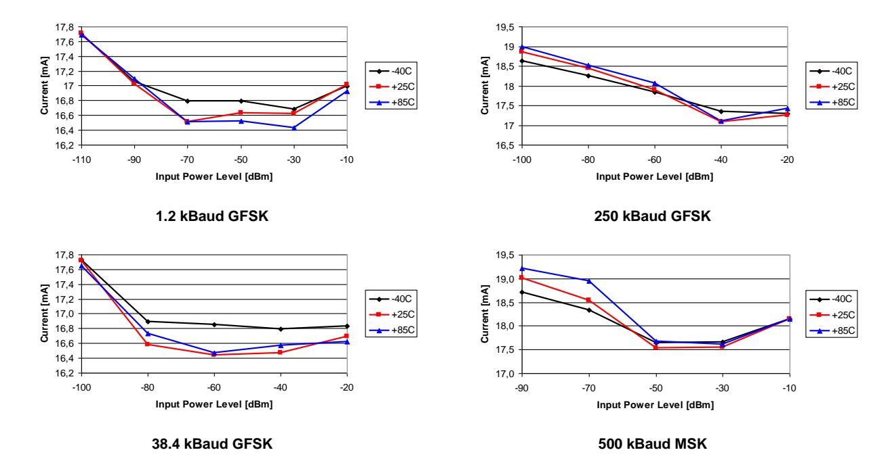

<span id="fig_3">**Figure 3:** Typical RX Current Consumption over Temperature and Input Power Level, 868/915 MHz, Sensitivity Optimized Setting</span>

### 4.2 RF Receive Section

T<sub>A</sub> = 25C, VDD = 3.0 V if nothing else stated. All measurement results are obtained using the CC1101EM reference designs ([\[1\]](#ref_1) and [\[2\]](#ref_2).)

| Parameter | Min | Typ | Max | Unit | Condition/Note |
|-|-|-|-|-|-|
| Digital channel filter bandwidth | 58  | | 812 | kHz  | User programmable. The bandwidth limits are proportional to crystal frequency (given values assume a 26.0 MHz crystal) |
| Spurious emissions | -68 | | -57 | dBm  | 25 MHz – 1 GHz (Maximum figure is the ETSI EN 300 220 limit) |
| Spurious emissions | -66 | | -47 | dBm | Above 1 GHz (Maximum figure is the ETSI EN 300 220 limit)<br>Typical radiated spurious emission is -49 dBm measured at the VCO frequency |
| RX latency | | 9 | | bit | Serial operation. Time from start of reception until data is available on the receiver data output pin is equal to 9 bit |

#### 315 MHz

| Parameter | Min | Typ | Max | Unit | Condition/Note |
|-|-|-|-|-|-|
| 1.2 kBaud data rate, sensitivity optimized, MDMCFG2.DEM_DCFILT_OFF=0<br>(2-FSK, 1% packet error rate, 20 bytes packet length, 5.2 kHz deviation, 58 kHz digital channel filter bandwidth) | | | | | |
| Receiver sensitivity | | -111 | | dBm | Sensitivity can be traded for current consumption by setting<br>MDMCFG2.DEM_DCFILT_OFF=1. The typical current<br>consumption is then reduced from 17.2 mA to 15.4 mA at the<br>sensitivity limit. The sensitivity is typically reduced to -109 dBm |
| 500 kBaud data rate, sensitivity optimized, MDMCFG2.DEM_DCFILT_OFF=0<br>(MSK, 1% packet error rate, 20 bytes packet length, 812 kHz digital channel filter bandwidth) | | | | | |
| Receiver sensitivity | | -88 | | dBm | MDMCFG2.DEM_DCFILT_OFF=1 cannot be used for data rates ><br>250 kBaud |

#### 433 MHz

| Parameter | Min | Typ | Max | Unit | Condition/Note |
|-|-|-|-|-|-|
| 0.6 kBaud data rate, sensitivity optimized, MDMCFG2.DEM_DCFILT_OFF=0<br>(GFSK, 1% packet error rate, 20 bytes packet length, 14.3 kHz deviation, 58 kHz digital channel filter bandwidth) | | | |
| Receiver sensitivity | | -116 | | dBm | |
| 1.2 kBaud data rate, sensitivity optimized, MDMCFG2.DEM_DCFILT_OFF=0<br>(GFSK, 1% packet error rate, 20 bytes packet length, 5.2 kHz deviation, 58 kHz digital channel filter bandwidth) | | | |
| Receiver sensitivity | | -112 | | dBm | Sensitivity can be traded for current consumption by setting<br>MDMCFG2.DEM_DCFILT_OFF=1. The typical current<br>consumption is then reduced from 18.0 mA to 16.0 mA at the<br>sensitivity limit. The sensitivity is typically reduced to -110 dBm |
| 38.4 kBaud data rate, sensitivity optimized, MDMCFG2.DEM_DCFILT_OFF=0<br>(GFSK, 1% packet error rate, 20 bytes packet length, 20 kHz deviation, 100 kHz digital channel filter bandwidth) | | | |
| Receiver sensitivity | | -104 | | dBm | |
| 250 kBaud data rate, sensitivity optimized, MDMCFG2.DEM_DCFILT_OFF=0<br>(GFSK, 1% packet error rate, 20 bytes packet length, 127 kHz deviation, 540 kHz digital channel filter bandwidth) | | | |
| Receiver sensitivity | | -95  | | dBm |

#### 868/915 MHz

| Parameter | Min | Typ | Max | Unit | Condition/Note |
|-|-|-|-|-|-|
| 1.2 kBaud data rate, sensitivity optimized, MDMCFG2.DEM_DCFILT_OFF=0<br>(GFSK, 1% packet error rate, 20 bytes packet length, 5.2 kHz deviation, 58 kHz digital channel filter bandwidth) | | | |
| Receiver sensitivity | | -112 | | dBm | Sensitivity can be traded for current consumption by setting<br>MDMCFG2.DEM_DCFILT=1. The typical current consumption is then reduced from 17.7 mA to 15.7 mA at sensitivity limit. The sensitivity is typically reduced to -109 dBm |
| Saturation | | -14 | | dBm | FIFOTHR.CLOSE_IN_RX=0. See more in DN010 [8] |
| Adjacent channel<br>rejection<br>±100 kHz offset | | 37 | | dB | Desired channel 3 dB above the sensitivity limit.<br>100 kHz channel spacing<br>See Figure 4 for selectivity performance at other offset frequencies |
| Image channel<br>rejection | | 31 | | dB | IF frequency 152 kHz<br>Desired channel 3 dB above the sensitivity limit |
| Blocking<br>±2 MHz offset<br>±10 MHz offset | | -50<br>-40 | | dBm<br>dBm | Desired channel 3 dB above the sensitivity limit<br>See Figure 4 for blocking performance at other offset<br>frequencies |
| 38.4 kBaud data rate, sensitivity optimized, MDMCFG2.DEM_DCFILT_OFF=0<br>(GFSK, 1% packet error rate, 20 bytes packet length, 20 kHz deviation, 100 kHz digital channel filter bandwidth) | | | | | |
| Receiver sensitivity | | -104 | | dBm | Sensitivity can be traded for current consumption by setting<br>MDMCFG2.DEM_DCFILT_OFF=1. The typical current<br>consumption is then reduced from 17.7 mA to 15.6 mA at the<br>sensitivity limit. The sensitivity is typically reduced to -102<br>dBm |
| Saturation | | -16 | | dBm | FIFOTHR.CLOSE_IN_RX=0. See more in DN010 [8] |
| Adjacent channel rejection<br>-200 kHz offset<br>+200 kHz offset | | 12<br>25 | | dB<br>dB | Desired channel 3 dB above the sensitivity limit.<br>200 kHz channel spacing<br>See Figure 5 for blocking performance at other offset<br>frequencies |
| Image channel rejection | | 23 | | dB | IF frequency 152 kHz<br>Desired channel 3 dB above the sensitivity limit |
| Blocking<br>±2 MHz offset<br>±10 MHz offset | | -50<br>-40 | | dBm<br>dBm | Desired channel 3 dB above the sensitivity limit<br>See Figure 5 for blocking performance at other offset<br>frequencies |
| 250 kBaud data rate, sensitivity optimized, MDMCFG2.DEM_DCFILT_OFF=0<br>(GFSK, 1% packet error rate, 20 bytes packet length, 127 kHz deviation, 540 kHz digital channel filter bandwidth) | | | | | |
| Receiver sensitivity | | -95 | | dBm | Sensitivity can be traded for current consumption by setting<br>MDMCFG2.DEM_DCFILT_OFF=1. The typical current<br>consumption is then reduced from 18.9 mA to 16.9 mA at the<br>sensitivity limit. The sensitivity is typically reduced to -91 dBm |
| Saturation | | -17 | | dBm | FIFOTHR.CLOSE_IN_RX=0. See more in DN010 [8] |
| Adjacent channel rejection | | 25 | | dB | Desired channel 3 dB above the sensitivity limit.<br>750 kHz channel spacing<br>See Figure 6 for blocking performance at other offset<br>frequencies |
| Image channel rejection | | 14 | | dB | IF frequency 304 kHz<br>Desired channel 3 dB above the sensitivity limit |
| Blocking<br>±2 MHz offset<br>±10 MHz offset | | -50<br>-40 | | dBm<br>dBm | Desired channel 3 dB above the sensitivity limit<br>See Figure 6 for blocking performance at other offset<br>frequencies |
| 500 kBaud data rate, sensitivity optimized, MDMCFG2.DEM_DCFILT_OFF=0<br>(MSK, 1% packet error rate, 20 bytes packet length, 812 kHz digital channel filter bandwidth) | | | | | |
| Receiver sensitivity | | -90 | | dBm | MDMCFG2.DEM_DCFILT_OFF=1 cannot be used for data<br>rates > 250 kBaud |
| Image channel rejection | | 1 | | dB | IF frequency 355 kHz<br>Desired channel 3 dB above the sensitivity limit |
| Blocking<br>±2 MHz offset<br>±10 MHz offset | | -50<br>-40 | | dBm<br>dBm | Desired channel 3 dB above the sensitivity limit<br>See Figure 7 for blocking performance at other offset<br>frequencies |
| 4-FSK, 125 kBaud data rate (250 kbps), sensitivity optimized, MDMCFG2.DEM_DCFILT_OFF=0<br>(1% packet error rate, 20 bytes packet length, 127 kHz deviation, 406 kHz digital channel filter bandwidth) | | | | | |
| Receiver sensitivity | | -96 | | dBm | |
| 4-FSK, 250 kBaud data rate (500 kbps), sensitivity optimized, MDMCFG2.DEM_DCFILT_OFF=0<br>(1% packet error rate, 20 bytes packet length, 254 kHz deviation, 812 kHz digital channel filter bandwidth) | | | | | |
| Receiver sensitivity | | -91 | | dBm | |
| 4-FSK, 300 kBaud data rate (600 kbps), sensitivity optimized, MDMCFG2.DEM_DCFILT_OFF=0<br>(1% packet error rate, 20 bytes packet length, 228 kHz deviation, 812 kHz digital channel filter bandwidth) | | | | | |
| Receiver sensitivity | | -89 | | dBm | |

<span id="table_7">**Table 7:** RF Receive Section</span>

| | Supply Voltage<br>VDD = 1.8 V | | | Supply Voltage<br>VDD = 3.0 V | | | Supply Voltage<br>VDD = 3.6 V | | |
|-|-|-|-|-|-|-|-|-|-|
| Temperature [°C] | -40 | 25 | 85 | -40 | 25 | 85 | -40 | 25 | 85 |
| Sensitivity [dBm]<br>1.2 kBaud  | -113 | -112 | -110 | -113 | -112 | -110 | -113 | -112 | -110 |
| Sensitivity [dBm]<br>38.4 kBaud | -105 | -104 | -102 | -105 | -104 | -102 | -105 | -104 | -102 |
| Sensitivity [dBm]<br>250 kBaud  | -97 | -96  | -92  | -97 | -95  | -92  | -97 | -94  | -92  |
| Sensitivity [dBm]<br>500 kBaud  | -91 | -90  | -86  | -91 | -90  | -86  | -91 | -90  | -86  |

<span id="table_8">**Table 8:** Typical Sensitivity over Temperature and Supply Voltage, 868 MHz, Sensitivity Optimized Setting</span>

| | Supply Voltage<br>VDD = 1.8 V | | | Supply Voltage<br>VDD = 3.0 V | | | Supply Voltage<br>VDD = 3.6 V | | |
|-|-|-|-|-|-|-|-|-|-|
| Temperature [°C] | -40 | 25 | 85 | -40 | 25 | 85 | -40 | 25 | 85 |
| Sensitivity [dBm]<br>1.2 kBaud  | -113 | -112 | -110 | -113 | -112 | -110 | -113 | -112 | -110 |
| Sensitivity [dBm]<br>38.4 kBaud | -105 | -104 | -102 | -104 | -104 | -102 | -105 | -104 | -102 |
| Sensitivity [dBm]<br>250 kBaud  | -97 | -94  | -92  | -97 | -95  | -92  | -97 | -95  | -92  |
| Sensitivity [dBm]<br>500 kBaud  | -91 | -89  | -86  | -91 | -90  | -86  | -91 | -89  | -86  |

<span id="table_9">**Table 9:** Typical Sensitivity over Temperature and Supply Voltage, 915 MHz, Sensitivity Optimized Setting</span>

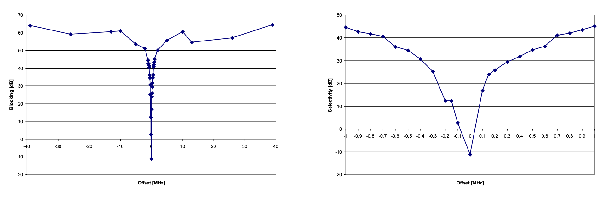

<span id="fig_4">**Figure 4:** Typical Selectivity at 1.2 kBaud Data Rate, 868.3 MHz, GFSK, 5.2 kHz Deviation. IF Frequency is 152.3 kHz and the Digital Channel Filter Bandwidth is 58 kHz</span>

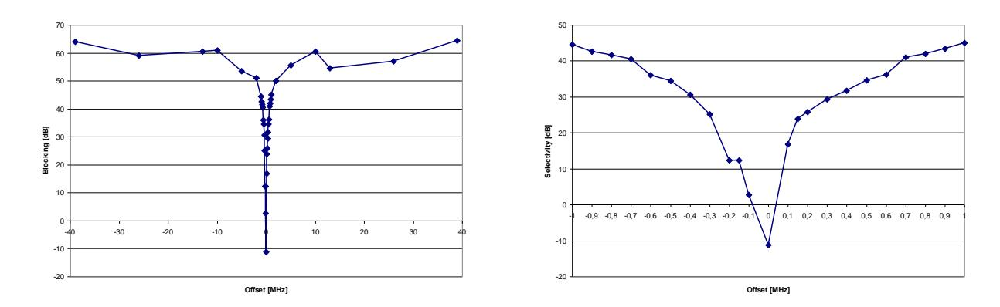

<span id="fig_5">**Figure 5:** Typical Selectivity at 38.4 kBaud Data Rate, 868 MHz, GFSK, 20 kHz Deviation. IF Frequency is 152.3 kHz and the Digital Channel Filter Bandwidth is 100 kHz</span>

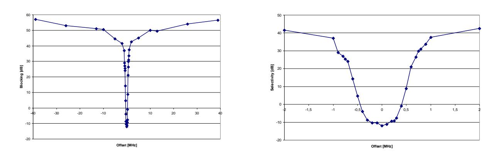

<span id="fig_6">**Figure 6:** Typical Selectivity at 250 kBaud Data Rate, 868 MHz, GFSK, IF Frequency is 304 kHz and the Digital Channel Filter Bandwidth is 540 kHz</span>

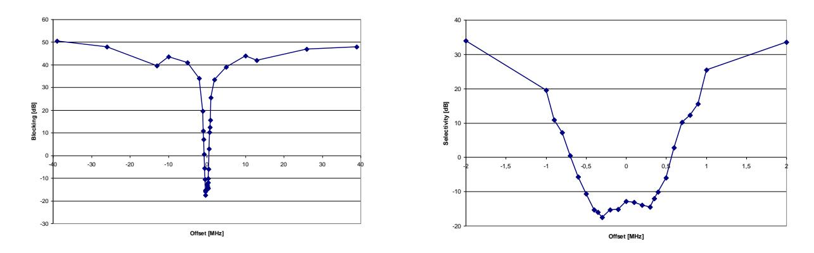

<span id="fig_7">**Figure 7:** Typical Selectivity at 500 kBaud Data Rate, 868 MHz, GFSK, IF Frequency is 355 kHz and the Digital Channel Filter Bandwidth is 812 kHz</span>

## 4.3 RF Transmit Section

 $T_A = 25$ °C, VDD = 3.0 V, +10 dBm if nothing else stated. All measurement results are obtained using the CC1101EM reference designs ([1] and [2]).

| Parameter | Min | Typ | Max | Unit | Condition/Note |
|-|-|-|-|-|-|
| Differential load impedance | | | | | Differential impedance as seen from the RF-port (RF_P and RF_N) towards the antenna. Follow the CC1101EM reference designs ([1] and [2]) available from the TI website |
| 315 MHz | | 122 + j31 | | Ω | |
| 433 MHz | | 116 + j41 | | Ω | |
| 868/915 MHz | | 86.5 + j43 | | Ω | |
| Output power, highest setting | | | | | Output power is programmable, and full range is available in all frequency bands. Output power may be restricted by regulatory limits. |
| 315 MHz | | +10 | | dBm | |
| 433 MHz | | +10 | | dBm | See Design Note DN013 [15] for output power and harmonics figures when using <i>multi-layer</i> inductors. The output power is |
| 868 MHz | | +12 | | dBm | then typically +10 dBm when operating at 868/915 MHz. |
| 915 MHz | | +11 | | dBm | Delivered to a 50 $\Omega$ single-ended load via CC1101EM reference designs ([1] and [2]) RF matching network |
| Output power, lowest setting | | -30 | | dBm | Output power is programmable, and full range is available in all frequency bands |
| | | | | | Delivered to a $50\Omega$ single-ended load via CC1101EM reference designs ([1] and [2]) RF matching network |
| Harmonics, radiated | | | | | Measured on CC1101EM reference designs ([1] and [2]) with CW, maximum output power |
| 2nd Harm, 433 MHz<br>3rd Harm, 433 MHz | -49<br>-40 | | | dBm | The antennas used during the radiated measurements (SMAFF-433 from R.W. Badland and Nearson S331 868/915) play a part in attenuating the harmonics |
| 2nd Harm, 868 MHz<br>3rd Harm, 868 MHz | -47<br>-55 | | | dBm | pay a part in anonaamig the maintenace |
| 2nd Harm, 915 MHz<br>3rd Harm, 915 MHz | -50<br>-54 | | | dBm | Note: All harmonics are below -41.2 dBm when operating in the 902 – 928 MHz band |
| Harmonics, conducted | | | | | |
| 315 MHz | < -35<br>< -53 | | | dBm | Measured with +10 dBm CW at 315 MHz and 433 MHz Frequencies below 960 MHz Frequencies above 960 MHz |
| 433 MHz | -43<br>< -45 | | | dBm | Frequencies below 1 GHz<br>Frequencies above 1 GHz |
| 868 MHz<br>2nd Harm<br>other harmonics | -36<br>< -46 | | | dBm | Measured with +12 dBm CW at 868 MHz |
| 915 MHz<br>2nd Harm | -34 | | | dBm | Measured with +11 dBm CW at 915 MHz (requirement is -20 dBc under FCC 15.247) |
| other harmonics | < -50 | | | dBm | |
| Parameter | Min | Typ | Max | Unit | Condition/Note |
| Spurious emissions<br>conducted, harmonics<br>not included | | | | | |
| 315 MHz | | < -58<br>< -53 | | dBm<br>dBm | Measured with +10 dBm CW at 315 MHz and 433 MHz<br>Frequencies below 960 MHz<br>Frequencies above 960 MHz |
| 433 MHz | | < -50<br>< -54<br>< -56 | | dBm<br>dBm<br>dBm | Frequencies below 1 GHz<br>Frequencies above 1 GHz<br>Frequencies within 47-74, 87.5-118, 174-230, 470-862 MHz |
| 868 MHz | | < -50<br>< -52<br>< -53 | | dBm<br>dBm<br>dBm | Measured with +12 dBm CW at 868 MHz<br>Frequencies below 1 GHz<br>Frequencies above 1 GHz<br>Frequencies within 47-74, 87.5-118, 174-230, 470-862 MHz<br>All radiated spurious emissions are within the limits of ETSI.<br>The peak conducted spurious emission is -53 dBm at 699 MHz<br>(868 MHz – 169 MHz), which is in a frequency band limited to<br>-54 dBm by EN 300 220. An alternative filter can be used to<br>reduce the emission at 699 MHz below -54 dBm, for conducted<br>measurements, and is shown in Figure 11. See more<br>information in DN017 [9].<br>For compliance with modulation bandwidth requirements under<br>EN 300 220 in the 863 to 870 MHz frequency range it is<br>recommended to use a 26 MHz crystal for frequencies below<br>869 MHz and a 27 MHz crystal for frequencies above 869<br>MHz. |
| 915 MHz | | < -51<br>< -54 | | dBm<br>dBm | Measured with +11 dBm CW at 915 MHz<br>Frequencies below 960 MHz<br>Frequencies above 960 MHz |
| TX latency | | 8 | | bit | Serial operation. Time from sampling the data on the<br>transmitter data input pin until it is observed on the RF output<br>ports |

<span id="table_10">**Table 10:** RF Transmit Section</span>

| | Supply Voltage<br>VDD = 1.8 V | | | Supply Voltage<br>VDD = 3.0 V | | | Supply Voltage<br>VDD = 3.6 V | | |
|-|-|-|-|-|-|-|-|-|-|
| Temperature [°C] | -40 | 25 | 85 | -40 | 25 | 85 | -40 | 25 | 85 |
| Output Power [dBm],<br>PATABLE=0xC0, +12 dBm | 12 | 11 | 10 | 12 | 12 | 11 | 12 | 12 | 11 |
| Output Power [dBm],<br>PATABLE=0xC5, +10 dBm | 11 | 10 | 9  | 11 | 10 | 10 | 11 | 10 | 10 |
| Output Power [dBm],<br>PATABLE=0x50, 0 dBm | 1 | 0  | -1 | 2 | 1  | 0  | 2 | 1  | 0  |

<span id="table_11">**Table 11:** Typical Variation in Output Power over Temperature and Supply Voltage, 868 MHz</span>

| | Supply Voltage<br>VDD = 1.8 V | | | Supply Voltage<br>VDD = 3.0 V | | | Supply Voltage<br>VDD = 3.6 V | | |
|-|-|-|-|-|-|-|-|-|-|
| Temperature [°C] | -40 | 25 | 85 | -40 | 25 | 85 | -40 | 25 | 85 |
| Output Power [dBm],<br>PATABLE=0xC0, +11 dBm | 11  | 10 | 10 | 12  | 11 | 11 | 12  | 11 | 11 |
| Output Power [dBm],<br>PATABLE=0x8E, +0 dBm  | 2 | 1  | 0 | 2 | 1  | 0 | 2 | 1  | 0  |

<span id="table_12">**Table 12:** Typical Variation in Output Power over Temperature and Supply Voltage, 915 MHz</span>

### 4.4 Crystal Oscillator

T<sup>A</sup> = 25C, VDD = 3.0 V if nothing else is stated. All measurement results obtained using the CC1101EM reference designs ([\[1\]](#ref_1) and [\[2\]](#ref_2)).

| Parameter | Min | Typ | Max | Unit | Condition/Note |
|-|-|-|-|-|-|
| Crystal frequency | 26  | 26  | 27  | MHz  | For compliance with modulation bandwidth requirements under<br>EN 300 220 in the 863 to 870 MHz frequency range it is<br>recommended to use a 26 MHz crystal for frequencies below<br>869 MHz and a 27 MHz crystal for frequencies above 869 MHz. |
| Tolerance | | ±40 | | ppm  | This is the total tolerance including a) initial tolerance, b) crystal<br>loading, c) aging, and d) temperature dependence. The<br>acceptable crystal tolerance depends on RF frequency and<br>channel spacing / bandwidth. |
| Load capacitance  | 10  | 13  | 20  | pF | Simulated over operating conditions |
| ESR | | | 100 | Ω | |
| Start-up time | | 150 | | µs | This parameter is to a large degree crystal dependent. Measured<br>on the CC1101EM reference designs ([1] and [2]) using crystal<br>AT-41CD2 from NDK |

<span id="table_13">**Table 13:** Crystal Oscillator Parameters</span>

### 4.5 Low Power RC Oscillator

T<sup>A</sup> = 25C, VDD = 3.0 V if nothing else is stated. All measurement results obtained using the CC1101EM reference designs ([\[1\]](#ref_1) an[d \[2\]\)](ref_2).

| Parameter | Min  | Typ  | Max | Unit | Condition/Note |
|-|-|-|-|-|-|
| Calibrated frequency | 34.7 | 34.7 | 36 | kHz | Calibrated RC Oscillator frequency is XTAL<br>frequency divided by 750 |
| Frequency accuracy after<br>calibration | | | $\pm 1$ | % | |
| Temperature coefficient | | +0.5 | | % / °C | Frequency drift when temperature changes after<br>calibration |
| Supply voltage coefficient | | +3 | | % / V  | Frequency drift when supply voltage changes after<br>calibration |
| Initial calibration time | | 2 | | ms | When the RC Oscillator is enabled, calibration is<br>continuously done in the background as long as<br>the crystal oscillator is running |

<span id="table_14">**Table 14:** RC Oscillator Parameters</span>

### 4.6 Frequency Synthesizer Characteristics

 $T_A = 25^{\circ}$ C, VDD = 3.0 V if nothing else is stated. All measurement results are obtained using the CC1101EM reference designs ([1] and [2]). Min figures are given using a 27 MHz crystal. Typ and max figures are given using a 26 MHz crystal.

| Parameter | Min | Typ | Max | Unit | Condition/Note |
|-|-|-|-|-|-|
| Programmed frequency resolution | 397 | $F_{XOSC}/2^{16}$ | 412 | Hz | 26-27 MHz crystal. The resolution (in Hz) is equal for all frequency bands |
| Synthesizer frequency tolerance | | ±40 | | ppm | Given by crystal used. Required accuracy (including temperature and aging) depends on frequency band and channel bandwidth / spacing |
| RF carrier phase noise | | -92 | | dBc/Hz | @ 50 kHz offset from carrier |
| RF carrier phase noise | | -92 | | dBc/Hz | @ 100 kHz offset from carrier |
| RF carrier phase noise | | -92 | | dBc/Hz | @ 200 kHz offset from carrier |
| RF carrier phase noise | | -98 | | dBc/Hz | @ 500 kHz offset from carrier |
| RF carrier phase noise | | -107 | | dBc/Hz | @ 1 MHz offset from carrier |
| RF carrier phase noise | | -113 | | dBc/Hz | @ 2 MHz offset from carrier |
| RF carrier phase noise | | -119 | | dBc/Hz | @ 5 MHz offset from carrier |
| RF carrier phase noise | | -129 | | dBc/Hz | @ 10 MHz offset from carrier |
| PLL turn-on / hop time<br>( See Table 34)  | 72  | 75 | 75  | μs | Time from leaving the IDLE state until arriving in the RX, FSTXON or TX state, when not performing calibration. Crystal oscillator running. |
| PLL RX/TX settling time<br>( See Table 34) | 29  | 30 | 30  | μs | Settling time for the 1-IF frequency step from RX to TX |
| PLL TX/RX settling time<br>( See Table 34) | 30  | 31 | 31  | μs | Settling time for the 1-IF frequency step from TX to RX. 250 kbps data rate. |
| PLL calibration time<br>(See Table 35) | 685 | 712 | 724 | μs | Calibration can be initiated manually or automatically before entering or after leaving RX/TX |

<span id="table_15">**Table 15:** Frequency Synthesizer Parameters</span>

### 4.7 Analog Temperature Sensor

 $T_A = 25$ °C, VDD = 3.0 V if nothing else is stated. All measurement results obtained using the CC1101EM reference designs ([1] and [2]). Note that it is necessary to write 0xBF to the PTEST register to use the analog temperature sensor in the IDLE state.

| Parameter | Min | Typ | Max | Unit  | Condition/Note |
|-|-|-|-|-|-|
| Output voltage at –40°C | | 0.651 | | V | |
| Output voltage at 0°C | | 0.747 | | V | |
| Output voltage at +40°C | | 0.847 | | V | |
| Output voltage at +80°C | | 0.945 | | V | |
| Temperature coefficient | | 2.47  | | mV/°C | Fitted from –20 °C to +80 °C |
| Error in calculated temperature, calibrated | -2* | 0 | 2*  | °C | From –20 °C to +80 °C when using 2.47 mV / °C, after 1-point calibration at room temperature<br>* The indicated minimum and maximum error with 1-point calibration is based on simulated values for typical process parameters |
| Current consumption increase when enabled | | 0.3 | | mA | |

<span id="table_16">**Table 16:** Analog Temperature Sensor Parameters</span>

### 4.8 DC Characteristics

 $T_A = 25^{\circ}C$  if nothing else stated.

| Digital Inputs/Outputs | Min | Max | Unit | Condition |
|-|-|-|-|-|
| Logic "0" input voltage  | 0 | 0.7 | V | |
| Logic "1" input voltage  | VDD-0.7 | VDD | V | |
| Logic "0" output voltage | 0 | 0.5 | V | For up to 4 mA output current |
| Logic "1" output voltage | VDD-0.3 | VDD | V | For up to 4 mA output current |
| Logic "0" input current  | N/A | -50 | nA | Input equals 0V |
| Logic "1" input current  | N/A | 50  | nA | Input equals VDD |

<span id="table_17">**Table 17:** DC Characteristics</span>

### 4.9 Power-On Reset

For proper Power-On-Reset functionality the power supply should comply with the requirements in Table 18 below. Otherwise, the chip should be assumed to have unknown state until transmitting an SRES strobe over the SPI interface. See Section 19.1 on page 50 for further details.

| Parameter | Min | Typ | Max | Unit | Condition/Note |
|-|-|-|-|-|-|
| Power-up ramp-up time | | | 5 | ms | From 0V until reaching 1.8V |
| Power off time | 1 | | | ms | Minimum time between power-on and power-off |

<span id="table_18">**Table 18:** Power-On Reset Requirements</span>

## 5 Pin Configuration

The **CC1101** pin-out is shown in Figure 8 and Table 19. See Section 26 for details on the I/O configuration.

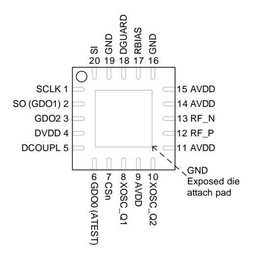

<span id="fig_8">**Figure 8:** Pinout Top View</span>

**Note:** The exposed die attach pad **must** be connected to a solid ground plane as this is the main ground connection for the chip

| Pin # | Pin Name | Pin type | Description |
|-|-|-|-|
| 1 | SCLK | Digital Input | Serial configuration interface, clock input |
| 2 | SO (GDO1) | Digital Output | Serial configuration interface, data output<br>Optional general output pin when CSn is high |
| 3 | GDO2 | Digital Output | Digital output pin for general use:<br>• Test signals<br>• FIFO status signals<br>• Clear channel indicator<br>• Clock output, down-divided from XOSC<br>• Serial output RX data |
| 4 | DVDD | Power (Digital)  | 1.8 - 3.6 V digital power supply for digital I/O's and for the digital core<br>voltage regulator |
| 5 | DCOUPL | Power (Digital)  | 1.6 - 2.0 V digital power supply output for decoupling<br>NOTE: This pin is intended for use with the CC1101 only. It can not be used<br>to provide supply voltage to other devices |
| 6 | GDO0<br>(ATEST) | Digital I/O | Digital output pin for general use:<br>• Test signals<br>• FIFO status signals<br>• Clear channel indicator<br>• Clock output, down-divided from XOSC<br>• Serial output RX data<br>• Serial input TX data<br>Also used as analog test I/O for prototype/production testing |
| 7 | CSn | Digital Input | Serial configuration interface, chip select |
| 8 | XOSC_Q1 | Analog I/O | Crystal oscillator pin 1, or external clock input |
| 9 | AVDD | Power (Analog) | 1.8 - 3.6 V analog power supply connection |
| 10 | XOSC_Q2 | Analog I/O | Crystal oscillator pin 2 |
| 11 | AVDD | Power (Analog) | 1.8 - 3.6 V analog power supply connection |
| 12 | RF_P | RF I/O | Positive RF input signal to LNA in receive mode<br>Positive RF output signal from PA in transmit mode |
| 13 | RF_N | RF I/O | Negative RF input signal to LNA in receive mode<br>Negative RF output signal from PA in transmit mode |
| 14 | AVDD | Power (Analog) | 1.8 - 3.6 V analog power supply connection |
| 15 | AVDD | Power (Analog) | 1.8 - 3.6 V analog power supply connection |
| 16 | GND | Ground (Analog)  | Analog ground connection |
| 17 | RBIAS | Analog I/O | External bias resistor for reference current |
| 18 | DGUARD | Power (Digital)  | Power supply connection for digital noise isolation |
| 19 | GND | Ground (Digital) | Ground connection for digital noise isolation |
| 20 | SI | Digital Input | Serial configuration interface, data input |

<span id="table_19">**Table 19:** Pinout Overview</span>


## 6 Circuit Description

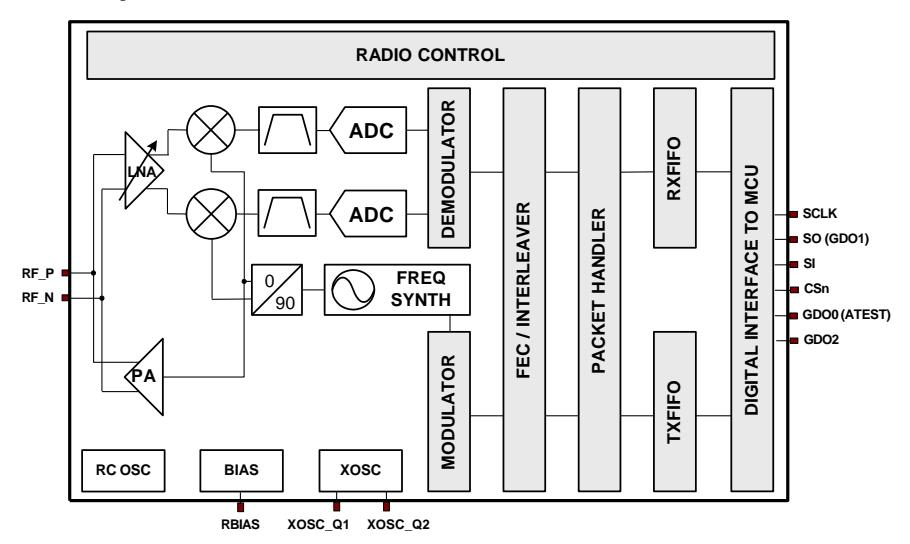

<span id="fig_9">**Figure 9:** **CC1101** Simplified Block Diagram</span>

A simplified block diagram of **CC1101** is shown in Figure 9.

**CC1101** features a low-IF receiver. The received RF signal is amplified by the low-noise amplifier (LNA) and down-converted in quadrature (I and Q) to the intermediate frequency (IF). At IF, the I/Q signals are digitised by the ADCs. Automatic gain control (AGC), fine channel filtering, demodulation, and bit/packet synchronization are performed digitally.

The transmitter part of **CC1101** is based on direct synthesis of the RF frequency. The frequency synthesizer includes a completely on-chip LC VCO and a 90 degree phase shifter for generating the I and Q LO signals to the down-conversion mixers in receive mode.

A crystal is to be connected to XOSC\_Q1 and XOSC\_Q2. The crystal oscillator generates the reference frequency for the synthesizer, as well as clocks for the ADC and the digital part.

A 4-wire SPI serial interface is used for configuration and data buffer access.

The digital baseband includes support for channel configuration, packet handling, and data buffering.

## 7 Application Circuit

Only a few external components are required for using the *CC1101*. The recommended application circuits for *CC1101* are shown in Figure 10 and

Figure 11. The external components are described in Table 20, and typical values are given in Table 21.

The 315 MHz and 433 MHz CC1101EM reference design [1] use inexpensive multi-layer inductors. The 868 MHz and 915 MHz CC1101EM reference design [2] use wire-wound inductors as this give better output power, sensitivity, and attenuation of harmonics compared to using multi-layer inductors. Refer to design note DN032 [24] for information about performance when using wire-wound inductors from different vendors. See also Design Note DN013 [15], which gives the output power and harmonics when using *multi-layer* inductors. The output power is then typically +10 dBm when operating at 868/915 MHz.

### 7.1 Bias Resistor

The bias resistor R171 is used to set an accurate bias current.


### 7.2 Balun and RF Matching

The balanced RF input and output of **CC1101** share two common pins and are designed for a simple, low-cost matching and balun network on the printed circuit board. The receive- and transmit switching at the **CC1101** front-end is controlled by a dedicated on-chip function, eliminating the need for an external RX/TX-switch

A few external passive components combined with the internal RX/TX switch/termination circuitry ensures match in both RX and TX mode. The components between the RF\_N/RF\_P pins and the point where the two signals are joined together (C131, C121, L121 and L131 for the 315/433 MHz reference design [1], and L121, L131, C121, L122, C131, C122 and L132 for the 868/915 MHz reference design [2]) form a balun that converts the differential RF signal on *CC1101* to a single-ended RF signal. C124 is needed for DC blocking. Together with an appropriate LC network, the balun components also transform the impedance to match a 50  $\Omega$  load. C125 provides DC blocking and is only needed if there is a DC path in the antenna. For the 868/915 MHz reference design, this component may also be used for additional filtering, see Section 7.5 below.

Suggested values for 315 MHz, 433 MHz, and 868/915 MHz are listed in Table 21.

The balun and LC filter component values and their placement are important to keep the performance optimized. It is highly recommended to follow the CC1101EM reference design ([1] and [2]). Gerber files and schematics for the reference designs are available for download from the TI website.

### 7.3 Crystal

A crystal in the frequency range 26-27 MHz must be connected between the XOSC\_Q1 and XOSC\_Q2 pins. The oscillator is designed for parallel mode operation of the crystal. In addition, loading capacitors (C81 and C101) for the crystal are required. The loading capacitor values depend on the total load capacitance,  $C_L$ , specified for the crystal. The total load capacitance seen between the crystal terminals should equal  $C_L$  for the crystal to oscillate at the specified frequency.

$$C_{L} = \frac{1}{\frac{1}{C_{81}} + \frac{1}{C_{101}}} + C_{parasitic}$$

The parasitic capacitance is constituted by pin input capacitance and PCB stray capacitance. Total parasitic capacitance is typically 2.5 pF.

The crystal oscillator is amplitude regulated. This means that a high current is used to start up the oscillations. When the amplitude builds up, the current is reduced to what is necessary to maintain approximately 0.4 Vpp signal swing. This ensures a fast start-up, and keeps the drive level to a minimum. The ESR of the crystal should be within the specification in order to ensure a reliable start-up (see Section 4.4).

The initial tolerance, temperature drift, aging and load pulling should be carefully specified in order to meet the required frequency accuracy in a certain application.

Avoid routing digital signals with sharp edges close to XOSC\_Q1 PCB track or underneath the crystal Q1 pad as this may shift the crystal dc operating point and result in duty cycle variation.

For compliance with modulation bandwidth requirements under EN 300 220 in the 863 to 870 MHz frequency range it is recommended to use a 26 MHz crystal for frequencies below 869 MHz and a 27 MHz crystal for frequencies above 869 MHz.

### 7.4 Reference Signal

The chip can alternatively be operated with a reference signal from 26 to 27 MHz instead of a crystal. This input clock can either be a full-swing digital signal (0 V to VDD) or a sine wave of maximum 1 V peak-peak amplitude. The reference signal must be connected to the XOSC\_Q1 input. The sine wave must be connected to XOSC\_Q1 using a serial capacitor. When using a full-swing digital signal, this capacitor can be omitted. The XOSC\_Q2 line must be left un-connected. C81 and C101 can be omitted when using a reference signal.

### 7.5 Additional Filtering

In the 868/915 MHz reference design, C126 and L125 together with C125 build an optional filter to reduce emission at carrier frequency – 169 MHz. This filter is necessary for applications with an external antenna connector that seek compliance with ETSI EN 300-220. For more information, see DN017 [\[9\].](ref_9)

If this filtering is not necessary, C125 will work as a DC block (only necessary if there is a DC path in the antenna). C126 and L125 should in that case be left unmounted.

Additional external components (e.g. an RF SAW filter) may be used in order to improve the performance in specific applications.

### 7.6 Power Supply Decoupling

The power supply must be properly decoupled close to the supply pins. Note that decoupling capacitors are not shown in the application circuit. The placement and the size of the decoupling capacitors are very important to achieve the optimum performance. The CC1101EM reference designs ([\[1\]](#ref_1) and [\[2\]](#ref_2)) should be followed closely.

### 7.7 Antenna Considerations

The reference design ([\[1\]](#ref_1) and [\[2\]](#ref_2)) contains a SMA connector and is matched for a 50 load. The SMA connector makes it easy to connect evaluation modules and prototypes to different test equipment for example a spectrum analyzer. The SMA connector can also be replaced by an antenna suitable for the desired application. Please refer to the antenna selection guide [\[13\]](#ref_13) for further details regarding antenna solutions provided by TI.

| Component | Description |
|-|-|
| C51 | Decoupling capacitor for on-chip voltage regulator to digital part |
| C81/C101  | Crystal loading capacitors |
| C121/C131 | RF balun/matching capacitors |
| C122 | RF LC filter/matching filter capacitor (315/433 MHz). RF balun/matching capacitor (868/915 MHz). |
| C123 | RF LC filter/matching capacitor |
| C124 | RF balun DC blocking capacitor |
| C125 | RF LC filter DC blocking capacitor and part of optional RF LC filter (868/915 MHz) |
| C126 | Part of optional RF LC filter and DC-block (868/915 MHz) |
| L121/L131 | RF balun/matching inductors (inexpensive multi-layer type) |
| L122 | RF LC filter/matching filter inductor (315 and 433 MHz). RF balun/matching inductor (868/915 MHz).<br>(inexpensive multi-layer type) |
| L123 | RF LC filter/matching filter inductor (inexpensive multi-layer type) |
| L124 | RF LC filter/matching filter inductor (inexpensive multi-layer type) |
| L125 | Optional RF LC filter/matching filter inductor (inexpensive multi-layer type) (868/915 MHz) |
| L132 | RF balun/matching inductor. (inexpensive multi-layer type) |
| R171 | Resistor for internal bias current reference |
| XTAL | 26 – 27 MHz crystal |

<span id="table_20">**Table 20:** Overview of External Components (excluding supply decoupling capacitors)</span>

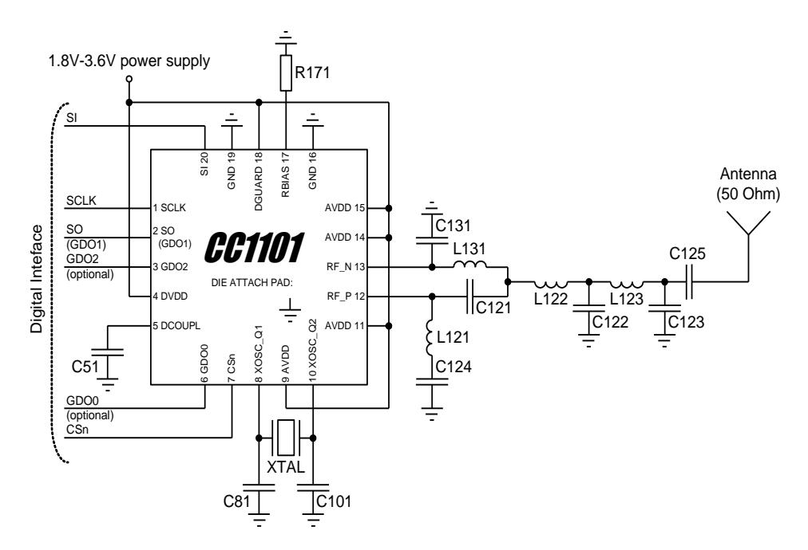
<span id="fig_10">**Figure 10:** Typical Application and Evaluation Circuit 315/433 MHz (excluding supply decoupling capacitors)</span>

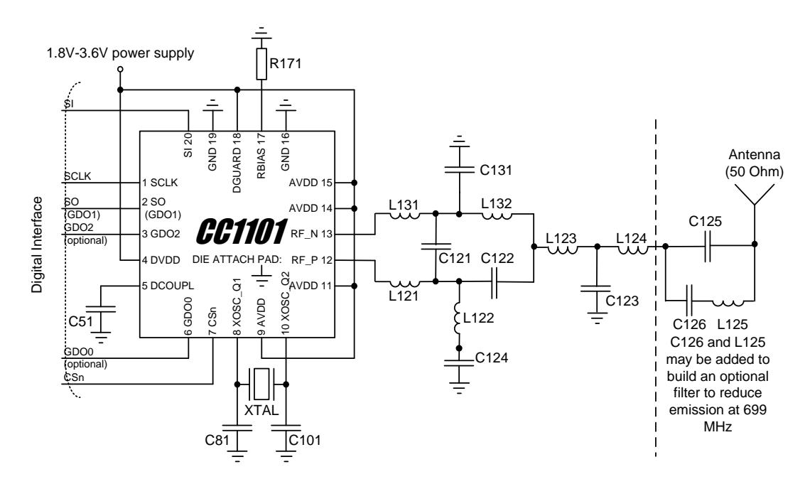
<span id="fig_11">**Figure 11:** Typical Application and Evaluation Circuit 868/915 MHz (excluding supply decoupling capacitors)</span>

| Component | Value at 315MHz | Value at 433MHz | Value at<br>868/915MHz | Manufacturer |
|-|-|-|-|-|
| C51 | | 100 nF ± 10%, 0402 X5R | | Murata GRM1555C series |
| C81 | | 27 pF ± 5%, 0402 NP0 | | Murata GRM1555C series |
| C101 | | 27 pF ± 5%, 0402 NP0 | | Murata GRM1555C series |
| C121 | 6.8 pF ± 0.5 pF,<br>0402 NP0 | 3.9 pF ± 0.25 pF,<br>0402 NP0  | 1.0 pF ± 0.25 pF,<br>0402 NP0 | Murata GRM1555C series |
| C122 | 12 pF ± 5%, 0402<br>NP0 | 8.2 pF ± 0.5 pF,<br>0402 NP0 | 1.5 pF ± 0.25 pF,<br>0402 NP0 | Murata GRM1555C series |
| C123 | 6.8 pF ± 0.5 pF,<br>0402 NP0 | 5.6 pF ± 0.5 pF,<br>0402 NP0 | 3.3 pF ± 0.25 pF,<br>0402 NP0 | Murata GRM1555C series |
| C124 | 220 pF ± 5%,<br>0402 NP0 | 220 pF ± 5%, 0402<br>NP0 | 100 pF ± 5%, 0402<br>NP0 | Murata GRM1555C series |
| C125 | 220 pF ± 5%,<br>0402 NP0 | 220 pF ± 5%, 0402<br>NP0 | 12 pF ± 5%, 0402<br>NP0 | Murata GRM1555C series |
| C126 | | | 47 pF ± 5%, 0402<br>NP0 | Murata GRM1555C series |
| C131 | 6.8 pF ± 0.5 pF,<br>0402 NP0 | 3.9 pF ± 0.25 pF,<br>0402 NP0  | 1.5 pF ± 0.25 pF,<br>0402 NP0 | Murata GRM1555C series |
| L121 | 33 nH ± 5%, 0402<br>monolithic | 27 nH ± 5%, 0402<br>monolithic | 12 nH ± 5%, 0402<br>monolithic  | Murata LQG15HS series (315/433 MHz)<br>Murata LQW15xx series (868/915 MHz) |
| L122 | 18 nH ± 5%, 0402<br>monolithic | 22 nH ± 5%, 0402<br>monolithic | 18 nH ± 5%, 0402<br>monolithic  | Murata LQG15HS series (315/433 MHz)<br>Murata LQW15xx series (868/915 MHz) |
| L123 | 33 nH ± 5%, 0402<br>monolithic | 27 nH ± 5%, 0402<br>monolithic | 12 nH ± 5%, 0402<br>monolithic  | Murata LQG15HS series (315/433 MHz)<br>Murata LQW15xx series (868/915 MHz) |
| L124 | | | 12 nH ± 5%, 0402<br>monolithic  | Murata LQG15HS series (315/433 MHz)<br>Murata LQW15xx series (868/915 MHz) |
| L125 | | | 3.3 nH ± 5%, 0402<br>monolithic | Murata LQG15HS series (315/433 MHz)<br>Murata LQW15xx series (868/915 MHz) |
| L131 | 33 nH ± 5%, 0402<br>monolithic | 27 nH ± 5%, 0402<br>monolithic | 12 nH ± 5%, 0402<br>monolithic  | Murata LQG15HS series (315/433 MHz)<br>Murata LQW15xx series (868/915 MHz) |
| L132 | | | 18 nH ± 5%, 0402<br>monolithic  | Murata LQG15HS series (315/433 MHz)<br>Murata LQW15xx series (868/915 MHz) |
| R171 | 56 kΩ ± 1%, 0402 | | | Koa RK73 series |
| XTAL | | 26.0 MHz surface mount crystal | | NDK, NX3225GA or AT-41CD2 |

<span id="table_21">**Table 21:** Bill Of Materials for the Application Circuit<sup>1</sup></span>

<sup>1</sup> Refer to design note DN032 [\[24\]](#ref_24) for information about performance when using inductors from other vendors than Murata.

### 7.8 PCB Layout Recommendations

The top layer should be used for signal routing, and the open areas should be filled with metallization connected to ground using several vias.

The area under the chip is used for grounding and shall be connected to the bottom ground plane with several vias for good thermal performance and sufficiently low inductance to ground.

In the CC1101EM reference designs ([\[1\]](#ref_1) and [\[2\]](#ref_2),) 5 vias are placed inside the exposed die attached pad. These vias should be "tented" (covered with solder mask) on the component side of the PCB to avoid migration of solder through the vias during the solder reflow process.

The solder paste coverage should not be 100%. If it is, out gassing may occur during the reflow process, which may cause defects (splattering, solder balling). Using "tented" vias reduces the solder paste coverage below 100%. See [Figure 12](#fig_12) for top solder resist and top paste masks.

Each decoupling capacitor should be placed as close as possible to the supply pin it is supposed to decouple. Each decoupling capacitor should be connected to the power line (or power plane) by separate vias. The best routing is from the power line (or power plane) to the decoupling capacitor and then to the CC1101 supply pin. Supply power filtering is very important.

Each decoupling capacitor ground pad should be connected to the ground plane by separate vias. Direct connections between neighboring power pins will increase noise coupling and should be avoided unless absolutely necessary. Routing in the ground plane underneath the chip or the balun/RF matching circuit, or between the chip's ground vias and the decoupling capacitor's ground vias should be avoided. This improves the grounding and ensures the shortest possible current return path.

Avoid routing digital signals with sharp edges close to XOSC\_Q1 PCB track or underneath the crystal Q1 pad as this may shift the crystal dc operating point and result in duty cycle variation.

The external components should ideally be as small as possible (0402 is recommended) and surface mount devices are highly recommended. Please note that components with different sizes than those specified may have differing characteristics.

Precaution should be used when placing the microcontroller in order to avoid noise interfering with the RF circuitry.

A CC1101DK Development Kit with a fully assembled CC1101EM Evaluation Module is available. It is strongly advised that this reference layout is followed very closely in order to get the best performance. The schematic, BOM and layout Gerber files are all available from the TI website ([\[1\]](#ref_1) and [\[2\]](#ref_2).)


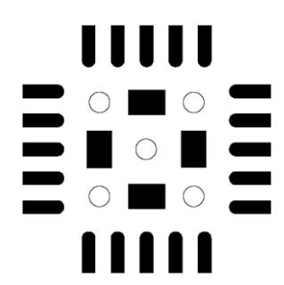

<span id="fig_12">**Figure 12:** Left: Top Solder Resist Mask (Negative). Right: Top Paste Mask. Circles are Vias</span>

## 8 Configuration Overview

CC1101 can be configured to achieve optimum performance for many different applications. Configuration is done using the SPI interface. See Section [10](#10-4-wire-serial-configuration-and-data-interface) below for more description of the SPI interface. The following key parameters can be programmed:

- Power-down / power up mode
- Crystal oscillator power-up / power-down
- Receive / transmit mode
- RF channel selection
- Data rate
- Modulation format
- RX channel filter bandwidth
- RF output power
- Data buffering with separate 64-byte receive and transmit FIFOs
- Packet radio hardware support
- Forward Error Correction (FEC) with interleaving
- Data whitening
- Wake-On-Radio (WOR)

Details of each configuration register can be found in Section [29,](#29-configuration-registers) starting on page [66.](#29-configuration-registers)

[Figure 13](#fig_13) shows a simplified state diagram that explains the main CC1101 states together with typical usage and current consumption. For detailed information on controlling the diagram, see Section 19, starting on page 50.

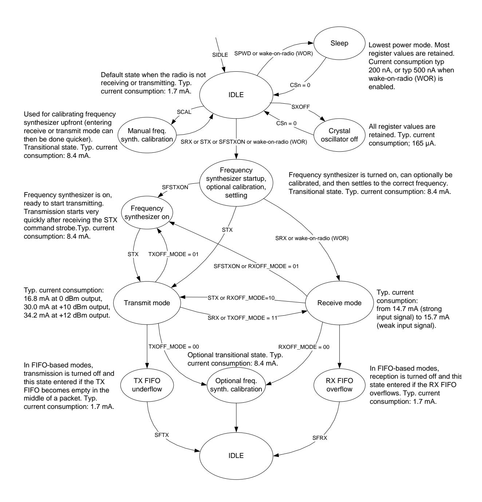

<span id="fig_13">**Figure 13:** Simplified State Diagram, with Typical Current Consumption at 1.2 kBaud Data Rate and MDMCFG2.DEM DCFILT OFF=1 (current optimized). Frequency Band = 868 MHz</span>


## 9 Configuration Software

CC1101 can be configured using the SmartRFTM Studio software [\[5\].](ref_5) The SmartRF Studio software is highly recommended for obtaining optimum register settings, and for evaluating performance and functionality. A screenshot of the SmartRF Studio user interface for CC1101 is shown in [Figure 14.](#fig_14)

After chip reset, all the registers have default values as shown in the tables in Section [29.](#29-configuration-registers) The optimum register setting might differ from the default value. After a reset all registers that shall be different from the default value therefore needs to be programmed through the SPI interface.

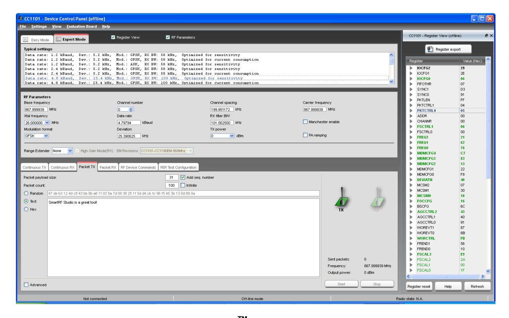

<span id="fig_14">**Figure 14:** SmartRFTM Studio [\[5\]](#ref_5) User Interface</span>

## 10 4-wire Serial Configuration and Data Interface

CC1101 is configured via a simple 4-wire SPI-compatible interface (SI, SO, SCLK and CSn) where CC1101 is the slave. This interface is also used to read and write buffered data. All transfers on the SPI interface are done most significant bit first.

All transactions on the SPI interface start with a header byte containing a R/W¯ bit, a burst access bit (B), and a 6-bit address (A<sub>5</sub> – A<sub>0</sub>).

The CSn pin must be kept low during transfers on the SPI bus. If CSn goes high during the transfer of a header byte or during read/write from/to a register, the transfer will be cancelled. The timing for the address and data transfer on the SPI interface is shown in [Figure](#fig_15)  [15](#fig_15) with reference to [Table 22.](#10-4-wire-serial-configuration-and-data-interface)

When CSn is pulled low, the MCU must wait until CC1101 SO pin goes low before starting to transfer the header byte. This indicates that the crystal is running. Unless the chip was in the SLEEP or XOFF states, the SO pin will always go low immediately after taking CSn low.


<span id="fig_15">**Figure 15:** Configuration Registers Write and Read Operations</span>

| Parameter | Description | Min | Max | Units |
|-|-|-|-|-|
| fSCLK | SCLK frequency 100 ns delay inserted between address byte and data byte (single access), or between address and data, and between each data byte (burst access). | - | 10  | MHz |
| | SCLK frequency, single access No delay between address and data byte | - | 9 | |
| | SCLK frequency, burst access No delay between address and data byte, or between data bytes | - | 6.5 | |
| tsp,pd | CSn low to positive edge on SCLK, in power-down mode | 150 | - | μs |
| tsp | CSn low to positive edge on SCLK, in active mode | 20 | - | ns |
| tch | Clock high | 50 | - | ns |
| tcl | Clock low | 50 | - | ns |
| trise | Clock rise time | - | 40  | ns |
| tfall | Clock fall time | - | 40  | ns |
| tsd | Setup data (negative SCLK edge) to positive edge on SCLK (tsd applies between address and data bytes, and between data bytes) | Single access 55 | - | ns |
| | | Burst access 76  | - | |
| thd | Hold data after positive edge on SCLK | 20 | - | ns |
| tns | Negative edge on SCLK to CSn high. | 20 | - | ns |

<span id="table_22">**Table 22:** SPI Interface Timing Requirements</span>

**Note:** The minimum  $t_{sp,pd}$  figure in Table 22 can be used in cases where the user does not read the CHIP\_RDYn signal. CSn low to positive edge on SCLK when the chip is woken from power-down depends on the start-up time of the crystal being used. The 150  $\mu$ s in Table 22 is the crystal oscillator start-up time measured on CC1101EM reference designs ([1] and [2]) using crystal AT-41CD2 from NDK.

### 10.1 Chip Status Byte

When the header byte, data byte, or command strobe is sent on the SPI interface, the chip status byte is sent by the CC1101 on the SO pin. The status byte contains key status signals, useful for the MCU. The first bit, s7, is the [CHIP\\_RDYn](#101-chip-status-byte) signal and this signal must go low before the first positive edge of SCLK. The [CHIP\\_RDYn](#101-chip-status-byte) signal indicates that the crystal is running.

Bits 6, 5, and 4 comprise the [STATE](#101-chip-status-byte) value. This value reflects the state of the chip. The XOSC and power to the digital core are on in the IDLE state, but all other modules are in power down. The frequency and channel configuration should only be updated when the chip is in this state. The RX state will be active when the chip is in receive mode. Likewise, TX is active when the chip is transmitting.

The last four bits (3:0) in the status byte contains [FIFO\\_BYTES\\_AVAILABLE.](#101-chip-status-byte) For read operations (the R/W¯ bit in the header byte is set to 1), the [FIFO\\_BYTES\\_AVAILABLE](#101-chip-status-byte) field contains the number of bytes available for reading from the RX FIFO. For write operations (the R/W¯ bit in the header byte is set to 0), the [FIFO\\_BYTES\\_AVAILABLE](#101-chip-status-byte) field contains the number of bytes that can be written to the TX FIFO. When [FIFO\\_BYTES\\_AVAILABLE=](#101-chip-status-byte)15, 15 or more bytes are available/free.

[Table 23](#table_23) gives a status byte summary.

| Bits | Name | Description |
|-|-|-|
| 7 | CHIP_RDYn | Stays high until power and crystal have stabilized. Should always be low when using the SPI interface. |
| 6:4  | STATE[2:0] | Indicates the current main state machine mode Value State Description 000 IDLE IDLE state<br>(Also reported for some transitional states instead of SETTLING or CALIBRATE) 001 RX Receive mode 010 TX Transmit mode 011 FSTXON Fast TX ready 100 CALIBRATE Frequency synthesizer calibration is running 101 SETTLING PLL is settling 110 RXFIFO_OVERFLOW RX FIFO has overflowed. Read out any useful data, then flush the FIFO with SFRX 111 TXFIFO_UNDERFLOW TX FIFO has underflowed. Acknowledge with SFTX |
| 3:0  | FIFO_BYTES_AVAILABLE[3:0] | The number of bytes available in the RX FIFO or free bytes in the TX FIFO |

<span id="table_23">**Table 23:** Status Byte Summary</span>

### 10.2 Register Access

The configuration registers on the CC1101 are located on SPI addresses from 0x00 to 0x2E. [Table 43](#table_43) on page [68](#271-asynchronous-serial-operation) lists all configuration registers. It is highly recommended to use SmartRF Studio [\[5\]](#ref_5) to generate optimum register settings. The detailed description of each register is found in Section [29.1](#291-configuration-register-details--registers-with-preserved-values-in-sleep-state) and [29.2,](#292-configuration-register-details--registers-that-loose-programming-in-sleep-state) starting on page [71.](#291-configuration-register-details--registers-with-preserved-values-in-sleep-state) All configuration registers can be both written to and read. The R/W¯ bit controls if the register should be written to or read. When writing to registers, the status byte is sent on the SO pin each time a header byte or data byte is transmitted on the SI pin. When reading from registers, the status byte is sent on the SO pin each time a header byte is transmitted on the SI pin.

Registers with consecutive addresses can be accessed in an efficient way by setting the burst bit (B) in the header byte. The address bits (A<sub>5</sub> – A<sub>0</sub>) set the start address in an internal address counter. This counter is incremented by one each new byte (every 8 clock pulses). The burst access is either a read or a write access and must be terminated by setting CSn high.

For register addresses in the range 0x30- 0x3D, the burst bit is used to select between status registers when burst bit is one, and between command strobes when burst bit is zero. See more in Section [10.3](#103-spi-read) below. Because of this, burst access is not available for status registers and they must be accessed one at a time. The status registers can only be read.

### 10.3 SPI Read

When reading register fields over the SPI interface while the register fields are updated by the radio hardware (e.g. [MARCSTATE](#293-status-register-details) or [TXBYTES](#293-status-register-details)), there is a small, but finite, probability that a single read from the register is being corrupt. As an example, the probability of any single read from [TXBYTES](#293-status-register-details) being corrupt, assuming the maximum data rate is used, is approximately 80 ppm. Refer to the CC1101 Errata Notes [\[3\]](#ref_3) for more details.

### 10.4 Command Strobes

Command Strobes may be viewed as single byte instructions to CC1101. By addressing a command strobe register, internal sequences will be started. These commands are used to disable the crystal oscillator, enable receive mode, enable wake-on-radio etc. The 13 command strobes are listed in [Table 42](#table_42) on page [67.](#26-general-purpose--test-output-control-pins)

**Note:** An SIDLE strobe will clear all pending command strobes until IDLE state is reached. This means that if for example an SIDLE strobe is issued while the radio is in RX state, any other command strobes issued before the radio reaches IDLE state will be ignored.

The command strobe registers are accessed by transferring a single header byte (no data is being transferred). That is, only the R/W¯ bit, the burst access bit (set to 0), and the six

address bits (in the range 0x30 through 0x3D) are written. The R/W¯ bit can be either one or zero and will determine how the [FIFO\\_BYTES\\_AVAILABLE](#101-chip-status-byte) field in the status byte should be interpreted.

When writing command strobes, the status byte is sent on the SO pin.

A command strobe may be followed by any other SPI access without pulling CSn high. However, if an [SRES](#26-general-purpose--test-output-control-pins) strobe is being issued, one will have to wait for SO to go low again before the next header byte can be issued as shown in [Figure 16.](#fig_16) The command strobes are executed immediately, with the exception of the [SPWD,](#26-general-purpose--test-output-control-pins) [SWOR,](#26-general-purpose--test-output-control-pins) and the [SXOFF](#26-general-purpose--test-output-control-pins) strobes, which are executed when CSn goes high.

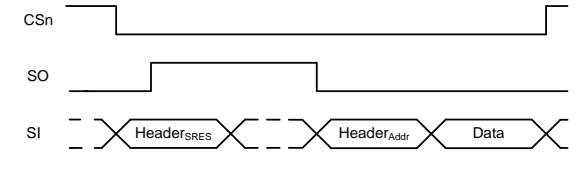

<span id="fig_16">**Figure 16:** [SRES C](#26-general-purpose--test-output-control-pins)ommand Strobe</span>

### 10.5 FIFO Access

The 64-byte TX FIFO and the 64-byte RX FIFO are accessed through the 0x3F address. When the R/W¯ bit is zero, the TX FIFO is accessed, and the RX FIFO is accessed when the R/W¯ bit is one.

The TX FIFO is write-only, while the RX FIFO is read-only.

The burst bit is used to determine if the FIFO access is a single byte access or a burst access. The single byte access method expects a header byte with the burst bit set to zero and one data byte. After the data byte, a new header byte is expected; hence, CSn can remain low. The burst access method expects one header byte and then consecutive data bytes until terminating the access by setting CSn high.

The following header bytes access the FIFOs:
- 0x3F: Single byte access to TX FIFO
- 0x7F: Burst access to TX FIFO
- 0xBF: Single byte access to RX FIFO
- 0xFF: Burst access to RX FIFO

When writing to the TX FIFO, the status byte (see Section [10.1\)](#102-register-access) is output on SO for each new data byte as shown in [Figure 15.](#fig_15) This status byte can be used to detect TX FIFO underflow while writing data to the TX FIFO. Note that the status byte contains the number of bytes free before writing the byte in progress to the TX FIFO. When the last byte that fits in the TX FIFO is transmitted on SI, the status byte received concurrently on SO will indicate that one byte is free in the TX FIFO.

The TX FIFO may be flushed by issuing a [SFTX](#26-general-purpose--test-output-control-pins) command strobe. Similarly, a [SFRX](#26-general-purpose--test-output-control-pins) command strobe will flush the RX FIFO. A [SFTX](#26-general-purpose--test-output-control-pins) or [SFRX](#26-general-purpose--test-output-control-pins) command strobe can only be issued in the IDLE, TXFIFO\_UNDERFLOW, or RXFIFO\_OVERFLOW states. Both FIFOs are flushed when going to the SLEEP state.

[Figure 17](#fig_17) gives a brief overview of different register access types possible.

### 10.6 PATABLE Access

The 0x3E address is used to access the PATABLE, which is used for selecting PA power control settings. The SPI expects up to eight data bytes after receiving the address. By programming the PATABLE, controlled PA power ramp-up and ramp-down can be achieved, as well as ASK modulation shaping for reduced bandwidth. See SmartRF Studio [\[5\]](#ref_5) for recommended shaping / PA ramping sequences. See also Section [24](#20-data-fifo) for details on output power programming.

The PATABLE is an 8-byte table that defines the PA control settings to use for each of the eight PA power values (selected by the 3-bit value [FREND0.PA\\_POWER](#0x27-rcctrl1--rc-oscillator-configuration)). The table is written and read from the lowest setting (0) to the highest (7), one byte at a time. An index counter is used to control the access to the table. This counter is incremented each time a byte is read or written to the table, and set to the lowest index when CSn is high. When the highest value is reached the counter restarts at zero.

The access to the PATABLE is either single byte or burst access depending on the burst bit. When using burst access the index counter will count up; when reaching 7 the counter will restart at 0. The R/W¯ bit controls whether the access is a read or a write access.

If one byte is written to the PATABLE and this value is to be read out, CSn must be set high before the read access in order to set the index counter back to zero.

Note that the content of the PATABLE is lost when entering the SLEEP state, except for the first byte (index 0).

For more information, see Design Note DN501 [\[18\].](ref_18)

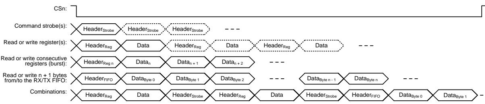

<span id="fig_17">**Figure 17:** Register Access Types</span>

## 11 Microcontroller Interface and Pin Configuration

In a typical system, CC1101 will interface to a microcontroller. This microcontroller must be able to:

- Program CC1101 into different modes
- Read and write buffered data
- Read back status information via the 4-wire SPI-bus configuration interface (SI, SO, SCLK and CSn)

### 11.1 Configuration Interface

The microcontroller uses four I/O pins for the SPI configuration interface (SI, SO, SCLK and CSn). The SPI is described in Section [10](#10-4-wire-serial-configuration-and-data-interface) on page [29.](#10-4-wire-serial-configuration-and-data-interface)

### 11.2 General Control and Status Pins

The CC1101 has two dedicated configurable pins (GDO0 and GDO2) and one shared pin (GDO1) that can output internal status information useful for control software. These pins can be used to generate interrupts on the MCU. See Section [26](#21-frequency-programming) on page [61](#21-frequency-programming) for more details on the signals that can be programmed.

GDO1 is shared with the SO pin in the SPI interface. The default setting for GDO1/SO is 3-state output. By selecting any other of the programming options, the GDO1/SO pin will become a generic pin. When CSn is low, the pin will always function as a normal SO pin.

In the synchronous and asynchronous serial modes, the GDO0 pin is used as a serial TX data input pin while in transmit mode.

The GDO0 pin can also be used for an on-chip analog temperature sensor. By measuring the voltage on the GDO0 pin with an external ADC, the temperature can be calculated. Specifications for the temperature sensor are found in Section [4.7.](#3-general-characteristics) With default [PTEST](#292-configuration-register-details--registers-that-loose-programming-in-sleep-state) register setting (0x7F), the temperature sensor output is only available if the frequency synthesizer is enabled (e.g. the MANCAL, FSTXON, RX, and TX states). It is necessary to write 0xBF to the [PTEST](#292-configuration-register-details--registers-that-loose-programming-in-sleep-state) register to use the analog temperature sensor in the IDLE state. Before leaving the IDLE state, the [PTEST](#292-configuration-register-details--registers-that-loose-programming-in-sleep-state) register should be restored to its default value (0x7F).

### 11.3 Optional Radio Control Feature

The CC1101 has an optional way of controlling the radio by reusing SI, SCLK, and CSn from the SPI interface. This feature allows for a simple three-pin control of the major states of the radio: SLEEP, IDLE, RX, and TX. This optional functionality is enabled with the [MCSM0.PIN\\_CTRL\\_EN](#0x18-mcsm0-main-radio-control-state-machine-configuration) configuration bit.

State changes are commanded as follows:

- If CSn is high, the SI and SCLK are set to the desired state according to [Table 24.](#103-spi-read)
- If CSn goes low, the state of SI and SCLK is latched and a command strobe is generated internally according to the pin configuration.

It is only possible to change state with the latter functionality. That means that for instance RX will not be restarted if SI and SCLK are set to RX and CSn toggles. When CSn is low the SI and SCLK has normal SPI functionality.

All pin control command strobes are executed immediately except the [SPWD](#26-general-purpose--test-output-control-pins) strobe. The [SPWD](#26-general-purpose--test-output-control-pins) strobe is delayed until CSn goes high.

| CSn | SCLK | SI | Function |
|-|-|-|-|
| 1 | X | X | Chip unaffected by SCLK/SI |
| ↓ | 0 | 0 | Generates SPWD strobe |
| ↓ | 0 | 1 | Generates STX strobe |
| ↓ | 1 | 0 | Generates SIDLE strobe |
| ↓ | 1 | 1 | Generates SRX strobe |
| 0 | SPI<br>mode | SPI<br>mode | SPI mode (wakes up into<br>IDLE if in SLEEP/XOFF) |

<span id="table_24">**Table 24:** Optional Pin Control Coding</span>

## 12 Data Rate Programming

The data rate used when transmitting, or the data rate expected in receive is programmed by the MDMCFG3.DRATE\_M and the MDMCFG4.DRATE\_E configuration registers. The data rate is given by the formula below. As the formula shows, the programmed data rate depends on the crystal frequency.

$$R_{DATA} = \frac{\left(256 + DRATE\_M\right) \cdot 2^{DRATE\_E}}{2^{28}} \cdot f_{XOSC}$$

The following approach can be used to find suitable values for a given data rate:

$$DRATE\_E = \left\lfloor \log_2 \left( \frac{R_{DATA} \cdot 2^{20}}{f_{XOSC}} \right) \right\rfloor$$

$$DRATE\_M = \frac{R_{DATA} \cdot 2^{28}}{f_{XOSC} \cdot 2^{DRATE\_E}} - 256$$

If DRATE\_M is rounded to the nearest integer and becomes 256, increment DRATE\_E and use DRATE M = 0.

The data rate can be set from 0.6 kBaud to 500 kBaud with the minimum step size according to Table 25 below. See Table 3 for the minimum and maximum data rates for the different modulation formats.

| Min Data<br>Rate<br>[kBaud] | Typical Data<br>Rate<br>[kBaud] | Max Data<br>Rate<br>[kBaud] | Data rate<br>Step Size<br>[kBaud] |
|-|-|-|-|
| 0.6 | 1.0 | 0.79 | 0.0015 |
| 0.79 | 1.2 | 1.58 | 0.0031 |
| 1.59 | 2.4 | 3.17 | 0.0062 |
| 3.17 | 4.8 | 6.33 | 0.0124 |
| 6.35 | 9.6 | 12.7 | 0.0248 |
| 12.7 | 19.6 | 25.3 | 0.0496 |
| 25.4 | 38.4 | 50.7 | 0.0992 |
| 50.8 | 76.8 | 101.4 | 0.1984 |
| 101.6 | 153.6 | 202.8 | 0.3967 |
| 203.1 | 250 | 405.5 | 0.7935 |
| 406.3 | 500 | 500 | 1.5869 |

Table 25: Data Rate Step Size (assuming a 26 MHz crystal)

### 13 Receiver Channel Filter Bandwidth

In order to meet different channel width requirements, the receiver channel filter is programmable. The MDMCFG4.CHANBW\_E and MDMCFG4.CHANBW\_M configuration registers control the receiver channel filter bandwidth, which scales with the crystal oscillator frequency.

The following formula gives the relation between the register settings and the channel filter bandwidth:

$$BW_{channel} = \frac{f_{XOSC}}{8 \cdot (4 + CHANBW_{M}) \cdot 2^{CHANBW_{E}}}$$

Table 26 lists the channel filter bandwidths supported by the **CC1101**.

| MDMCFG4.<br>CHANBW_M | MDMCFG4.CHANBW_E | | | |
|-|-|-|-|-|
| | 00 | 01  | 10  | 11  |
| 00 | 812 | 406 | 203 | 102 |
| 01 | 650 | 325 | 162 | 81  |
| 10 | 541 | 270 | 135 | 68  |
| 11 | 464 | 232 | 116 | 58  |

Table 26: Channel Filter Bandwidths [kHz] (assuming a 26 MHz crystal)

By compensating for a frequency offset between the transmitter and the receiver, the filter bandwidth can be reduced and the sensitivity improved, see more in DN005 [17] and in Section 14.1.

## 14 Demodulator, Symbol Synchronizer, and Data Decision

CC1101 contains an advanced and highly configurable demodulator. Channel filtering and frequency offset compensation is performed digitally. To generate the RSSI level (see Section [17.3](#151-data-whitening) for more information), the signal level in the channel is estimated. Data filtering is also included for enhanced performance.

### 14.1 Frequency Offset Compensation

The CC1101 has a very fine frequency resolution (see [Table 15\)](#4-electrical-specifications). This feature can be used to compensate for frequency offset and drift.

When using 2-FSK, GFSK, 4-FSK, or MSK modulation, the demodulator will compensate for the offset between the transmitter and receiver frequency within certain limits, by estimating the centre of the received data. The frequency offset compensation configuration is controlled from the [FOCCFG](#0x1b-agcctrl2--agc-control) register. By compensating for a large frequency offset between the transmitter and the receiver, the sensitivity can be improved, see DN005 [\[17\].](ref_17)

The tracking range of the algorithm is selectable as fractions of the channel bandwidth with the [FOCCFG.FOC\\_LIMIT](#0x1b-agcctrl2--agc-control) configuration register.

If the [FOCCFG.FOC\\_BS\\_CS\\_GATE](#0x1b-agcctrl2--agc-control) bit is set, the offset compensator will freeze until carrier sense asserts. This may be useful when the radio is in RX for long periods with no traffic, since the algorithm may drift to the boundaries when trying to track noise.

The tracking loop has two gain factors, which affects the settling time and noise sensitivity of the algorithm. [FOCCFG.FOC\\_PRE\\_K](#0x1b-agcctrl2--agc-control) sets the gain before the sync word is detected, and [FOCCFG.FOC\\_POST\\_K](#0x1b-agcctrl2--agc-control) selects the gain after the sync word has been found.

**Note:** Frequency offset compensation is not supported for ASK or OOK modulation.

The estimated frequency offset value is available in the [FREQEST](#293-status-register-details) status register. This can be used for permanent frequency offset compensation. By writing the value from [FREQEST](#293-status-register-details) into [FSCTRL0.FREQOFF](#0x0a-channr--channel-number), the frequency synthesizer will automatically be adjusted according to the estimated frequency offset. More details regarding this permanent frequency compensation algorithm can be found in DN015 [\[10\].](ref_10)

### 14.2 Bit Synchronization

The bit synchronization algorithm extracts the clock from the incoming symbols. The algorithm requires that the expected data rate is programmed as described in Section [12.](#105-fifo-access) Re-synchronization is performed continuously to adjust for error in the incoming symbol rate.

**14.3 Byte Synchronization**

Byte synchronization is achieved by a continuous sync word search. The sync word is a 16 bit configurable field (can be repeated to get a 32 bit) that is automatically inserted at the start of the packet by the modulator in transmit mode. The MSB in the sync word is sent first. The demodulator uses this field to find the byte boundaries in the stream of bits. The sync word will also function as a system identifier, since only packets with the correct predefined sync word will be received if the sync word detection in RX is enabled in register [MDMCFG2](#0x12-mdmcfg2--modem-configuration) (see Section [17.1\)](#171-sync-word-qualifier). The sync word detector correlates against the user-configured 16 or 32 bit sync word. The correlation threshold can be set to 15/16, 16/16, or 30/32 bits match. The sync word can be further qualified using the preamble quality indicator mechanism described below and/or a carrier sense condition. The sync word is configured through the [SYNC1](#0x04-sync1--sync-word-high-byte) and [SYNC0](#0x05-sync0--sync-word-low-byte) registers.

In order to make false detections of sync words less likely, a mechanism called preamble quality indication (PQI) can be used to qualify the sync word. A threshold value for the preamble quality must be exceeded in order for a detected sync word to be accepted. See Section [17.2](#15-packet-handling-hardware-support) for more details.

## 15 Packet Handling Hardware Support

The CC1101 has built-in hardware support for packet oriented radio protocols.

In transmit mode, the packet handler can be configured to add the following elements to the packet stored in the TX FIFO:

- A programmable number of preamble bytes
- A two byte synchronization (sync) word. Can be duplicated to give a 4-byte sync word (recommended). It is not possible to only insert preamble or only insert a sync word
- A CRC checksum computed over the data field.

The recommended setting is 4-byte preamble and 4-byte sync word, except for 500 kBaud data rate where the recommended preamble length is 8 bytes. In addition, the following can be implemented on the data field and the optional 2-byte CRC checksum:

- Whitening of the data with a PN9 sequence
- Forward Error Correction (FEC) by the use of interleaving and coding of the data (convolutional coding)

In receive mode, the packet handling support will de-construct the data packet by implementing the following (if enabled):

- Preamble detection
- Sync word detection
- CRC computation and CRC check
- One byte address check
- Packet length check (length byte checked against a programmable maximum length)
- De-whitening
- De-interleaving and decoding

Optionally, two status bytes (see [Table 27](#table_27) and [Table 28\)](#11-microcontroller-interface-and-pin-configuration) with RSSI value, Link Quality Indication, and CRC status can be appended in the RX FIFO.

| Bit | Field Name | Description |
|-|-|-|
| 7:0 | RSSI | RSSI value  |

<span id="table_27">**Table 27:** Received Packet Status Byte 1 (first byte appended after the data)</span>

| Bit | Field Name | Description |
|-|-|-|
| 7 | CRC_OK | 1: CRC for received data OK<br>(or CRC disabled) |
| | | 0: CRC error in received data |
| 6:0 | LQI | Indicating the link quality |

<span id="table_28">**Table 28:** Received Packet Status Byte 2 (second byte appended after the data)</span>

**Note:** Register fields that control the packet handling features should only be altered when CC1101 is in the IDLE state.

### 15.1 Data Whitening

From a radio perspective, the ideal over the air data are random and DC free. This results in the smoothest power distribution over the occupied bandwidth. This also gives the regulation loops in the receiver uniform operation conditions (no data dependencies).

Real data often contain long sequences of zeros and ones. In these cases, performance can be improved by whitening the data before transmitting, and de-whitening the data in the receiver.

With CC1101, this can be done automatically. By setting [PKTCTRL0.WHITE\\_DATA=](#0x08-pktctrl0--packet-automation-control)1, all data, except the preamble and the sync word will be XOR-ed with a 9-bit pseudo-random (PN9) sequence before being transmitted. This is shown in [Figure 18.](#fig_18) At the receiver end, the data are XOR-ed with the same pseudorandom sequence. In this way, the whitening is reversed, and the original data appear in the receiver. The PN9 sequence is initialized to all 1's.

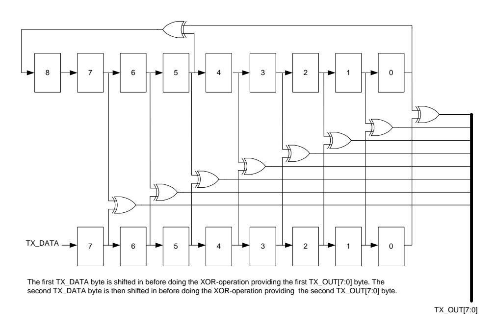

<span id="fig_18">**Figure 18:** Data Whitening in TX Mode</span>

### 15.2 Packet Format

The format of the data packet can be configured and consists of the following items (see [Figure 19\)](#fig_19):

- Preamble
- Synchronization word
- Optional length byte
- Optional address byte
- Payload
- Optional 2 byte CRC

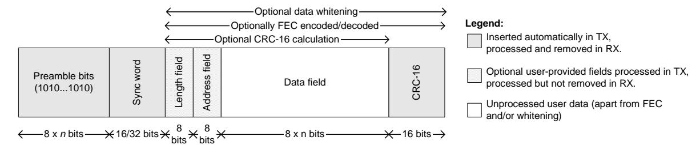

<span id="fig_19">**Figure 19:** Packet Format</span>

The preamble pattern is an alternating sequence of ones and zeros (10101010…). The minimum length of the preamble is programmable through the value of [MDMCFG1.NUM\\_PREAMBLE](#0x13-mdmcfg1--modem-configuration). When enabling TX, the modulator will start transmitting the preamble. When the programmed number of preamble bytes has been transmitted, the modulator will send the sync word and then data from the TX FIFO if data is available. If the TX FIFO is empty, the modulator will continue to send preamble bytes until the first byte is written to the TX FIFO. The modulator will then send the sync word and then the data bytes.

The synchronization word is a two-byte value set in the [SYNC1](#0x04-sync1--sync-word-high-byte) and [SYNC0](#0x05-sync0--sync-word-low-byte) registers. The sync word provides byte synchronization of the incoming packet. A one-byte sync word can be emulated by setting the [SYNC1](#0x04-sync1--sync-word-high-byte) value to the preamble pattern. It is also possible to emulate a 32 bit sync word by setting [MDMCFG2.SYNC\\_MODE](#0x12-mdmcfg2--modem-configuration) to 3 or 7. The sync word will then be repeated twice.

CC1101 supports both constant packet length protocols and variable length protocols. Variable or fixed packet length mode can be used for packets up to 255 bytes. For longer packets, infinite packet length mode must be used.

Fixed packet length mode is selected by setting [PKTCTRL0.LENGTH\\_CONFIG=](#0x08-pktctrl0--packet-automation-control)0. The desired packet length is set by the [PKTLEN](#0x06-pktlen--packet-length) register. This value must be different from 0.

In variable packet length mode, [PKTCTRL0.LENGTH\\_CONFIG=](#0x08-pktctrl0--packet-automation-control)1, the packet length is configured by the first byte after the sync word. The packet length is defined as the payload data, excluding the length byte and the optional CRC. The [PKTLEN](#0x06-pktlen--packet-length) register is used to set the maximum packet length allowed in RX. Any packet received with a length byte with a value greater than [PKTLEN](#0x06-pktlen--packet-length) will be discarded. The [PKTLEN](#0x06-pktlen--packet-length) value must be different from 0.The first byte written to the TXFIFO must be different from 0.

With [PKTCTRL0.LENGTH\\_CONFIG=](#0x08-pktctrl0--packet-automation-control)2, the packet length is set to infinite and transmission and reception will continue until turned off manually. As described in the next section, this can be used to support packet formats with different length configuration than natively supported by CC1101. One should make sure that TX mode is not turned off during the transmission of the first half of any byte. Refer to the CC1101 Errata Notes [\[3\]](#ref_3) for more details.

**Note:** The minimum packet length supported (excluding the optional length byte and CRC) is one byte of payload data.

#### 15.2.1 Arbitrary Length Field Configuration

The packet length register, [PKTLEN](#0x06-pktlen--packet-length), can be reprogrammed during receive and transmit. In combination with fixed packet length mode ([PKTCTRL0.LENGTH\\_CONFIG=](#0x08-pktctrl0--packet-automation-control)0), this opens the possibility to have a different length field configuration than supported for variable length packets (in variable packet length mode the length byte is the first byte after the sync word). At the start of reception, the packet length is set to a large value. The MCU reads out enough bytes to interpret the length field in the packet. Then the [PKTLEN](#0x06-pktlen--packet-length) value is set according to this value. The end of packet will occur when the byte counter in the packet handler is equal to the [PKTLEN](#0x06-pktlen--packet-length) register. Thus, the MCU must be able to program the correct length, before the internal counter reaches the packet length.

#### 15.2.2 Packet Length > 255

The packet automation control register, [PKTCTRL0,](#0x08-pktctrl0--packet-automation-control) can be reprogrammed during TX and RX. This opens the possibility to transmit and receive packets that are longer than 256 bytes and still be able to use the packet handling hardware support. At the start of the packet, the infinite packet length mode ([PKTCTRL0.LENGTH\\_CONFIG=](#0x08-pktctrl0--packet-automation-control)2) must be active. On the TX side, the [PKTLEN](#0x06-pktlen--packet-length) register is set to mod(length, 256). On the RX side the MCU reads out enough bytes to interpret the length field in the packet and sets the [PKTLEN](#0x06-pktlen--packet-length) register to mod(length, 256). When less than 256 bytes remains of the packet, the MCU disables infinite packet length mode and activates fixed packet length mode. When the internal byte counter reaches the [PKTLEN](#0x06-pktlen--packet-length) value, the transmission or reception ends (the radio enters the state determined by [TXOFF\\_MODE](#0x17-mcsm1-main-radio-control-state-machine-configuration) or [RXOFF\\_MODE\)](#0x17-mcsm1-main-radio-control-state-machine-configuration). Automatic CRC appending/checking can also be used (by setting [PKTCTRL0.CRC\\_EN=](#0x08-pktctrl0--packet-automation-control)1).

When for example a 600-byte packet is to be transmitted, the MCU should do the following (see also [Figure 20\)](#fig_20)

- Set [PKTCTRL0.LENGTH\\_CONFIG=](#0x08-pktctrl0--packet-automation-control)2.
- Pre-program the [PKTLEN](#0x06-pktlen--packet-length) register to mod(600, 256) = 88.
- Transmit at least 345 bytes (600 255), for example by filling the 64-byte TX FIFO six times (384 bytes transmitted).
- Set [PKTCTRL0.LENGTH\\_CONFIG=](#0x08-pktctrl0--packet-automation-control)0.
- The transmission ends when the packet counter reaches 88. A total of 600 bytes are transmitted.

Internal byte counter in packet handler counts from 0 to 255 and then starts at 0 again

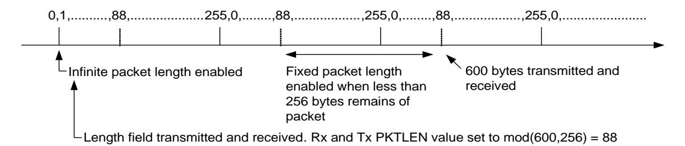

<span id="fig_20">**Figure 20:** Packet Length > 255</span>

### 15.3 Packet Filtering in Receive Mode

CC1101 supports three different types of packet-filtering; address filtering, maximum length filtering, and CRC filtering.

#### 15.3.1 Address Filtering

Setting [PKTCTRL1.ADR\\_CHK](#0x07-pktctrl1--packet-automation-control) to any other value than zero enables the packet address filter. The packet handler engine will compare the destination address byte in the packet with the programmed node address in the [ADDR](#0x08-pktctrl0--packet-automation-control) register and the 0x00 broadcast address when [PKTCTRL1.ADR\\_CHK=](#0x07-pktctrl1--packet-automation-control)10 or both the 0x00 and 0xFF broadcast addresses when [PKTCTRL1.ADR\\_CHK=](#0x07-pktctrl1--packet-automation-control)11. If the received address matches a valid address, the packet is received and written into the RX FIFO. If the address match fails, the packet is discarded and receive mode restarted (regardless of the [MCSM1.RXOFF\\_MODE](#0x17-mcsm1-main-radio-control-state-machine-configuration) setting).

If the received address matches a valid address when using infinite packet length mode and address filtering is enabled, 0xFF will be written into the RX FIFO followed by the address byte and then the payload data.

#### 15.3.2 Maximum Length Filtering

In variable packet length mode, [PKTCTRL0.LENGTH\\_CONFIG=](#0x08-pktctrl0--packet-automation-control)1, the [PKTLEN.PACKET\\_LENGTH](#0x06-pktlen--packet-length) register value is used to set the maximum allowed packet length. If the received length byte has a larger value than this, the packet is discarded and receive mode restarted (regardless of the [MCSM1.RXOFF\\_MODE](#0x17-mcsm1-main-radio-control-state-machine-configuration) setting).

#### 15.3.3 CRC Filtering

The filtering of a packet when CRC check fails is enabled by setting [PKTCTRL1.CRC\\_AUTOFLUSH=](#0x07-pktctrl1--packet-automation-control)1. The CRC auto flush function will flush the entire RX FIFO if the CRC check fails. After auto flushing the RX FIFO, the next state depends on the [MCSM1.RXOFF\\_MODE](#0x17-mcsm1-main-radio-control-state-machine-configuration) setting.

When using the auto flush function, the maximum packet length is 63 bytes in variable packet length mode and 64 bytes in fixed packet length mode. Note that when [PKTCTRL1.APPEND\\_STATUS](#0x07-pktctrl1--packet-automation-control) is enabled, the maximum allowed packet length is reduced by two bytes in order to make room in the RX FIFO for the two status bytes appended at the end of the packet. Since the entire RX FIFO is flushed when the CRC check fails, the previously received packet must be read out of the FIFO before receiving the current packet. The MCU must not read from the current packet until the CRC has been checked as OK.

### 15.4 Packet Handling in Transmit Mode

The payload that is to be transmitted must be written into the TX FIFO. The first byte written must be the length byte when variable packet length is enabled. The length byte has a value equal to the payload of the packet (including the optional address byte). If address recognition is enabled on the receiver, the second byte written to the TX FIFO must be the address byte.

If fixed packet length is enabled, the first byte written to the TX FIFO should be the address (assuming the receiver uses address recognition).

The modulator will first send the programmed number of preamble bytes. If data is available in the TX FIFO, the modulator will send the two-byte (optionally 4-byte) sync word followed by the payload in the TX FIFO. If CRC is enabled, the checksum is calculated over all the data pulled from the TX FIFO, and the result is sent as two extra bytes following the payload data. If the TX FIFO runs empty before the complete packet has been transmitted, the radio will enter TXFIFO\_UNDERFLOW state. The only way to exit this state is by issuing an [SFTX](#26-general-purpose--test-output-control-pins) strobe. Writing to the TX FIFO after it has underflowed will not restart TX mode.

If whitening is enabled, everything following the sync words will be whitened. This is done before the optional FEC/Interleaver stage. Whitening is enabled by setting [PKTCTRL0.WHITE\\_DATA=](#0x08-pktctrl0--packet-automation-control)1.

If FEC/Interleaving is enabled, everything following the sync words will be scrambled by the interleaver and FEC encoded before being modulated. FEC is enabled by setting [MDMCFG1.FEC\\_EN=1](#0x13-mdmcfg1--modem-configuration).

### 15.5 Packet Handling in Receive Mode

In receive mode, the demodulator and packet handler will search for a valid preamble and the sync word. When found, the demodulator has obtained both bit and byte synchronization and will receive the first payload byte.

If FEC/Interleaving is enabled, the FEC decoder will start to decode the first payload byte. The interleaver will de-scramble the bits before any other processing is done to the data.

If whitening is enabled, the data will be dewhitened at this stage.

When variable packet length mode is enabled, the first byte is the length byte. The packet handler stores this value as the packet length and receives the number of bytes indicated by the length byte. If fixed packet length mode is used, the packet handler will accept the programmed number of bytes.

Next, the packet handler optionally checks the address and only continues the reception if the address matches. If automatic CRC check is enabled, the packet handler computes CRC and matches it with the appended CRC checksum.

At the end of the payload, the packet handler will optionally write two extra packet status bytes (see [Table 27](#table_27) and [Table 28\)](#11-microcontroller-interface-and-pin-configuration) that contain CRC status, link quality indication, and RSSI value.

### 15.6 Packet Handling in Firmware

When implementing a packet oriented radio protocol in firmware, the MCU needs to know when a packet has been received/transmitted. Additionally, for packets longer than 64 bytes, the RX FIFO needs to be read while in RX and the TX FIFO needs to be refilled while in TX. This means that the MCU needs to know the number of bytes that can be read from or written to the RX FIFO and TX FIFO respectively. There are two possible solutions to get the necessary status information:

#### a) Interrupt Driven Solution

The GDO pins can be used in both RX and TX to give an interrupt when a sync word has been received/transmitted or when a complete packet has been received/transmitted by setting [IOCFGx.GDOx\\_CFG=0x06](#291-configuration-register-details--registers-with-preserved-values-in-sleep-state). In addition, there are two configurations for the [IOCFGx.GDOx\\_CFG](#291-configuration-register-details--registers-with-preserved-values-in-sleep-state) register that can be used as an interrupt source to provide information on how many bytes that are in the RX FIFO and TX FIFO respectively. The [IOCFGx.GDOx\\_CFG=0x00](#291-configuration-register-details--registers-with-preserved-values-in-sleep-state) and the [IOCFGx.GDOx\\_CFG=0x01](#291-configuration-register-details--registers-with-preserved-values-in-sleep-state) configurations are associated with the RX FIFO while the [IOCFGx.GDOx\\_CFG=0x02](#291-configuration-register-details--registers-with-preserved-values-in-sleep-state) and the [IOCFGx.GDOx\\_CFG=0x03](#291-configuration-register-details--registers-with-preserved-values-in-sleep-state) configurations are associated with the TX FIFO. See [Table](#221-vco-and-pll-self-calibration)  [41](#221-vco-and-pll-self-calibration) for more information.

#### b) SPI Polling

The [PKTSTATUS](#293-status-register-details) register can be polled at a given rate to get information about the current GDO2 and GDO0 values respectively. The [RXBYTES](#293-status-register-details) and [TXBYTES](#293-status-register-details) registers can be polled at a given rate to get information about the number of bytes in the RX FIFO and TX FIFO respectively. Alternatively, the number of bytes in the RX FIFO and TX FIFO can be read from the chip status byte returned on the

MISO line each time a header byte, data byte, or command strobe is sent on the SPI bus.

It is recommended to employ an interrupt driven solution since high rate SPI polling reduces the RX sensitivity. Furthermore, as explained in Section 10.3 and the *CC1101* Errata Notes [3], when using SPI polling, there

is a small, but finite, probability that a single read from registers PKTSTATUS, RXBYTES and TXBYTES is being corrupt. The same is the case when reading the chip status byte.

Refer to the TI website for SW examples ([6] and [7]).

### 16 Modulation Formats

**CC1101** supports amplitude, frequency, and phase shift modulation formats. The desired modulation format is set in the MDMCFG2.MOD FORMAT register.

Optionally, the data stream can be Manchester coded by the modulator and decoded by the demodulator. This option is enabled by setting

MDMCFG2.MANCHESTER EN=1.

**Note:** Manchester encoding is not supported at the same time as using the FEC/Interleaver option or when using MSK and 4-FSK modulation.

#### 16.1 Frequency Shift Keying

**CC1101** supports both 2-FSK and 4-FSK modulation. 2-FSK can optionally be shaped by a Gaussian filter with BT = 0.5, producing a GFSK modulated signal. This spectrumshaping feature improves adjacent channel power (ACP) and occupied bandwidth. When selecting 4-FSK, the preamble and sync word is sent using 2-FSK (see Figure 21).

In 'true' 2-FSK systems with abrupt frequency shifting, the spectrum is inherently broad. By making the frequency shift 'softer', the spectrum can be made significantly narrower. Thus, higher data rates can be transmitted in the same bandwidth using GFSK.

When 2-FSK/GFSK/4-FSK modulation is used, the <code>DEVIATN</code> register specifies the expected frequency deviation of incoming signals in RX and should be the same as the TX deviation for demodulation to be performed reliably and robustly.

The frequency deviation is programmed with the <code>DEVIATION\_M</code> and <code>DEVIATION\_E</code> values in the <code>DEVIATN</code> register. The value has an exponent/mantissa form, and the resultant deviation is given by:

$$f_{dev} = \frac{f_{xosc}}{2^{17}} \cdot (8 + DEVIATION\_M) \cdot 2^{DEVIATION\_E}$$

The symbol encoding is shown in Table 29.

| Format | Symbol | Coding |
|-|-|-|
| 2-FSK/GFSK | '0' | - Deviation |
| 2-FSK/GFSK | '1' | + Deviation |
| 4-FSK | '01' | - Deviation |
| 4-FSK | '00' | - 1/3 · Deviation |
| 4-FSK | '10' | +1/3 · Deviation  |
| 4-FSK | '11' | + Deviation |

Table 29: Symbol Encoding for 2-FSK/GFSK and 4-FSK Modulation

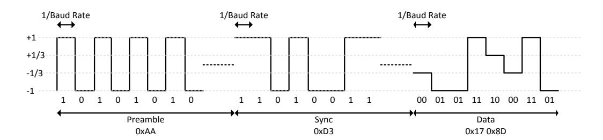

<span id="fig_21">**Figure 21:** Data Sent Over the Air (MDMCFG2.MOD\_FORMAT=100)</span>

#### 16.2 Minimum Shift Keying

When using MSK<sub>2</sub>, the complete transmission (preamble, sync word, and payload) will be MSK modulated.Phase shifts are performed with a constant transition time. The fraction of a symbol period used to change the phase can be modified with the [DEVIATN.DEVIATION\\_M](#0x15-deviatn---modem-deviation-setting) setting. This is equivalent to changing the shaping of the symbol. The [DEVIATN](#0x15-deviatn---modem-deviation-setting) register setting has no effect in RX when using MSK.

When using MSK, Manchester encoding/decoding should be disabled by setting [MDMCFG2.MANCHESTER\\_EN=](#0x12-mdmcfg2--modem-configuration)0.

The MSK modulation format implemented in CC1101 inverts the sync word and data compared to e.g. signal generators.

<sup>2</sup> Identical to offset QPSK with half-sine shaping (data coding may differ).

#### 16.3 Amplitude Modulation

CC1101 supports two different forms of amplitude modulation: On-Off Keying (OOK) and Amplitude Shift Keying (ASK).

OOK modulation simply turns the PA on or off to modulate ones and zeros respectively.

The ASK variant supported by the CC1101 allows programming of the modulation depth (the difference between 1 and 0), and shaping of the pulse amplitude. Pulse shaping produces a more bandwidth constrained output spectrum.

When using OOK/ASK, the AGC settings from the SmartRF Studio [\[5\]](#ref_5) preferred FSK/MSK settings are not optimum. DN022 [\[16\]](#ref_16) give guidelines on how to find optimum OOK/ASK settings from the preferred settings in SmartRF Studio [\[5\].](ref_5) The [DEVIATN](#0x15-deviatn---modem-deviation-setting) register setting has no effect in either TX or RX when using OOK/ASK.

## 17 Received Signal Qualifiers and Link Quality Information

CC1101 has several qualifiers that can be used to increase the likelihood that a valid sync word is detected:

- Sync Word Qualifier
- Preamble Quality Threshold
- RSSI
- Carrier Sense
- Clear Channel Assessment
- Link Quality Indicator

### 17.1 Sync Word Qualifier

If sync word detection in RX is enabled in the [MDMCFG2](#0x12-mdmcfg2--modem-configuration) register, the CC1101 will not start filling the RX FIFO and perform the packet filtering described in Section [15.3](#153-packet-filtering-in-receive-mode) before a valid sync word has been detected. The sync word qualifier mode is set by [MDMCFG2.SYNC\\_MODE](#0x12-mdmcfg2--modem-configuration) and is summarized in [Table 30.](#152-packet-format) Carrier sense in [Table 30](#table_30) is described in Section [17.4.](#174-carrier-sense-cs)

| MDMCFG2.SYNC_MODE | Sync Word Qualifier Mode |
|-|-|
| 000 | No preamble/sync |
| 001 | 15/16 sync word bits detected |
| 010 | 16/16 sync word bits detected |
| 011 | 30/32 sync word bits detected |
| 100 | No preamble/sync + carrier sense above threshold |
| 101 | 15/16 + carrier sense above threshold |
| 110 | 16/16 + carrier sense above threshold |
| 111 | 30/32 + carrier sense above threshold |

<span id="table_30">**Table 30:** Sync Word Qualifier Mode</span>

### 17.2 Preamble Quality Threshold (PQT)

The Preamble Quality Threshold (PQT) sync word qualifier adds the requirement that the received sync word must be preceded with a preamble with a quality above the programmed threshold.

Another use of the preamble quality threshold is as a qualifier for the optional RX termination timer. See Section 19.7 for details.

The preamble quality estimator increases an internal counter by one each time a bit is received that is different from the previous bit, and decreases the counter by eight each time a bit is received that is the same as the last bit.
The threshold is configured with the register field PKTCTRL1.PQT. A threshold of 4·PQT for this counter is used to gate sync word detection. By setting the value to zero, the preamble quality qualifier of the sync word is disabled.

A "Preamble Quality Reached" signal can be observed on one of the GDO pins by setting IOCFGx.GDOx\_CFG=8. It is also possible to determine if preamble quality is reached by checking the PQT\_REACHED bit in the PKTSTATUS register. This signal / bit asserts when the received signal exceeds the PQT.

### 17.3 RSSI

The RSSI value is an estimate of the signal power level in the chosen channel. This value is based on the current gain setting in the RX chain and the measured signal level in the channel

In RX mode, the RSSI value can be read continuously from the RSSI status register until the demodulator detects a sync word (when sync word detection is enabled). At that point the RSSI readout value is frozen until the next time the chip enters the RX state.

**Note**: It takes some time from the radio enters RX mode until a valid RSSI value is present in the RSSI register. Please see DN505 [12] for details on how the RSSI response time can be estimated.

The RSSI value is given in dBm with a  $\frac{1}{2}$  dB resolution. The RSSI update rate,  $f_{\text{RSSI}}$ , depends on the receiver filter bandwidth $(BW_{channel})$ is defined in Section 13) and AGCCTRLO.FILTER LENGTH.

$$f_{RSSI} = \frac{2 \cdot BW_{channel}}{8 \cdot 2^{FILTER\_LENGTH}}$$

If PKTCTRL1.APPEND\_STATUS is enabled, the last RSSI value of the packet is automatically added to the first byte appended after the payload.

The RSSI value read from the RSSI status register is a 2's complement number. The following procedure can be used to convert the RSSI reading to an absolute power level (RSSI\_dBm)

- 1) Read the RSSI status register
- 2) Convert the reading from a hexadecimal number to a decimal number (RSSI\_dec)
- 3) If RSSI\_dec ≥ 128 then RSSI\_dBm = (RSSI\_dec 256)/2 RSSI\_offset
- 4) Else if RSSI\_dec < 128 then RSSI\_dBm = (RSSI\_dec)/2 – RSSI\_offset

[Table 31](#table_31) gives typical values for the RSSI\_offset. [Figure 22](#fig_22) and [Figure 23](#fig_23) show typical plots of RSSI readings as a function of input power level for different data rates.

| Data rate [kBaud] | RSSI_offset [dB], 433 MHz | RSSI_offset [dB], 868 MHz |
|-|-|-|
| 1.2 | 74 | 74 |
| 38.4 | 74 | 74 |
| 250 | 74 | 74 |
| 500 | 74 | 74 |

<span id="table_31">**Table 31:** Typical RSSI\_offset Values</span>

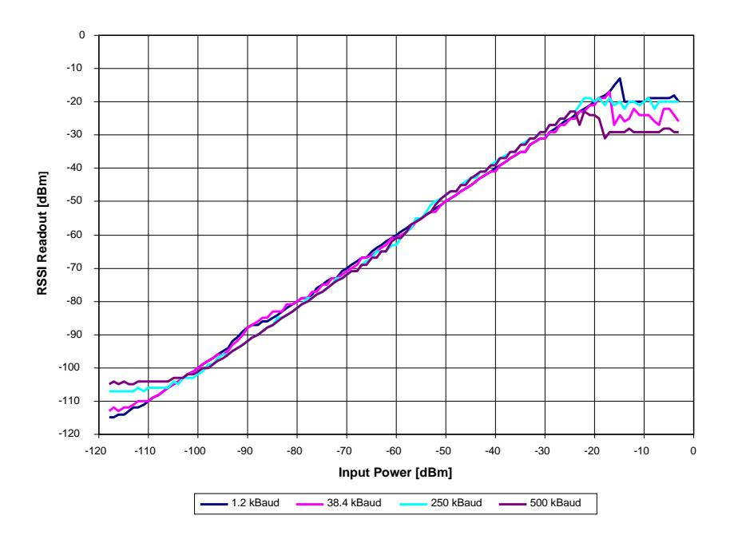

<span id="fig_22">**Figure 22:** Typical RSSI Value vs. Input Power Level for Different Data Rates at 433 MHz</span>
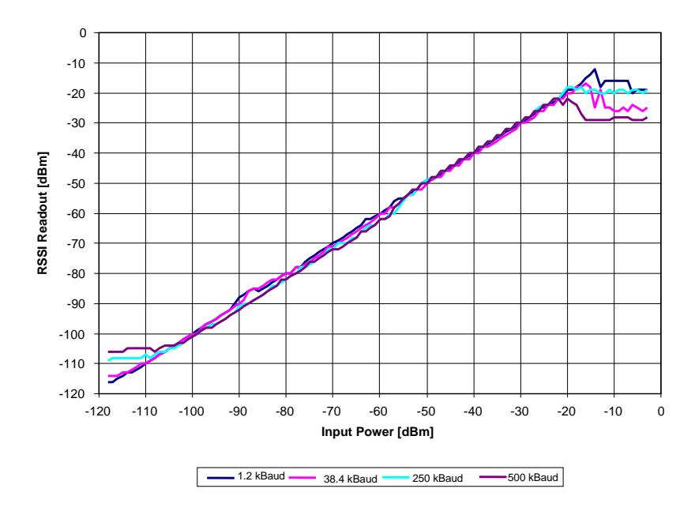

<span id="fig_23">**Figure 23:** Typical RSSI Value vs. Input Power Level for Different Data Rates at 868 MHz</span>

### 17.4 Carrier Sense (CS)

Carrier sense (CS) is used as a sync word qualifier and for Clear Channel Assessment (see Section [17.5\)](#1742-cs-relative-threshold). CS can be asserted based on two conditions which can be individually adjusted:

- CS is asserted when the RSSI is above a programmable absolute threshold, and deasserted when RSSI is below the same threshold (with hysteresis). See more in Section [17.4.1.](#17-received-signal-qualifiers-and-link-quality-information)
- CS is asserted when the RSSI has increased with a programmable number of dB from one RSSI sample to the next, and de-asserted when RSSI has decreased with the same number of dB. This setting is not dependent on the absolute signal level and is thus useful to detect signals in environments with time varying noise floor. See more in Section [17.4.2.](#1742-cs-relative-threshold)

Carrier sense can be used as a sync word qualifier that requires the signal level to be higher than the threshold for a sync word search to be performed and is set by setting [MDMCFG2](#0x12-mdmcfg2--modem-configuration) The carrier sense signal can be observed on one of the GDO pins by setting [IOCFGx.GDOx\\_CFG=](#291-configuration-register-details--registers-with-preserved-values-in-sleep-state)14 and in the status register bit [PKTSTATUS.CS](#293-status-register-details).

Other uses of Carrier sense include the TX-if-CCA function (see Section [17.5\)](#1742-cs-relative-threshold) and the optional fast RX termination (see Section [19.7\)](#197-rx-termination-timer).

CS can be used to avoid interference from other RF sources in the ISM bands.

#### 17.4.1 CS Absolute Threshold

The absolute threshold related to the RSSI value depends on the following register fields:

- [AGCCTRL2.MAX\\_LNA\\_GAIN](#0x20-worctrl--wake-on-radio-control)
- [AGCCTRL2.MAX\\_DVGA\\_GAIN](#0x20-worctrl--wake-on-radio-control)
- [AGCCTRL1.CARRIER\\_SENSE\\_ABS\\_THR](#0x21-frend1--front-end-rx-configuration)
- [AGCCTRL2.MAGN\\_TARGET](#0x20-worctrl--wake-on-radio-control)

For given [AGCCTRL2.MAX\\_LNA\\_GAIN](#0x20-worctrl--wake-on-radio-control) and [AGCCTRL2.MAX\\_DVGA\\_GAIN](#0x20-worctrl--wake-on-radio-control) settings, the absolute threshold can be adjusted ±7 dB in steps of 1 dB using [CARRIER\\_SENSE\\_ABS\\_THR](#0x21-frend1--front-end-rx-configuration).

The [MAGN\\_TARGET](#0x20-worctrl--wake-on-radio-control) setting is a compromise between blocker tolerance/selectivity and sensitivity. The value sets the desired signal level in the channel into the demodulator. Increasing this value reduces the headroom for blockers, and therefore close-in selectivity. It is strongly recommended to use SmartRF Studio [\[5\]](#ref_5) to generate the correct [MAGN\\_TARGET](#0x20-worctrl--wake-on-radio-control) setting. [Table 32](#table_32) and [Table](#175-clear-channel-assessment-cca) [33](#175-clear-channel-assessment-cca) show the typical RSSI readout values at the CS threshold at 2.4 kBaud and 250 kBaud data rate respectively. The default reset value for [CARRIER\\_SENSE\\_ABS\\_THR](#0x21-frend1--front-end-rx-configuration) = 0 (0 dB) has been used. [MAGN\\_TARGET](#0x20-worctrl--wake-on-radio-control) = 3 (33 dB) and 7 (42 dB) have been used for 2.4 kBaud and 250 kBaud data rate respectively. For other data rates, the user must generate similar tables to find the CS absolute threshold.

If the threshold is set high, i.e. only strong signals are wanted, the threshold should be adjusted upwards by first reducing the [MAX\\_LNA\\_GAIN](#0x20-worctrl--wake-on-radio-control) value and then the [MAX\\_DVGA\\_GAIN](#0x20-worctrl--wake-on-radio-control) value. This will reduce power consumption in the receiver front end, since the highest gain settings are avoided.

| MAX_LNA_GAIN[2:0] | | MAX_DVGA_GAIN[1:0] | | |
|-|-|-|-|-|
| | 00 | 01 | 10 | 11 |
| 000 | -97.5 | -91.5 | -85.5 | -79.5 |
| 001 | -94 | -88 | -82.5 | -76 |
| 010 | -90.5 | -84.5 | -78.5 | -72.5 |
| 011 | -88 | -82.5 | -76.5 | -70.5 |
| 100 | -85.5 | -80 | -73.5 | -68 |
| 101 | -84 | -78 | -72 | -66 |
| 110 | -82 | -76 | -70 | -64 |
| 111 | -79 | -73.5 | -67 | -61 |

<span id="table_32">**Table 32:** Typical RSSI Value in dBm at CS Threshold with [MAGN\\_TARGET](#0x20-worctrl--wake-on-radio-control) = 3 (33 dB) at 2.4 kBaud, 868 MHz</span>

| MAX_LNA_GAIN[2:0] | | MAX_DVGA_GAIN[1:0] | | |
|-|-|-|-|-|
| | 00 | 01 | 10 | 11 |
| 000 | -90.5 | -84.5 | -78.5 | -72.5 | |
| 001 | -88 | -82 | -76 | -70 | |
| 010 | -84.5 | -78.5 | -72 | -66 | |
| 011 | -82.5 | -76.5 | -70 | -64 | |
| 100 | -80.5 | -74.5 | -68 | -62 | |
| 101 | -78 | -72 | -66 | -60 | |
| 110 | -76.5 | -70 | -64 | -58 | |
| 111 | -74.5 | -68 | -62 | -56 | |
<span id="table_33">**Table 33:** Typical RSSI Value in dBm at CS Threshold with [MAGN\\_TARGET](#0x20-worctrl--wake-on-radio-control) = 7 (42 dB) at 250 kBaud, 868 MHz</span>

#### 17.4.2 CS Relative Threshold

The relative threshold detects sudden changes in the measured signal level. This setting does not depend on the absolute signal level and is thus useful to detect signals in environments with a time varying noise floor. The register field [AGCCTRL1.CARRIER\\_SENSE\\_REL\\_THR](#0x21-frend1--front-end-rx-configuration) is used to enable/disable relative CS, and to select threshold of 6 dB, 10 dB, or 14 dB RSSI change.

### 17.5 Clear Channel Assessment (CCA)

The Clear Channel Assessment (CCA) is used to indicate if the current channel is free or busy. The current CCA state is viewable on any of the GDO pins by setting [IOCFGx.GDOx\\_CFG=](#291-configuration-register-details--registers-with-preserved-values-in-sleep-state)0x09.

[MCSM1.CCA\\_MODE](#0x17-mcsm1-main-radio-control-state-machine-configuration) selects the mode to use when determining CCA.

When the [STX](#26-general-purpose--test-output-control-pins) or [SFSTXON](#26-general-purpose--test-output-control-pins) command strobe is given while CC1101 is in the RX state, the TX or FSTXON state is only entered if the clear channel requirements are fulfilled. Otherwise, the chip will remain in RX. If the channel then

becomes available, the radio will not enter TX or FSTXON state before a new strobe command is sent on the SPI interface. This feature is called TX-if-CCA. Four CCA requirements can be programmed:

- Always (CCA disabled, always goes to TX)
- If RSSI is below threshold
- Unless currently receiving a packet
- Both the above (RSSI below threshold and not currently receiving a packet)

### 17.6 Link Quality Indicator (LQI)

The Link Quality Indicator is a metric of the current quality of the received signal. If [PKTCTRL1.APPEND\\_STATUS](#0x07-pktctrl1--packet-automation-control) is enabled, the value is automatically added to the last byte appended after the payload. The value can also be read from the [LQI](#293-status-register-details) status register. The LQI gives an estimate of how easily a received signal can be demodulated by accumulating the magnitude of the error between ideal constellations and the received signal over the 64 symbols immediately following the sync word. LQI is best used as a relative measurement of the link quality (a low value indicates a better link than what a high value does), since the value is dependent on the modulation format.

## 18 Forward Error Correction with Interleaving

### 18.1 Forward Error Correction (FEC)

CC1101 has built in support for Forward Error Correction (FEC). To enable this option, set [MDMCFG1.FEC\\_EN](#0x13-mdmcfg1--modem-configuration) to 1. FEC is only supported in fixed packet length mode, i.e. when [PKTCTRL0.LENGTH\\_CONFIG=](#0x08-pktctrl0--packet-automation-control)0. FEC is employed on the data field and CRC word in order to reduce the gross bit error rate when operating near the sensitivity limit. Redundancy is added to the transmitted data in such a way that the receiver can restore the original data in the presence of some bit errors.

The use of FEC allows correct reception at a lower Signal-to-Noise Ratio (SNR), thus extending communication range if the receiver bandwidth remains constant. Alternatively, for a given SNR, using FEC decreases the bit error rate (BER). The packet error rate (PER) is related to BER by

$$PER = 1 - (1 - BER)^{packet\_length}$$

A lower BER can therefore be used to allow longer packets, or a higher percentage of packets of a given length, to be transmitted successfully. Finally, in realistic ISM radio environments, transient and time-varying phenomena will produce occasional errors even in otherwise good reception conditions. FEC will mask such errors and, combined with interleaving of the coded data, even correct relatively long periods of faulty reception (burst errors).

The FEC scheme adopted for CC1101 is convolutional coding, in which *n* bits are generated based on *k* input bits and the *m* most recent input bits, forming a code stream able to withstand a certain number of bit errors between each coding state (the *m*-bit window).

The convolutional coder is a rate ½ code with a constraint length of *m* = 4. The coder codes one input bit and produces two output bits; hence, the effective data rate is halved. This means that in order to transmit at the same effective data rate when using FEC, it is necessary to use twice as high over-the-air data rate. This will require a higher receiver bandwidth, and thus reduce sensitivity. In other words the improved reception by using FEC and the degraded sensitivity from a higher receiver bandwidth will be counteracting factors. See Design Note DN504 for more details [\[19\].](ref_19)

### 18.2 Interleaving

Data received through radio channels will often experience burst errors due to interference and time-varying signal strengths. In order to increase the robustness to errors spanning multiple bits, interleaving is used when FEC is enabled. After de-interleaving, a continuous span of errors in the received stream will become single errors spread apart.

CC1101 employs matrix interleaving, which is illustrated in [Figure 24.](#fig_24) The on-chip interleaving and de-interleaving buffers are 4 x 4 matrices. In the transmitter, the data bits from the rate ½ convolutional coder are written into the rows of the matrix, whereas the bit sequence to be transmitted is read from the columns of the matrix. Conversely, in the receiver, the received symbols are written into the rows of the matrix, whereas the data passed onto the convolutional decoder is read from the columns of the matrix.

CC1101 employs a 4x4 matrix interleaver with 2 bits (one encoder output symbol) per cell and the amount of data transmitted over the air will thus always be a multiple of four bytes (see DN507 [\[20\]](#ref_20) for more details). When FEC and interleaving is used, at least one extra byte is required for trellis termination and the packet control hardware therefore automatically inserts one or two extra bytes at the end of the packet. These bytes will be invisible to the user, as they are removed before the received packet enters the RXFIFO.

When FEC and interleaving is used the minimum data payload is 2 bytes.

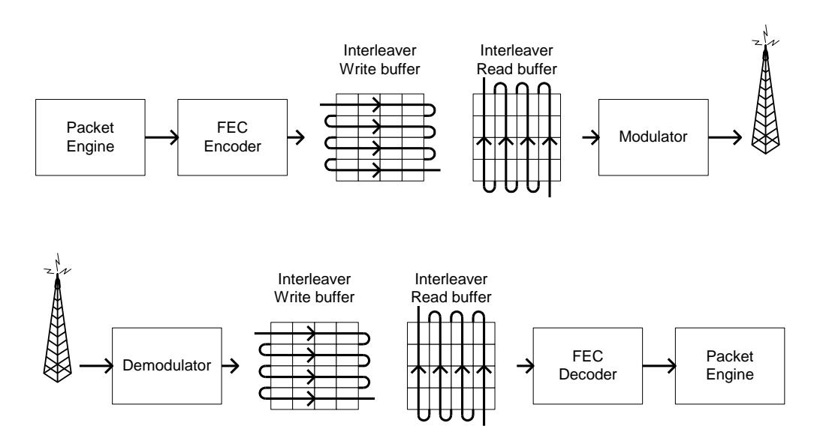

<span id="fig_24">**Figure 24:** General Principle of Matrix Interleaving</span>

## 19 Radio Control


<span id="fig_25">**Figure 25:** Complete Radio Control State Diagram</span>

**CC1101** has a built-in state machine that is used to switch between different operational states (modes). The change of state is done either by using command strobes or by internal events such as TX FIFO underflow.

A simplified state diagram, together with typical usage and current consumption, is shown in Figure 13 on page 28. The complete radio control state diagram is shown in Figure 25. The numbers refer to the state number readable in the MARCSTATE status register. This register is primarily for test purposes.

### 19.1 Power-On Start-Up Sequence

When the power supply is turned on, the system must be reset. This is achieved by one of the two sequences described below, i.e. automatic power-on reset (POR) or manual reset. After the automatic power-on reset or manual reset, it is also recommended to change the signal that is output on the GDO0 pin. The default setting is to output a clock signal with a frequency of CLK\_XOSC/192. However, to optimize performance in TX and RX, an alternative GDO setting from the settings found in [Table 41](#table_41) on page 62 should be selected.

#### 19.1.1 Automatic POR

A power-on reset circuit is included in the CC1101. The minimum requirements stated in [Table 18](#table_18) must be followed for the power-on reset to function properly. The internal powerup sequence is completed when [CHIP\\_RDYn](#101-chip-status-byte) goes low. [CHIP\\_RDYn](#101-chip-status-byte) is observed on the SO pin after CSn is pulled low. See Section [10.1](#102-register-access) for more details on [CHIP\\_RDYn](#101-chip-status-byte).

When the CC1101 reset is completed, the chip will be in the IDLE state and the crystal oscillator will be running. If the chip has had sufficient time for the crystal oscillator to stabilize after the power-on-reset, the SO pin will go low immediately after taking CSn low. If CSn is taken low before reset is completed, the SO pin will first go high, indicating that the crystal oscillator is not stabilized, before going low as shown in [Figure 26.](#fig_26)

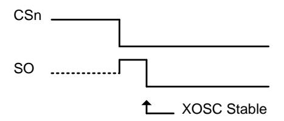

<span id="fig_26">**Figure 26:** Power-On Reset</span>

#### 19.1.2 Manual Reset

The other global reset possibility on CC1101 uses the [SRES](#26-general-purpose--test-output-control-pins) command strobe. By issuing this strobe, all internal registers and states are set to the default, IDLE state. The manual power-up sequence is as follows (see [Figure](#fig_27)  [27\)](#fig_27):

- Set SCLK = 1 and SI = 0, to avoid potential problems with pin control mode (see Section [11.3\)](#103-spi-read).
- Strobe CSn low / high.
- Hold CSn low and then high for at least 40 µs relative to pulling CSn low
- Pull CSn low and wait for SO to go low ([CHIP\\_RDYn](#101-chip-status-byte)).
- Issue the [SRES](#26-general-purpose--test-output-control-pins) strobe on the SI line.
- When SO goes low again, reset is complete and the chip is in the IDLE state.

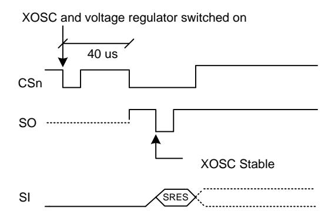

<span id="fig_27">**Figure 27:** Power-On Reset with [SRES](#26-general-purpose--test-output-control-pins)</span>

Note that the above reset procedure is only required just after the power supply is first turned on. If the user wants to reset the CC1101 after this, it is only necessary to issue an [SRES](#26-general-purpose--test-output-control-pins) command strobe.

### 19.2 Crystal Control

The crystal oscillator (XOSC) is either automatically controlled or always on, if [MCSM0.XOSC\\_FORCE\\_ON](#0x18-mcsm0-main-radio-control-state-machine-configuration) is set.

In the automatic mode, the XOSC will be turned off if the [SXOFF](#26-general-purpose--test-output-control-pins) or [SPWD](#26-general-purpose--test-output-control-pins) command strobes are issued; the state machine then goes to XOFF or SLEEP respectively. This can only be done from the IDLE state. The XOSC will be turned off when CSn is released (goes high). The XOSC will be automatically turned on again when CSn goes low. The state machine will then go to the IDLE state. The SO pin on the SPI interface must be pulled low before the SPI interface is ready to be used as described in Section [10.1.](#102-register-access)

If the XOSC is forced on, the crystal will always stay on even in the SLEEP state.

Crystal oscillator start-up time depends on crystal ESR and load capacitances. The electrical specification for the crystal oscillator can be found in Section [4.4.](#1-absolute-maximum-ratings)


### 19.3 Voltage Regulator Control

The voltage regulator to the digital core is controlled by the radio controller. When the chip enters the SLEEP state which is the state with the lowest current consumption, the voltage regulator is disabled. This occurs after CSn is released when a [SPWD](#26-general-purpose--test-output-control-pins) command strobe has been sent on the SPI interface. The chip is then in the SLEEP state. Setting CSn low again will turn on the regulator and crystal oscillator and make the chip enter the IDLE state.

When Wake on Radio is enabled, the WOR module will control the voltage regulator as described in Section [19.5.](#191-power-on-start-up-sequence)

### 19.4 Active Modes (RX and TX)

CC1101 has two active modes: receive and transmit. These modes are activated directly by the MCU by using the [SRX](#26-general-purpose--test-output-control-pins) and [STX](#26-general-purpose--test-output-control-pins)  command strobes, or automatically by Wake on Radio.

The frequency synthesizer must be calibrated regularly. CC1101 has one manual calibration option (using the [SCAL](#26-general-purpose--test-output-control-pins) strobe), and three automatic calibration options that are controlled by the [MCSM0.FS\\_AUTOCAL](#0x18-mcsm0-main-radio-control-state-machine-configuration) setting:

- Calibrate when going from IDLE to either RX or TX (or FSTXON)
-  Calibrate when going from either RX or TX to IDLE automatically<sup>3</sup>
- Calibrate every fourth time when going from either RX or TX to IDLE automaticall[y](#191-power-on-start-up-sequence)<sup>3</sup>

If the radio goes from TX or RX to IDLE by issuing an [SIDLE](#26-general-purpose--test-output-control-pins) strobe, calibration will not be performed. The calibration takes a constant number of XOSC cycles; see [Table 34](#table_34) for timing details regarding calibration.

When RX is activated, the chip will remain in receive mode until a packet is successfully received or the RX termination timer expires (see Section [19.7\)](#197-rx-termination-timer). The probability that a false sync word is detected can be reduced by using PQT, CS, maximum sync word length, and sync word qualifier mode as described in Section [17.](#15-packet-handling-hardware-support) After a packet is successfully received, the radio controller goes to the state indicated by the [MCSM1.RXOFF\\_MODE](#0x17-mcsm1-main-radio-control-state-machine-configuration) setting. The possible destinations are:

- IDLE
- FSTXON: Frequency synthesizer on and ready at the TX frequency. Activate TX with [STX](#26-general-purpose--test-output-control-pins)
- TX: Start sending preamble
- RX: Start search for a new packet

**Note:** When [MCSM1.RXOFF\\_MODE=](#0x17-mcsm1-main-radio-control-state-machine-configuration)11 and a packet has been received, it will take some time before a valid RSSI value is present in the [RSSI](#293-status-register-details) register again even if the radio has never exited RX mode. This time is the same as the RSSI response time discussed in DN505 [\[12\].](ref_12)

Similarly, when TX is active the chip will remain in the TX state until the current packet has been successfully transmitted. Then the state will change as indicated by the [MCSM1.TXOFF\\_MODE](#0x17-mcsm1-main-radio-control-state-machine-configuration) setting. The possible destinations are the same as for RX.

The MCU can manually change the state from RX to TX and vice versa by using the command strobes. If the radio controller is currently in transmit and the [SRX](#26-general-purpose--test-output-control-pins) strobe is used, the current transmission will be ended and the transition to RX will be done.

If the radio controller is in RX when the [STX](#26-general-purpose--test-output-control-pins) or [SFSTXON](#26-general-purpose--test-output-control-pins) command strobes are used, the TXif-CCA function will be used. If the channel is not clear, the chip will remain in RX. The [MCSM1.CCA\\_MODE](#0x17-mcsm1-main-radio-control-state-machine-configuration) setting controls the conditions for clear channel assessment. See Section [17.5](#176-link-quality-indicator-lqi) for details.

The [SIDLE](#26-general-purpose--test-output-control-pins) command strobe can always be used to force the radio controller to go to the IDLE state.

<sup>3</sup> Not forced in IDLE by issuing an SIDLE strobe

### 19.5 Wake On Radio (WOR)

The optional Wake on Radio (WOR) functionality enables **CC1101** to periodically wake up from SLEEP and listen for incoming packets without MCU interaction.

When the SWOR strobe command is sent on the SPI interface, the **CC1101** will go to the SLEEP state when CSn is released. The RC oscillator must be enabled before the SWOR strobe can be used, as it is the clock source for the WOR timer. The on-chip timer will set **CC1101** into IDLE state and then RX state. After a programmable time in RX, the chip will go back to the SLEEP state, unless a packet is received. See Figure 28 and Section 19.7 for details on how the timeout works.

To exit WOR mode, set the **CC1101** into the IDLE state

**CC1101** can be set up to signal the MCU that a packet has been received by using the GDO pins. If a packet is received, the MCSM1.RXOFF\_MODE will determine the behaviour at the end of the received packet. When the MCU has read the packet, it can put the chip back into SLEEP with the SWOR strobe from the IDLE state.

**Note:** The FIFO looses its content in the SLEEP state.

The WOR timer has two events, Event 0 and Event 1. In the SLEEP state with WOR activated, reaching Event 0 will turn on the digital regulator and start the crystal oscillator. Event 1 follows Event 0 after a programmed timeout.

The time between two consecutive Event 0 is programmed with a mantissa value given by WOREVT1.EVENTO and WOREVTO.EVENTO, and an exponent value set by WORCTRL.WOR RES. The equation is:

$$t_{Event0} = \frac{750}{f_{XOSC}} \cdot EVENT 0 \cdot 2^{5 \cdot WOR\_RES}$$

The Event 1 timeout is programmed with WORCTRL.EVENT1. Figure 28 shows the timing relationship between Event 0 timeout and Event 1 timeout.


<span id="fig_28">**Figure 28:** Event 0 and Event 1 Relationship</span>

The time from the *CC1101* enters SLEEP state until the next Event0 is programmed to appear,  $t_{SLEEP}$  in Figure 28, should be larger than 11.08 ms when using a 26 MHz crystal and 10.67 ms when a 27 MHz crystal is used. If  $t_{SLEEP}$  is less than 11.08 (10.67) ms, there is a chance that the consecutive Event 0 will occur

$\frac{750}{f_{xosc}} \cdot 128$ seconds

too early. Application Note AN047 [4] explains in detail the theory of operation and the different registers involved when using WOR, as well as highlighting important aspects when using WOR mode.

#### 19.5.1 RC Oscillator and Timing

The frequency of the low-power RC oscillator used for the WOR functionality varies with temperature and supply voltage. In order to keep the frequency as accurate as possible, the RC oscillator will be calibrated whenever possible, which is when the XOSC is running and the chip is not in the SLEEP state. When the power and XOSC are enabled, the clock used by the WOR timer is a divided XOSC clock. When the chip goes to the sleep state, the RC oscillator will use the last valid calibration result. The frequency of the RC oscillator is locked to the main crystal frequency divided by 750.

In applications where the radio wakes up very often, typically several times every second, it is possible to do the RC oscillator calibration once and then turn off calibration to reduce the current consumption. This is done by setting WORCTRL.RC\_CAL=0 and requires that RC oscillator calibration values are read from registers RCCTRL0\_STATUS and RCCTRL1 STATUS and written back to [RCCTRL0](#292-configuration-register-details--registers-that-loose-programming-in-sleep-state) and [RCCTRL1](#292-configuration-register-details--registers-that-loose-programming-in-sleep-state) respectively. If the RC oscillator calibration is turned off, it will have to be manually turned on again if temperature and supply voltage changes. Refer to Application Note AN047 [\[4\]](#ref_4) for further details.

### 19.6 Timing

#### 19.6.1 Overall State Transition Times

The main radio controller needs to wait in certain states in order to make sure that the internal analog/digital parts have settled down and are ready to operate in the new states. A number of factors are important for the state transition times:

- The crystal oscillator frequency, fxosc
- PA ramping enabled or not
- The data rate in cases where PA ramping is enabled
- The value of the TEST0, TEST1, and FSCAL3 registers

[Table 34](#table_34) shows timing in crystal clock cycles for key state transitions.

Power on time and XOSC start-up times are variable, but within the limits stated in [Table](#2-operating-conditions)  [13.](#2-operating-conditions)

Note that TX to IDLE and TX to RX transition times are functions of data rate (fbaudrate). When PA ramping is enabled (i.e. FREND0.PA\_POWER≠000b), TX to IDLE and TX to RX will require (FREND0.PA\_POWER)/8∙fbaudrate longer times than the times stated in [Table 34.](#196-timing)

| Description | Transition Time<br>(no PA ramping) | Transition Time [µs] |
|-|-|-|
| IDLE to RX, no calibration | $1953/ f_{xosc}$ | 75.1 |
| IDLE to RX, with calibration | $1953/ f_{xosc}$ + FS calibration Time | 799 |
| IDLE to TX/FSTXON, no calibration | $1954/ f_{xosc}$ | 75.2 |
| IDLE to TX/FSTXON, with calibration | $1953/ f_{xosc}$ + FS calibration Time | 799 |
| TX to RX switch | $782/ f_{xosc} + 0.25/ f_{baudrate}$ | 31.1 |
| RX to TX switch | $782/ f_{xosc}$ | 30.1 |
| TX to IDLE, no calibration | $\sim 0.25/ f_{baudrate}$ | ~1 |
| TX to IDLE, with calibration | $\sim 0.25/ f_{baudrate}$ + FS calibration Time | 725 |
| RX to IDLE, no calibration | $2/f_{xosc}$ | ~0.1 |
| RX to IDLE, with calibration | $2/f_{xosc}$ + FS calibration Time | 724 |
| Manual calibration | $283/f_{xosc}$ + FS calibration Time | 735 |

<span id="table_34">**Table 34:** Overall State Transition Times (Example for 26 MHz crystal oscillator, 250 kBaud data rate, and TEST0 = 0x0B (maximum calibration time)).</span>

#### 19.6.2 Frequency Synthesizer Calibration Time

[Table 35](#table_35) summarizes the frequency synthesizer (FS) calibration times for possible settings of TEST0 and FSCAL3.CHP\_CURR\_CAL\_EN. Setting FSCAL3.CHP\_CURR\_CAL\_EN to 00<sup>b</sup> disables the charge pump calibration stage. TEST0 is set to the values recommended by SmartRF Studio software [\[5\].](ref_5) The possible values for TEST0 when operating with different frequency bands are 0x09 and 0x0B. SmartRF Studio software [\[5\]](#ref_5) always sets FSCAL3.CHP\_CURR\_CAL\_EN to 10b.

Note that in a frequency hopping spread spectrum or a multi-channel protocol the calibration time can be reduced from 712/724 µs to 145/157 µs. This is explained in Section [28.2.](#24-output-power-programming)

| TEST0 | FSCAL3.CHP_CURR_CAL_EN | FS Calibration Time<br>$f_{xosc}$ = 26 MHz | FS Calibration Time<br>$f_{xosc}$ = 27 MHz |
|-|-|-|-|
| 0x09  | 00b | $3764/f_{xosc}$ = 145 µs | $3764/f_{xosc}$ = 139 µs |
| 0x09  | 10b | $18506/f_{xosc}$ = 712 µs | $18506/f_{xosc}$ = 685 µs |
| 0x0B  | 00b | $4073/f_{xosc}$ = 157 µs | $4073/f_{xosc}$ = 151 µs |
| 0x0B  | 10b | $18815/f_{xosc}$ = 724 µs | $18815/f_{xosc}$ = 697 µs |

<span id="table_35">**Table 35:** Frequency Synthesizer Calibration Times (26/27 MHz crystal)</span>

### 19.7 RX Termination Timer

CC1101 has optional functions for automatic termination of RX after a programmable time. The main use for this functionality is Wake on Radio, but it may also be useful for other applications. The termination timer starts when in RX state. The timeout is programmable with the [MCSM2.RX\\_TIME](#0x16-mcsm2--main-radio-control-state-machine-configuration) setting. When the timer expires, the radio controller will check the condition for staying in RX; if the condition is not met, RX will terminate.

The programmable conditions are:

- [MCSM2.RX\\_TIME\\_QUAL=0](#0x16-mcsm2--main-radio-control-state-machine-configuration): Continue receive if sync word has been found
- [MCSM2.RX\\_TIME\\_QUAL=1](#0x16-mcsm2--main-radio-control-state-machine-configuration): Continue receive if sync word has been found, or if the preamble quality is above threshold (PQT)

If the system expects the transmission to have started when enabling the receiver, the [MCSM2.RX\\_TIME\\_RSSI](#0x16-mcsm2--main-radio-control-state-machine-configuration) function can be used. The radio controller will then terminate RX if the first valid carrier sense sample indicates no carrier (RSSI below threshold). See Section [17.4](#174-carrier-sense-cs) for details on Carrier Sense.

For ASK/OOK modulation, lack of carrier sense is only considered valid after eight symbol periods. Thus, the [MCSM2.RX\\_TIME\\_RSSI](#0x16-mcsm2--main-radio-control-state-machine-configuration) function can be used in ASK/OOK mode when the distance between "1" symbols is eight or less.

If RX terminates due to no carrier sense when the [MCSM2.RX\\_TIME\\_RSSI](#0x16-mcsm2--main-radio-control-state-machine-configuration) function is used, or if no sync word was found when using the [MCSM2.RX\\_TIME](#0x16-mcsm2--main-radio-control-state-machine-configuration) timeout function, the chip will always go back to IDLE if WOR is disabled and back to SLEEP if WOR is enabled. Otherwise, the [MCSM1.RXOFF\\_MODE](#0x17-mcsm1-main-radio-control-state-machine-configuration) setting determines the state to go to when RX ends. This means that the chip will not automatically go back to SLEEP once a sync word has been received. It is therefore recommended to always wake up the microcontroller on sync word detection when using WOR mode. This can be done by selecting output signal 6 (see [Table 41](#table_41) on page 62) on one of the programmable GDO output pins, and programming the microcontroller to wake up on an edge-triggered interrupt from this GDO pin.

## 20 Data FIFO

The CC1101 contains two 64 byte FIFOs, one for received data and one for data to be transmitted. The SPI interface is used to read from the RX FIFO and write to the TX FIFO. Section [10.5](#104-command-strobes) contains details on the SPI FIFO access. The FIFO controller will detect overflow in the RX FIFO and underflow in the TX FIFO.

When writing to the TX FIFO it is the responsibility of the MCU to avoid TX FIFO overflow. A TX FIFO overflow will result in an error in the TX FIFO content.

Likewise, when reading the RX FIFO the MCU must avoid reading the RX FIFO past its empty value since a RX FIFO underflow will result in an error in the data read out of the RX FIFO.

The chip status byte that is available on the SO pin while transferring the SPI header and contains the fill grade of the RX FIFO if the access is a read operation and the fill grade of the TX FIFO if the access is a write operation. Section [10.1](#102-register-access) contains more details on this.

The number of bytes in the RX FIFO and TX FIFO can be read from the status registers [RXBYTES.NUM\\_RXBYTES](#293-status-register-details) and [TXBYTES.NUM\\_TXBYTES](#293-status-register-details) respectively. If a received data byte is written to the RX FIFO at the exact same time as the last byte in the RX FIFO is read over the SPI interface, the RX FIFO pointer is not properly updated and the last read byte will be duplicated. To avoid this problem, the RX FIFO should never be emptied before the last byte of the packet is received.

For packet lengths less than 64 bytes it is recommended to wait until the complete packet has been received before reading it out of the RX FIFO.

If the packet length is larger than 64 bytes, the MCU must determine how many bytes can be read from the RX FIFO ([RXBYTES.NUM\\_RXBYTES](#293-status-register-details)-1). The following software routine can be used:

- 1. Read [RXBYTES.NUM\\_RXBYTES](#293-status-register-details) repeatedly at a rate specified to be at least twice that of which RF bytes are received until the same value is returned twice; store value in *n*.
- 2. If *n* < # of bytes remaining in packet, read *n*-1 bytes from the RX FIFO.
- 3. Repeat steps 1 and 2 until *n* = # of bytes remaining in packet.
- 4. Read the remaining bytes from the RX FIFO.

The 4-bit [FIFOTHR.FIFO\\_THR](#0x00-iocfg2--gdo2-output-pin-configuration) setting is used to program threshold points in the FIFOs.

[Table 36](#table_36) lists the 16 [FIFO\\_THR](#0x00-iocfg2--gdo2-output-pin-configuration) settings and the corresponding thresholds for the RX and TX FIFOs. The threshold value is coded in opposite directions for the RX FIFO and TX FIFO. This gives equal margin to the overflow and underflow conditions when the threshold is reached.

| FIFO_THR  | Bytes in TX FIFO | Bytes in RX FIFO |
|-|-|-|
| 0 (0000)  | 61 | 4 |
| 1 (0001)  | 57 | 8 |
| 2 (0010)  | 53 | 12 |
| 3 (0011)  | 49 | 16 |
| 4 (0100)  | 45 | 20 |
| 5 (0101)  | 41 | 24 |
| 6 (0110)  | 37 | 28 |
| 7 (0111)  | 33 | 32 |
| 8 (1000)  | 29 | 36 |
| 9 (1001)  | 25 | 40 |
| 10 (1010) | 21 | 44 |
| 11 (1011) | 17 | 48 |
| 12 (1100) | 13 | 52 |
| 13 (1101) | 9 | 56 |
| 14 (1110) | 5 | 60 |
| 15 (1111) | 1 | 64 |

<span id="table_36">**Table 36:** [FIFO\\_THR](#0x00-iocfg2--gdo2-output-pin-configuration) Settings and the Corresponding FIFO Thresholds</span>

A signal will assert when the number of bytes in the FIFO is equal to or higher than the programmed threshold. This signal can be viewed on the GDO pins (see [Table 41](#table_41) on page 62).

[Figure 29](#fig_29) shows the number of bytes in both the RX FIFO and TX FIFO when the threshold signal toggles in the case of [FIFO\\_THR=](#0x00-iocfg2--gdo2-output-pin-configuration)13. [Figure 30](#fig_30) shows the signal on the GDO pin as the respective FIFO is filled above the threshold, and then drained below in the case of [FIFO\\_THR=](#0x00-iocfg2--gdo2-output-pin-configuration)13.

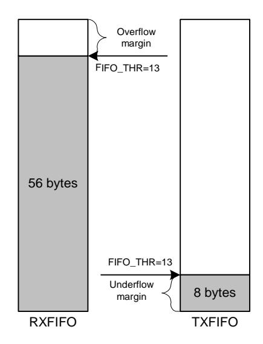

<span id="fig_29">**Figure 29:** Example of FIFOs at Threshold</span>

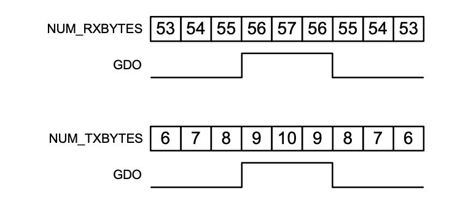

<span id="fig_30">**Figure 30:** Number of Bytes in FIFO vs. the GDO Signal (GDOx\_CFG=0x00 in RX and GDOx\_CFG=0x02 in TX, FIFO THR=13)</span>

## 21 Frequency Programming

The frequency programming in **CC1101** is designed to minimize the programming needed in a channel-oriented system.

To set up a system with channel numbers, the desired channel spacing is programmed with the <code>MDMCFGO.CHANSPC\_M</code> and <code>MDMCFGI.CHANSPC\_E</code> registers. The channel spacing registers are mantissa and exponent respectively. The base or start frequency is set

by the 24 bit frequency word located in the FREQ2, FREQ1, and FREQ0 registers. This word will typically be set to the centre of the lowest channel frequency that is to be used.

The desired channel number is programmed with the 8-bit channel number register, CHANNR.CHAN, which is multiplied by the channel offset. The resultant carrier frequency is given by:

$$f_{carrier} = \frac{f_{XOSC}}{2^{16}} \cdot \left(FREQ + CHAN \cdot \left( (256 + CHANSPC \_M) \cdot 2^{CHANSPC\_E-2} \right) \right)$$

With a 26 MHz crystal the maximum channel spacing is 405 kHz. To get e.g. 1 MHz channel spacing, one solution is to use 333 kHz channel spacing and select each third channel in CHANNR.CHAN.

The preferred IF frequency is programmed with the FSCTRL1.FREQ\_IF register. The IF frequency is given by:

$$f_{IF} = \frac{f_{XOSC}}{2^{10}} \cdot FREQ \_IF$$

If any frequency programming register is altered when the frequency synthesizer is running, the synthesizer may give an undesired response. Hence, the frequency programming should only be updated when the radio is in the IDLE state.

## 22 VCO

The VCO is completely integrated on-chip.

### 22.1 VCO and PLL Self-Calibration

The VCO characteristics vary with temperature and supply voltage changes as well as the desired operating frequency. In order to ensure reliable operation, CC1101 includes frequency synthesizer self-calibration circuitry. This calibration should be done regularly, and must be performed after turning on power and before using a new frequency (or channel). The number of XOSC cycles for completing the PLL calibration is given in [Table 34](#table_34) on page [54.](#196-timing)

The calibration can be initiated automatically or manually. The synthesizer can be automatically calibrated each time the synthesizer is turned on, or each time the synthesizer is turned off automatically. This is configured with the [MCSM0.FS\\_AUTOCAL](#0x18-mcsm0-main-radio-control-state-machine-configuration) register setting. In manual mode, the calibration is initiated when the [SCAL](#26-general-purpose--test-output-control-pins) command strobe is activated in the IDLE mode.

**Note:** The calibration values are maintained in SLEEP mode, so the calibration is still valid after waking up from SLEEP mode unless supply voltage or temperature has changed significantly.

If calibration is performed *each* time before entering active mode (RX or TX) the user can program register [IOCFGx.GDOx\\_CFG](#291-configuration-register-details--registers-with-preserved-values-in-sleep-state) to 0x0A to check that the PLL is in lock. The lock detector output available on the GDOx pin should then be an interrupt for the MCU (x = 0,1, or 2). A positive transition on the GDOx pin means that the PLL is in lock. As an alternative the user can read register FSCAL1. The PLL is in lock if the register content is different from 0x3F. Refer also to the CC1101 Errata Notes [\[3\]](#ref_3). The PLL must be recalibrated until PLL lock is achieved if the PLL does not lock the first time.

If the calibration is not performed each time before entering active mode (RX or TX) the user should program register [IOCFGx.GDOx\\_CFG](#291-configuration-register-details--registers-with-preserved-values-in-sleep-state) to 0x0A to check that the PLL is in lock before receiving/transmitting data. The lock detector output available on the GDOx pin should then be an interrupt for the MCU (x = 0,1, or 2). A positive transition on the GDOx pin means that the PLL is in lock. Since the current calibration values are only valid for a finite temperature range (typically ±40C) the PLL must be re-calibrated if the lock indicator does not indicate PLL lock.

## 23 Voltage Regulators

CC1101 contains several on-chip linear voltage regulators that generate the supply voltages needed by low-voltage modules. These voltage regulators are invisible to the user, and can be viewed as integral parts of the various modules. The user must however make sure that the absolute maximum ratings and required pin voltages in [Table 1](#table_1) and [Table 19](#table_19) are not exceeded.

By setting the CSn pin low, the voltage regulator to the digital core turns on and the crystal oscillator starts. The SO pin on the SPI interface must go low before the first positive edge of SCLK (setup time is given in [Table](#10-4-wire-serial-configuration-and-data-interface)  [22\)](#10-4-wire-serial-configuration-and-data-interface).

If the chip is programmed to enter power-down mode ([SPWD](#26-general-purpose--test-output-control-pins) strobe issued), the power will be turned off after CSn goes high. The power and crystal oscillator will be turned on again when CSn goes low.

The voltage regulator for the digital core requires one external decoupling capacitor.

The voltage regulator output should only be used for driving the CC1101.

## 24 Output Power Programming

The RF output power level from the device has two levels of programmability as illustrated in [Figure 31.](#fig_31) The special PATABLE register can hold up to eight user selected output power settings. The 3-bit [FREND0.PA\\_POWER](#0x27-rcctrl1--rc-oscillator-configuration) value selects the PATABLE entry to use. This twolevel functionality provides flexible PA power ramp up and ramp down at the start and end of transmission when using 2-FSK, GFSK, 4-FSK, and MSK modulation as well as ASK modulation shaping. All the PA power settings in the PATABLE from index 0 up to the [FREND0.PA\\_POWER](#0x27-rcctrl1--rc-oscillator-configuration) value are used.

The power ramping at the start and at the end of a packet can be turned off by setting [FREND0.PA\\_POWER=](#0x27-rcctrl1--rc-oscillator-configuration)0 and then program the desired output power to index 0 in the PATABLE.

If OOK modulation is used, the logic 0 and logic 1 power levels shall be programmed to index 0 and 1 respectively.

[Table 39](#table_39) contains recommended PATABLE settings for various output levels and frequency bands. DN013 [\[15\]](#ref_15) gives the complete tables for the different frequency bands using multi-layer inductors. Using PA settings from 0x61 to 0x6F is not allowed. [Table 40](#table_40) contains output power and current consumption for default PATABLE setting (0xC6).

See Section [10.6](#102-register-access) for PATABLE programming details. PATABLE must be programmed in burst mode if you want to write to other entries than PATABLE[0].

**Note:** All content of the PATABLE except for the first byte (index 0) is lost when entering the SLEEP state.

| | | 868 MHz | | 915 MHz |
|-|-|-|-|-|
| Output<br>Power<br>[dBm] | Setting | Current<br>Consumption,<br>Typ. [mA] | Setting | Current<br>Consumption,<br>Typ. [mA] |
| -30 | 0x03 | 12.0 | 0x03 | 11.9 |
| -20 | 0x17 | 12.6 | 0x0E | 12.5 |
| -15 | 0x1D | 13.3 | 0x1E | 13.3 |
| -10 | 0x26 | 14.5 | 0x27 | 14.8 |
| -6 | 0x37 | 16.4 | 0x38 | 17.0 |
| 0 | 0x50 | 16.8 | 0x8E | 17.2 |
| 5 | 0x86 | 19.9 | 0x84 | 20.2 |
| 7 | 0xCD | 25.8 | 0xCC | 25.7 |
| 10 | 0xC5 | 30.0 | 0xC3 | 30.7 |
| 12/11 | 0xC0 | 34.2 | 0xC0 | 33.4 |

<span id="table_37">**Table 37:** Optimum PATABLE Settings for Various Output Power Levels and Frequency Bands Using Wire-Wound Inductors in 868/915 MHz Frequency Bands</span>

| | | 868 MHz | | 915 MHz |  |
|-|-|-|-|-|-|
| Default<br>Power<br>Setting | Output<br>Power<br>[dBm] | Current<br>Consumption,<br>Typ. [mA] | Output<br>Power<br>[dBm] | Current<br>Consumption,<br>Typ. [mA] |  |
| 0xC6 | 9.6 | 29.4 | 8.9 | 28.7 |  |

<span id="table_38">**Table 38:** Output Power and Current Consumption for Default PATABLE Setting Using Wire-Wound Inductors in 868/915 MHz Frequency Bands</span>

| | 315 MHz | | 433 MHz | | 868 MHz | | 915 MHz | |
|-|-|-|-|-|-|-|-|-|
| Output<br>Power<br>[dBm] | Setting | Current<br>Consumption,<br>Typ. [mA] | Setting | Current<br>Consumption,<br>Typ. [mA] | Setting | Current<br>Consumption,<br>Typ. [mA] | Setting | Current<br>Consumption,<br>Typ. [mA] |
| -30 | 0x12 | 10.9 | 0x12 | 11.9 | 0x03 | 12.1 | 0x03 | 12.0 |
| -20 | 0x0D | 11.4 | 0x0E | 12.4 | 0x0F | 12.7 | 0x0E | 12.6 |
| -15 | 0x1C | 12.0 | 0x1D | 13.1 | 0x1E | 13.4 | 0x1E | 13.4 |
| -10 | 0x34 | 13.5 | 0x34 | 14.4 | 0x27 | 15.0 | 0x27 | 14.9 |
| 0 | 0x51 | 15.0 | 0x60 | 15.9 | 0x50 | 16.9 | 0x8E | 16.7 |
| 5 | 0x85 | 18.3 | 0x84 | 19.4 | 0x81 | 21.0 | 0xCD | 24.3 |
| 7 | 0xCB | 22.1 | 0xC8 | 24.2 | 0xCB | 26.8 | 0xC7 | 26.9 |
| 10 | 0xC2 | 26.9 | 0xC0 | 29.1 | 0xC2 | 32.4 | 0xC0 | 31.8 |

<span id="table_39">**Table 39:** Optimum PATABLE Settings for Various Output Power Levels and Frequency Bands Using Multi-layer Inductors</span>

| Default<br>Power<br>Setting | Output<br>Power<br>[dBm] | 315 MHz<br>Current<br>Consumption,<br>Typ. [mA] | 433 MHz<br>Output<br>Power<br>[dBm] | Current<br>Consumption,<br>Typ. [mA] | 868 MHz<br>Output<br>Power<br>[dBm] | Current<br>Consumption,<br>Typ. [mA] | 915 MHz<br>Output<br>Power<br>[dBm] | Current<br>Consumption,<br>Typ. [mA] |
|-|-|-|-|-|-|-|-|-|
| 0xC6 | 8.5 | 24.4 | 7.8 | 25.2 | 8.5 | 29.5 | 7.2 | 27.4 |

<span id="table_40">**Table 40:** Output Power and Current Consumption for Default PATABLE Setting Using Multi-layer Inductors</span>

## 25 Shaping and PA Ramping

With ASK modulation, up to eight power settings are used for shaping. The modulator contains a counter that counts up when transmitting a one and down when transmitting a zero. The counter counts at a rate equal to 8 times the symbol rate. The counter saturates at [FREND0.PA\\_POWER](#0x27-rcctrl1--rc-oscillator-configuration) and 0 respectively. This counter value is used as an index for a lookup in the power table. Thus, in order to utilize the whole table, [FREND0.PA\\_POWER](#0x27-rcctrl1--rc-oscillator-configuration) should be 7 when ASK is active. The shaping of the ASK signal is dependent on the configuration of the PATABLE. [Figure 32](#fig_32) shows some examples of ASK shaping.


<span id="fig_31">**Figure 31:** PA POWER and PATABLE</span>

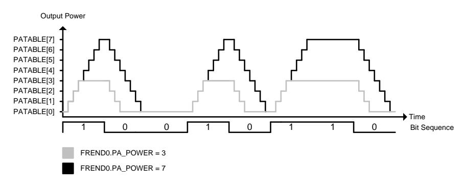

<span id="fig_32">**Figure 32:** Shaping of ASK Signal</span>

## 26 General Purpose / Test Output Control Pins

The three digital output pins GDO0, GDO1, and GDO2 are general control pins configured with IOCFG0.GDO0\_CFG, IOCFG1.GDO1\_CFG, and IOCFG2.GDO2\_CFG respectively. Table 41 shows the different signals that can be monitored on the GDO pins. These signals can be used as inputs to the MCU.

GDO1 is the same pin as the SO pin on the SPI interface, thus the output programmed on this pin will only be valid when CSn is high. The default value for GDO1 is 3-stated which is useful when the SPI interface is shared with other devices.

The default value for GDO0 is a 135-141 kHz clock output (XOSC frequency divided by 192). Since the XOSC is turned on at power-on-reset, this can be used to clock the MCU in systems with only one crystal. When the MCU is up and running, it can change the clock frequency by writing to IOCFG0.GDO0 CFG.

An on-chip analog temperature sensor is enabled by writing the value 128 (0x80) to the IOCFG0 register. The voltage on the GDO0 pin is then proportional to temperature. See Section 4.7 for temperature sensor specifications.

If the IOCFGx.GDOx\_CFG setting is less than 0x20 and IOCFGx\_GDOx\_INV is 0 (1), the GDO0 and GDO2 pins will be hardwired to 0 (1), and the GDO1 pin will be hardwired to 1 (0) in the SLEEP state. These signals will be hardwired until the CHIP\_RDYn signal goes low.

If the <code>IOCFGx.GDOx\_CFG</code> setting is 0x20 or higher, the GDO pins will work as programmed also in SLEEP state. As an example, GDO1 is high impedance in all states if <code>IOCFG1.GDO1 CFG=0x2E</code>.

| | GDOx_CFG[5:0] Description |
|-|-|
| 0 (0x00) | Associated to the RX FIFO: Asserts when RX FIFO is filled at or above the RX FIFO threshold. De-asserts when RX FIFO<br>is drained below the same threshold. |
| 1 (0x01) | Associated to the RX FIFO: Asserts when RX FIFO is filled at or above the RX FIFO threshold or the end of packet is<br>reached. De-asserts when the RX FIFO is empty. |
| 2 (0x02) | Associated to the TX FIFO: Asserts when the TX FIFO is filled at or above the TX FIFO threshold. De-asserts when the TX<br>FIFO is below the same threshold. |
| 3 (0x03) | Associated to the TX FIFO: Asserts when TX FIFO is full. De-asserts when the TX FIFO is drained below the TX FIFO<br>threshold. |
| 4 (0x04) | Asserts when the RX FIFO has overflowed. De-asserts when the FIFO has been flushed. |
| 5 (0x05) | Asserts when the TX FIFO has underflowed. De-asserts when the FIFO is flushed.
| 6 (0x06) | Asserts when sync word has been sent / received, and de-asserts at the end of the packet. In RX, the pin will also deassert when a packet is discarded due to address or maximum length filtering or when the radio enters<br>RXFIFO_OVERFLOW state. In TX the pin will de-assert if the TX FIFO underflows. |
| 7 (0x07) | Asserts when a packet has been received with CRC OK. De-asserts when the first byte is read from the RX FIFO. |
| 8 (0x08) | Preamble Quality Reached. Asserts when the PQI is above the programmed PQT value. De-asserted when the chip re<br>enters RX state (MARCSTATE=0x0D) or the PQI gets below the programmed PQT value. |
| 9 (0x09) | Clear channel assessment. High when RSSI level is below threshold (dependent on the current CCA_MODE setting). |
| 10 (0x0A) | Lock detector output. The PLL is in lock if the lock detector output has a positive transition or is constantly logic high. To<br>check for PLL lock the lock detector output should be used as an interrupt for the MCU. |
| | Serial Clock. Synchronous to the data in synchronous serial mode. |
| 11 (0x0B) | In RX mode, data is set up on the falling edge by CC1101 when GDOx_INV=0.<br>In TX mode, data is sampled by CC1101 on the rising edge of the serial clock when GDOx_INV=0. |
| 12 (0x0C) | Serial Synchronous Data Output. Used for synchronous serial mode. |
| 13 (0x0D) | Serial Data Output. Used for asynchronous serial mode. |
| 14 (0x0E) | Carrier sense. High if RSSI level is above threshold. Cleared when entering IDLE mode. |
| 15 (0x0F) | CRC_OK. The last CRC comparison matched. Cleared when entering/restarting RX mode. |
| 16 (0x10) to 21 (0x15) | Reserved – used for test |
| 22 (0x16) | RX_HARD_DATA[1]. Can be used together with RX_SYMBOL_TICK for alternative serial RX output. |
| 23 (0x17) | RX_HARD_DATA[0]. Can be used together with RX_SYMBOL_TICK for alternative serial RX output. |
| 24 (0x18) to 26 (0x1A) | Reserved – used for test |
| 27 (0x1B) | PA_PD. Note: PA_PD will have the same signal level in SLEEP and TX states. To control an external PA or RX/TX switch<br>in applications where the SLEEP state is used it is recommended to use GDOx_CFGx=0x2F instead. |
| 28 (0x1C) | LNA_PD. Note: LNA_PD will have the same signal level in SLEEP and RX states. To control an external LNA or RX/TX |
| 29 (0x1D) | switch in applications where the SLEEP state is used it is recommended to use GDOx_CFGx=0x2F instead.<br>RX_SYMBOL_TICK. Can be used together with RX_HARD_DATA for alternative serial RX output. |
| 30 (0x1E) to 35 (0x23) | Reserved – used for test |
| 36 (0x24) | WOR_EVNT0 |
| 37 (0x25) | WOR_EVNT1 |
| 38 (0x26) | CLK_256 |
| 39 (0x27) | CLK_32k |
| 40 (0x28) | Reserved – used for test |
| | |
| 41 (0x29) | CHIP_RDYn |
| 42 (0x2A)<br>43 (0x2B) | Reserved – used for test<br>XOSC_STABLE |
| | |
| 44 (0x2C) | Reserved – used for test |
| 45 (0x2D) | Reserved – used for test |
| 46 (0x2E) | High impedance (3-state) |
| 47 (0x2F) | HW to 0 (HW1 achieved by setting GDOx_INV=1). Can be used to control an external LNA/PA or RX/TX switch. |
| 48 (0x30) | CLK_XOSC/1 |
| 49 (0x31) | CLK_XOSC/1.5 |
| 50 (0x32) | CLK_XOSC/2 |
| 51 (0x33) | CLK_XOSC/3 |
| 52 (0x34) | CLK_XOSC/4 |
| 53 (0x35) | CLK_XOSC/6 |
| 54 (0x36) | CLK_XOSC/8 |
| 55 (0x37) | CLK_XOSC/12 |
| 56 (0x38) | CLK_XOSC/16 |
| 57 (0x39) | CLK_XOSC/24 |
| 58 (0x3A) | CLK_XOSC/32 |
| 59 (0x3B) | CLK_XOSC/48 |
| 60 (0x3C) | CLK_XOSC/64 |
| 61 (0x3D) | CLK_XOSC/96 |
| 62 (0x3E) | CLK_XOSC/128 |
| 63 (0x3F) | CLK_XOSC/192 |

<span id="table_41">**Table 41:** GDOx Signal Selection (x = 0, 1, or 2)</span>

**Note:** There are 3 GDO pins, but only one CLK_XOSC/n can be selected as an output at any time. If CLK_XOSC/n is to be monitored on one of the GDO pins, the other two GDO pins must be configured to values less than 0x30. The GDO0 default value is CLK_XOSC/192. To optimize RF performance, these signals should not be used while the radio is in RX or TX mode.

## 27 Asynchronous and Synchronous Serial Operation

Several features and modes of operation have been included in the CC1101 to provide backward compatibility with previous Chipcon products and other existing RF communication systems. For new systems, it is recommended to use the built-in packet handling features, as they can give more robust communication, significantly offload the microcontroller, and simplify software development.

### 27.1 Asynchronous Serial Operation

Asynchronous transfer is included in the CC1101 for backward compatibility with systems that are already using the asynchronous data transfer.

When asynchronous transfer is enabled, several of the support mechanisms for the MCU that are included in CC1101 will be disabled, such as packet handling hardware, buffering in the FIFO, and so on. The asynchronous transfer mode does not allow for the use of the data whitener, interleaver, and FEC, and it is not possible to use Manchester encoding. MSK is not supported for asynchronous transfer.

Setting [PKTCTRL0.PKT\\_FORMAT](#0x08-pktctrl0--packet-automation-control) to 3 enables asynchronous serial mode. In TX, the GDO0 pin is used for data input (TX data). Data output can be on GDO0, GDO1, or GDO2. This is set by the [IOCFG0.GDO0\\_CFG,](#291-configuration-register-details--registers-with-preserved-values-in-sleep-state) [IOCFG1.GDO1\\_CFG](#291-configuration-register-details--registers-with-preserved-values-in-sleep-state) and [IOCFG2.GDO2\\_CFG](#291-configuration-register-details--registers-with-preserved-values-in-sleep-state) fields.

The CC1101 modulator samples the level of the asynchronous input 8 times faster than the programmed data rate. The timing requirement for the asynchronous stream is that the error in the bit period must be less than one eighth of the programmed data rate.

In asynchronous serial mode no data decision is done on-chip and the raw data is put on the data output line in RX. When using asynchronous serial mode make sure the interfacing MCU does proper oversampling and that it can handle the jitter on the data output line. The MCU should tolerate a jitter of ±1/8 of a bit period as the data stream is timediscrete using 8 samples per bit.

In asynchronous serial mode there will be glitches of 37 - 38.5 ns duration (1/XOSC) occurring infrequently and with random periods. A simple RC filter can be added to the data output line between CC1101 and the MCU to get rid of the 37 - 38.5 ns ns glitches if considered a problem. The filter 3 dB cut-off frequency needs to be high enough so that the data is not filtered and at the same time low enough to remove the glitch. As an example, for 2.4 kBaud data rate a 1 kohm resistor and 2.7 nF capacitor can be used. This gives a 3 dB cut-off frequency of 59 kHz.

### 27.2 Synchronous Serial Operation

Setting [PKTCTRL0.PKT\\_FORMAT](#0x08-pktctrl0--packet-automation-control) to 1 enables synchronous serial mode. In the synchronous serial mode, data is transferred on a two-wire serial interface. The CC1101 provides a clock that is used to set up new data on the data input line or sample data on the data output line. Data input (TX data) is on the GDO0 pin. This pin will automatically be configured as an input when TX is active. The TX latency is 8 bits. The data output pin can be any of the GDO pins. This is set by the [IOCFG0.GDO0\\_CFG](#291-configuration-register-details--registers-with-preserved-values-in-sleep-state), [IOCFG1.GDO1\\_CFG](#291-configuration-register-details--registers-with-preserved-values-in-sleep-state), and [IOCFG2.GDO2\\_CFG](#291-configuration-register-details--registers-with-preserved-values-in-sleep-state) fields. Time from start of reception until data is available on the receiver data output pin is equal to 9 bit.

Preamble and sync word insertion/detection may or may not be active, dependent on the sync mode set by the [MDMCFG2.SYNC\\_MODE](#0x0b-fsctrl1---frequency-synthesizer-control).

If preamble and sync word is disabled, all other packet handler features and FEC should also be disabled. The MCU must then handle preamble and sync word insertion and detection in software.

If preamble and sync word insertion/detection are left on, all packet handling features and FEC can be used. One exception is that the address filtering feature is unavailable in synchronous serial mode.

When using the packet handling features in synchronous serial mode, the CC1101 will insert and detect the preamble and sync word and the MCU will only provide/get the data payload. This is equivalent to the recommended FIFO operation mode.

An alternative serial RX output option is to configure any of the GD0 pins for [RX\\_SYMBOL\\_TICK](#221-vco-and-pll-self-calibration) and [RX\\_HARD\\_DATA](#221-vco-and-pll-self-calibration), see [Table 41.](#221-vco-and-pll-self-calibration) [RX\\_HARD\\_DATA](#221-vco-and-pll-self-calibration)[1:0] is the hard decision symbol. [RX\\_HARD\\_DATA](#221-vco-and-pll-self-calibration)[1:0] contain data for 4-ary modulation formats while RX\_HARD\_DATA[1] contain data for 2 ary modulation formats. The

[RX\\_SYMBOL\\_TICK](#221-vco-and-pll-self-calibration) signal is the symbol clock and is high for one half symbol period whenever a new symbol is presented on the hard and soft data outputs. This option may be used for both synchronous and asynchronous interfaces.

## 28 System Considerations and Guidelines

### 28.1 SRD Regulations

International regulations and national laws regulate the use of radio receivers and transmitters. Short Range Devices (SRDs) for license free operation below 1 GHz are usually operated in the 315 MHz, 433 MHz, 868 MHz or 915 MHz frequency bands. The CC1101 is specifically designed for such use with its 300 - 348 MHz, 387 - 464 MHz, and 779 - 928 MHz operating ranges. The most important regulations when using the CC1101 in the 315 MHz, 433 MHz, 868 MHz, or 915 MHz frequency bands are EN 300 220 (Europe) and FCC CFR47 Part 15 (USA).

For compliance with modulation bandwidth requirements under EN 300 220 in the 863 to 870 MHz frequency range it is recommended to use a 26 MHz crystal for frequencies below 869 MHz and a 27 MHz crystal for frequencies above 869 MHz.

Please note that compliance with regulations is dependent on the complete system performance. It is the customer's responsibility to ensure that the system complies with regulations.

### 28.2 Frequency Hopping and Multi-Channel Systems

The 315 MHz, 433 MHz, 868 MHz, or 915 MHz bands are shared by many systems both in industrial, office, and home environments. It is therefore recommended to use frequency hopping spread spectrum (FHSS) or a multichannel protocol because the frequency diversity makes the system more robust with respect to interference from other systems operating in the same frequency band. FHSS also combats multipath fading.

CC1101 is highly suited for FHSS or multichannel systems due to its agile frequency synthesizer and effective communication interface. Using the packet handling support and data buffering is also beneficial in such systems as these features will significantly offload the host controller.

Charge pump current, VCO current, and VCO capacitance array calibration data is required for each frequency when implementing frequency hopping for CC1101. There are 3 ways of obtaining the calibration data from the chip:

- 1) Frequency hopping with calibration for each hop. The PLL calibration time is 712/724 µs (26 MHz crystal and [TEST0](#293-status-register-details) = 0x09/0B, see [Table 35\)](#197-rx-termination-timer). The blanking interval between each frequency hop is then 787/799 µs.
- 2) Fast frequency hopping without calibration for each hop can be done by performing the necessary calibrating at startup and saving the resulting [FSCAL3](#0x28-rcctrl0--rc-oscillator-configuration), [FSCAL2](#292-configuration-register-details--registers-that-loose-programming-in-sleep-state), and [FSCAL1](#292-configuration-register-details--registers-that-loose-programming-in-sleep-state) register values in MCU memory. The VCO capacitance calibration [FSCAL1](#292-configuration-register-details--registers-that-loose-programming-in-sleep-state) register value must be found for each RF frequency to be used. The VCO current calibration value and the charge pump current calibration value available in [FSCAL2](#292-configuration-register-details--registers-that-loose-programming-in-sleep-state) and [FSCAL3](#0x28-rcctrl0--rc-oscillator-configuration) respectively are not dependent on the RF frequency, so the same value can therefore be used for all RF frequencies for these two registers. Between each frequency hop, the calibration process can then be replaced by writing the [FSCAL3](#0x28-rcctrl0--rc-oscillator-configuration), [FSCAL2](#292-configuration-register-details--registers-that-loose-programming-in-sleep-state) and [FSCAL1](#292-configuration-register-details--registers-that-loose-programming-in-sleep-state) register values that corresponds to the next RF frequency. The PLL turn on time is approximately 75 µs [\(Table](#196-timing)  [34\)](#196-timing). The blanking interval between each frequency hop is then approximately 75 µs.
- 3) Run calibration on a single frequency at startup. Next write 0 to [FSCAL3\[5:4\]](#0x28-rcctrl0--rc-oscillator-configuration) to disable the charge pump calibration. After writing to [FSCAL3\[5:4\]](#0x28-rcctrl0--rc-oscillator-configuration), strobe [SRX](#26-general-purpose--test-output-control-pins) (or [STX](#26-general-purpose--test-output-control-pins)) with [MCSM0.FS\\_AUTOCAL=](#0x18-mcsm0-main-radio-control-state-machine-configuration)1 for each new frequency hop. That is, VCO current and VCO capacitance calibration is done, but not charge pump current calibration. When charge pump current calibration is disabled the calibration time is reduced from 712/724 µs to 145/157 µs (26 MHz crystal and [TEST0](#293-status-register-details) = 0x09/0B, see [Table 35\)](#197-rx-termination-timer). The blanking interval between each frequency hop is then 220/232 µs.

There is a trade off between blanking time and memory space needed for storing calibration data in non-volatile memory. Solution 2) above gives the shortest blanking interval, but requires more memory space to store calibration values. This solution also requires that the supply voltage and temperature do not vary much in order to have a robust solution. Solution 3) gives 567 µs smaller blanking interval than solution 1).

The recommended settings for [TEST0.VCO\\_SEL\\_CAL\\_EN](#293-status-register-details) change with frequency. This means that one should always use SmartRF Studio [\[5\]](#ref_5) to get the correct settings for a specific frequency before doing a calibration, regardless of which calibration method is being used.

**Note:** The content in the [TEST0](#293-status-register-details) register is not retained in SLEEP state, thus it is necessary to re-write this register when returning from the SLEEP state.

### 28.3 Wideband Modulation when not Using Spread Spectrum

Digital modulation systems under FCC Section 15.247 include 2-FSK, GFSK, and 4-FSK modulation. A maximum peak output power of 1 W (+30 dBm) is allowed if the 6 dB bandwidth of the modulated signal exceeds 500 kHz. In addition, the peak power spectral density conducted to the antenna shall not be greater than +8 dBm in any 3 kHz band.

Operating at high data rates and frequency separation, the CC1101 is suited for systems targeting compliance with digital modulation system as defined by FCC Section 15.247. An external power amplifier such as CC1190 [\[21\]](#ref_21) is needed to increase the output above +11 dBm. Please refer to DN006 [\[11\]](#ref_11) for further details concerning wideband modulation using CC1101 and DN036 for wideband modulation at 600 kbps data rate, +19 dBm output power when using CC1101 +CC1101 [\[25\].](ref_25)

### 28.4 Wireless MBUS

The wireless MBUS standard is a communication standard for meters and wireless readout of meters, and specifies the physical and the data link layer. Power consumption is a critical parameter for the meter side, since the communication link shall be operative for the full lifetime of the meter, without changing the battery. CC1101 combined with MSP430 is an excellent choice for the Wireless MBUS standard, CC1101 is a truly low cost, low power and flexible transceiver, and MSP430 a high performance and low power MCU. For more informati on regarding using CC1101 for Wireless MBUS applications, see AN067 [\[14\].](ref_14)

Since the Wireless MBUS standard operates in the 868-870 ISM band, the radio requirements must also comply with the ETSI EN 300 220 and CEPT/ERC/REC 70-03 E standards.

### 28.5 Data Burst Transmissions

The high maximum data rate of CC1101 opens up for burst transmissions. A low average data rate link (e.g. 10 kBaud) can be realized by using a higher over-the-air data rate. Buffering the data and transmitting in bursts at high data rate (e.g. 500 kBaud) will reduce the time in active mode, and hence also reduce the average current consumption significantly. Reducing the time in active mode will reduce the likelihood of collisions with other systems in the same frequency range.

**Note:** The sensitivity and thus transmission range is reduced for high data rate bursts compared to lower data rates.

### 28.6 Continuous Transmissions

In data streaming applications, the CC1101 opens up for continuous transmissions at 500 kBaud effective data rate. As the modulation is done with a closed loop PLL, there is no limitation in the length of a transmission (open loop modulation used in some transceivers often prevents this kind of continuous data streaming and reduces the effective data rate).

### 28.7 Battery Operated Systems

In low power applications, the SLEEP state with the crystal oscillator core switched off should be used when the **CC1101** is not active. It is possible to leave the crystal oscillator core running in the SLEEP state if start-up time is critical. The WOR functionality should be used in low power applications.

### 28.8 Increasing Range

In some applications it may be necessary to extend the range. The **CC1190** [21] is a range extender for 850-950 MHz RF transceivers, transmitters, and System-on-Chip devices from Texas Instruments. It increases the link budget by providing a power amplifier (PA) for increased output power, and a low-noise amplifier (LNA) with low noise figure for improved receiver sensitivity in addition to switches and RF matching for simple design of high performance wireless systems. Refer to AN094 [22] and AN096 [23] for performance figures of the **CC1101** + **CC1190** combination.

Figure 33 shows a simplified application circuit.

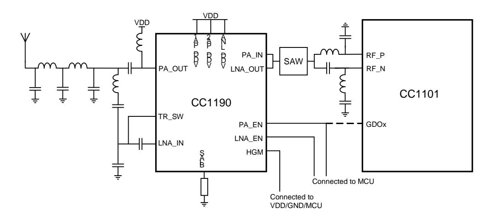

<span id="fig_33">**Figure 33:** Simplified CC1101-CC1190 Application Circuit</span>

## 29 Configuration Registers

The configuration of **CC1101** is done by programming 8-bit registers. The optimum configuration data based on selected system parameters are most easily found by using the SmartRF Studio software [5]. Complete descriptions of the registers are given in the following tables. After chip reset, all the registers have default values as shown in the tables. The optimum register setting might differ from the default value. After a reset, all registers that shall be different from the default value therefore needs to be programmed through the SPI interface.

There are 13 command strobe registers, listed in Table 42. Accessing these registers will initiate the change of an internal state or mode. There are 47 normal 8-bit configuration registers listed in Table 43. Many of these registers are for test purposes only, and need not be written for normal operation of *CC1101*.

There are also 12 status registers that are listed in Table 44. These registers, which are read-only, contain information about the status of **CC1101**.

The two FIFOs are accessed through one 8-bit register. Write operations write to the TX FIFO, while read operations read from the RX FIFO.

During the header byte transfer and while writing data to a register or the TX FIFO, a status byte is returned on the SO line. This status byte is described in Table 23 on page 31.

[Table 45](#table_45) summarizes the SPI address space. The address to use is given by adding the base address to the left and the burst and read/write bits on the top. Note that the burst bit has different meaning for base addresses above and below 0x2F.

| Address | Strobe<br>Name | Description |
|-|-|-|
| 0x30 | SRES | Reset chip. |
| 0x31 | SFSTXON | Enable and calibrate frequency synthesizer (if MCSM0.FS_AUTOCAL=1). If in RX (with CCA):<br>Go to a wait state where only the synthesizer is running (for quick RX / TX turnaround). |
| 0x32 | SXOFF | Turn off crystal oscillator. |
| 0x33 | SCAL | Calibrate frequency synthesizer and turn it off. SCAL can be strobed from IDLE mode without<br>setting manual calibration mode (MCSM0.FS_AUTOCAL=0) |
| 0x34 | SRX | Enable RX. Perform calibration first if coming from IDLE and MCSM0.FS_AUTOCAL=1. |
| 0x35 | STX | In IDLE state: Enable TX. Perform calibration first if MCSM0.FS_AUTOCAL=1.<br>If in RX state and CCA is enabled: Only go to TX if channel is clear. |
| 0x36 | SIDLE | Exit RX / TX, turn off frequency synthesizer and exit Wake-On-Radio mode if applicable. |
| 0x38 | SWOR | Start automatic RX polling sequence (Wake-on-Radio) as described in Section 19.5 if<br>WORCTRL.RC_PD=0. |
| 0x39 | SPWD | Enter power down mode when CSn goes high. |
| 0x3A | SFRX | Flush the RX FIFO buffer. Only issue SFRX in IDLE or RXFIFO_OVERFLOW states. |
| 0x3B | SFTX | Flush the TX FIFO buffer. Only issue SFTX in IDLE or TXFIFO_UNDERFLOW states. |
| 0x3C | SWORRST | Reset real time clock to Event1 value. |
| 0x3D | SNOP | No operation. May be used to get access to the chip status byte. |

<span id="table_42">**Table 42:** Command Strobes</span>

| Address | Register | Description | Preserved in SLEEP State | Details on Page Number |
|-|-|-|-|-|
| 0x00 | IOCFG2 | GDO2 output pin configuration | Yes | 71 |
| 0x01 | IOCFG1 | GDO1 output pin configuration | Yes | 71 |
| 0x02 | IOCFG0 | GDO0 output pin configuration | Yes | 71 |
| 0x03 | FIFOTHR | RX FIFO and TX FIFO thresholds | Yes | 72 |
| 0x04 | SYNC1 | Sync word, high byte | Yes | 73 |
| 0x05 | SYNC0 | Sync word, low byte | Yes | 73 |
| 0x06 | PKTLEN | Packet length | Yes | 73 |
| 0x07 | PKTCTRL1 | Packet automation control | Yes | 73 |
| 0x08 | PKTCTRL0 | Packet automation control | Yes | 74 |
| 0x09 | ADDR | Device address | Yes | 74 |
| 0x0A | CHANNR | Channel number | Yes | 74 |
| 0x0B | FSCTRL1 | Frequency synthesizer control | Yes | 75 |
| 0x0C | FSCTRL0 | Frequency synthesizer control | Yes | 75 |
| 0x0D | FREQ2 | Frequency control word, high byte | Yes | 75 |
| 0x0E | FREQ1 | Frequency control word, middle byte | Yes | 75 |
| 0x0F | FREQ0 | Frequency control word, low byte | Yes | 75 |
| 0x10 | MDMCFG4 | Modem configuration | Yes | 76 |
| 0x11 | MDMCFG3 | Modem configuration | Yes | 76 |
| 0x12 | MDMCFG2 | Modem configuration | Yes | 77 |
| 0x13 | MDMCFG1 | Modem configuration | Yes | 78 |
| 0x14 | MDMCFG0 | Modem configuration | Yes | 78 | |
| 0x15 | DEVIATN | Modem deviation setting | Yes | 79 |
| 0x16 | MCSM2 | Main Radio Control State Machine configuration  | Yes | 80 |
| 0x17 | MCSM1 | Main Radio Control State Machine configuration  | Yes | 81 |
| 0x18 | MCSM0 | Main Radio Control State Machine configuration  | Yes | 82 |
| 0x19 | FOCCFG | Frequency Offset Compensation configuration | Yes | 83 |
| 0x1A | BSCFG | Bit Synchronization configuration | Yes | 84 |
| 0x1B | AGCTRL2 | AGC control | Yes | 85 |
| 0x1C | AGCTRL1 | AGC control | Yes | 86 |
| 0x1D | AGCTRL0 | AGC control | Yes | 87 |
| 0x1E | WOREVT1 | High byte Event 0 timeout | Yes | 87 |
| 0x1F | WOREVT0 | Low byte Event 0 timeout | Yes | 88 |
| 0x20 | WORCTRL | Wake On Radio control | Yes | 88 |
| 0x21 | FREND1 | Front end RX configuration | Yes | 89 |
| 0x22 | FREND0 | Front end TX configuration | Yes | 89 |
| 0x23 | FSCAL3 | Frequency synthesizer calibration | Yes | 89 |
| 0x24 | FSCAL2 | Frequency synthesizer calibration | Yes | 90 |
| 0x25 | FSCAL1 | Frequency synthesizer calibration | Yes | 90 |
| 0x26 | FSCAL0 | Frequency synthesizer calibration | Yes | 90 |
| 0x27 | RCCTRL1 | RC oscillator configuration | Yes | 90 |
| 0x28 | RCCTRL0 | RC oscillator configuration | Yes | 90 |
| 0x29 | FSTEST | Frequency synthesizer calibration control | No | 91 |
| 0x2A | PTEST | Production test | No | 91 |
| 0x2B | AGCTEST | AGC test | No | 91 |
| 0x2C | TEST2 | Various test settings | No | 91 |
| 0x2D | TEST1 | Various test settings | No | 91 |
| 0x2E | TEST0 | Various test settings | No | 92 |

<span id="table_43">**Table 43:** Configuration Registers Overview</span>

| Address | Register | Description | Details on page number |
|-|-|-|-|
| 0x30 (0xF0) | PARTNUM | Part number for CC1101 | 92 |
| 0x31 (0xF1) | VERSION | Current version number | 92 |
| 0x32 (0xF2) | FREQEST | Frequency Offset Estimate | 92 |
| 0x33 (0xF3) | LQI | Demodulator estimate for Link Quality | 92 |
| 0x34 (0xF4) | RSSI | Received signal strength indication | 92 |
| 0x35 (0xF5) | MARCSTATE | Control state machine state | 93 |
| 0x36 (0xF6) | WORTIME1 | High byte of WOR timer | 93 |
| 0x37 (0xF7) | WORTIME0 | Low byte of WOR timer | 93 |
| 0x38 (0xF8) | PKTSTATUS | Current GDOx status and packet status | 94 |
| 0x39 (0xF9) | VCO_VC_DAC | Current setting from PLL calibration<br>module  | 94 |
| 0x3A (0xFA) | TXBYTES | Underflow and number of bytes in the TX<br>FIFO | 94 |
| 0x3B (0xFB) | RXBYTES | Overflow and number of bytes in the RX<br>FIFO  | 94 |
| 0x3C (0xFC) | RCCTRL1_STATUS | Last RC oscillator calibration result | 94 |
| 0x3D (0xFD) | RCCTRL0_STATUS | Last RC oscillator calibration result | 95 |

<span id="table_44">**Table 44:** Status Registers Overview</span>

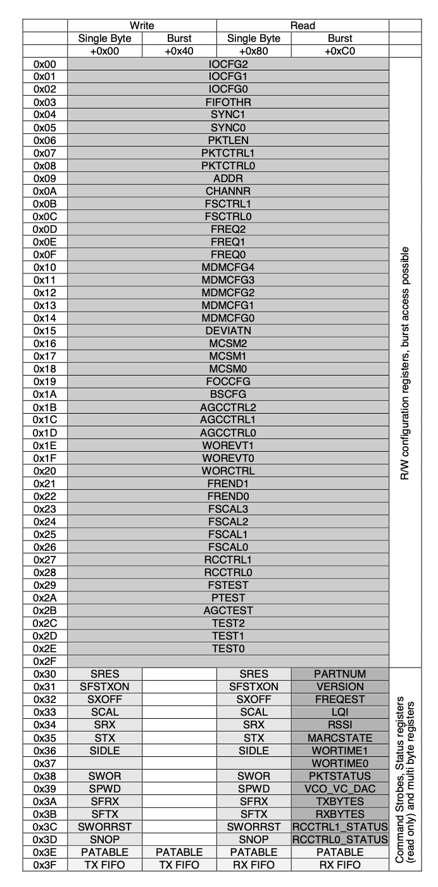
<span id="table_45">**Table 45:** SPI Address Space</span>

### 29.1 Configuration Register Details – Registers with preserved values in SLEEP state

#### 0x00: IOCFG2 – GDO2 Output Pin Configuration

| Bit | Field Name | Reset | R/W | Description |
|-|-|-|-|-|
| 7 | | | R0  | Not used |
| 6 | GDO2_INV | 0 | R/W | Invert output, i.e. select active low (1) / high (0) |
| 5:0 | GDO2_CFG[5:0] | 41 (0x29) | R/W | Default is CHP_RDYn (See Table 41 on page 62). |

#### 0x01: IOCFG1 – GDO1 Output Pin Configuration

| Bit | Field Name | Reset | R/W | Description |
|-|-|-|-|-|
| 7 | GDO_DS | 0 | R/W | Set high (1) or low (0) output drive strength on the GDO pins. |
| 6 | GDO1_INV | 0 | R/W | Invert output, i.e. select active low (1) / high (0) |
| 5:0 | GDO1_CFG[5:0] | 46 (0x2E) | R/W | Default is 3-state (See Table 41 on page 62). |

#### 0x02: IOCFG0 – GDO0 Output Pin Configuration

| Bit | Field Name | Reset | R/W | Description |
|-|-|-|-|-|
| 7 | TEMP_SENSOR_ENABLE | 0 | R/W | Enable analog temperature sensor. Write 0 in all other register<br>bits when using temperature sensor. |
| 6 | GDO0_INV | 0 | R/W | Invert output, i.e. select active low (1) / high (0) |
| 5:0 | GDO0_CFG[5:0] | 63 (0x3F) | R/W | Default is CLK_XOSC/192 (See Table 41 on page 62).<br>It is recommended to disable the clock output in initialization, in<br>order to optimize RF performance. |

#### 0x03: FIFOTHR – RX FIFO and TX FIFO Thresholds

```
+-------+--------------------+----------+-----+--------------------------------------------------------------------+
| Bit   | Field Name         | Reset    | R/W | Description                                                        |
+=======+====================+==========+=====+====================================================================+
| 7     |                    | 0        | R/W | Reserved, write 0 for compatibility with possible future           |
|       |                    |          |     | extensions                                                         |
+-------+--------------------+----------+-----+--------------------------------------------------------------------+
| 6     | ADC_RETENTION      | 0        | R/W | 0: TEST1 = 0x31 and TEST2 = 0x88 when waking up from SLEEP         |
|       |                    |          |     |                                                                    |
|       |                    |          |     | 1: TEST1 = 0x35 and TEST2 = 0x81 when waking up from SLEEP         |
|       |                    |          |     |                                                                    |
|       |                    |          |     | Note that the changes in the TEST registers due to the             |
|       |                    |          |     | ADC_RETENTION bit setting are only seen INTERNALLY in the analog   |
|       |                    |          |     | part. The values read from the TEST registers when waking up from  |
|       |                    |          |     | SLEEP mode will always be the reset value.                         |
|       |                    |          |     |                                                                    |
|       |                    |          |     | The ADC_RETENTION bit should be set to 1before going into SLEEP    |
|       |                    |          |     | mode if settings with an RX filter bandwidth below 325 kHz are     |
|       |                    |          |     | wanted at time of wake-up.                                         |
+-------+--------------------+----------+-----+--------------------------------------------------------------------+
| 5:4   | CLOSE_IN_RX [1:0]  | 0 (00)   | R/W | For more details, please see DN010 [8]                             |
|       |                    |          |     |                                                                    |
|       |                    |          |     | +-----------+-------------------------+                            |
|       |                    |          |     | | Setting   | RX Attenuation,         |                            |
|       |                    |          |     | |           | Typical Values          |                            |
|       |                    |          |     | +===========+=========================+                            |
|       |                    |          |     | | 0 (00)    | 0 dB                    |                            |
|       |                    |          |     | +-----------+-------------------------+                            |
|       |                    |          |     | | 1 (01)    | 6 dB                    |                            |
|       |                    |          |     | +-----------+-------------------------+                            |
|       |                    |          |     | | 2 (10)    | 12 dB                   |                            |
|       |                    |          |     | +-----------+-------------------------+                            |
|       |                    |          |     | | 3 (11)    | 18 dB                   |                            |
|       |                    |          |     | +-----------+-------------------------+                            |
+-------+--------------------+----------+-----+--------------------------------------------------------------------+
| 3:0   | FIFO_THR[3:0]      | 7 (0111) | R/W | Set the threshold for the TX FIFO and RX FIFO. The threshold is    |
|       |                    |          |     | exceeded when the number of bytes in the FIFO is equal to or       |
|       |                    |          |     | higher than the threshold value.                                   |
|       |                    |          |     |                                                                    |
|       |                    |          |     | +-----------+-----------------+-----------------+                  |
|       |                    |          |     | | Setting   | Bytes in TX     | Bytes in RX     |                  |
|       |                    |          |     | |           | FIFO            | FIFO            |                  |
|       |                    |          |     | +===========+=================+=================+                  |
|       |                    |          |     | | 0 (0000)  | 61              | 4               |                  |
|       |                    |          |     | +-----------+-----------------+-----------------+                  |
|       |                    |          |     | | 1 (0001)  | 57              | 8               |                  |
|       |                    |          |     | +-----------+-----------------+-----------------+                  |
|       |                    |          |     | | 2 (0010)  | 53              | 12              |                  |
|       |                    |          |     | +-----------+-----------------+-----------------+                  |
|       |                    |          |     | | 3 (0011)  | 49              | 16              |                  |
|       |                    |          |     | +-----------+-----------------+-----------------+                  |
|       |                    |          |     | | 4 (0100)  | 45              | 20              |                  |
|       |                    |          |     | +-----------+-----------------+-----------------+                  |
|       |                    |          |     | | 5 (0101)  | 41              | 24              |                  |
|       |                    |          |     | +-----------+-----------------+-----------------+                  |
|       |                    |          |     | | 6 (0110)  | 37              | 28              |                  |
|       |                    |          |     | +-----------+-----------------+-----------------+                  |
|       |                    |          |     | | 7 (0111)  | 33              | 32              |                  |
|       |                    |          |     | +-----------+-----------------+-----------------+                  |
|       |                    |          |     | | 8 (1000)  | 29              | 36              |                  |
|       |                    |          |     | +-----------+-----------------+-----------------+                  |
|       |                    |          |     | | 9 (1001)  | 25              | 40              |                  |
|       |                    |          |     | +-----------+-----------------+-----------------+                  |
|       |                    |          |     | | 10 (1010) | 21              | 44              |                  |
|       |                    |          |     | +-----------+-----------------+-----------------+                  |
|       |                    |          |     | | 11 (1011) | 17              | 48              |                  |
|       |                    |          |     | +-----------+-----------------+-----------------+                  |
|       |                    |          |     | | 12 (1100) | 13              | 52              |                  |
|       |                    |          |     | +-----------+-----------------+-----------------+                  |
|       |                    |          |     | | 13 (1101) | 9               | 56              |                  |
|       |                    |          |     | +-----------+-----------------+-----------------+                  |
|       |                    |          |     | | 14 (1110) | 5               | 60              |                  |
|       |                    |          |     | +-----------+-----------------+-----------------+                  |
|       |                    |          |     | | 15 (1111) | 1               | 64              |                  |
|       |                    |          |     | +-----------+-----------------+-----------------+                  |
+-------+--------------------+----------+-----+--------------------------------------------------------------------+
```

#### 0x04: SYNC1 – Sync Word, High Byte

| Bit | Field Name | Reset | R/W | Description |
|-|-|-|-|-|
| 7:0 | SYNC[15:8] | 211 (0xD3) | R/W | 8 MSB of 16-bit sync word |

#### 0x05: SYNC0 – Sync Word, Low Byte

| Bit | Field Name | Reset | R/W | Description |
|-|-|-|-|-|
| 7:0 | SYNC[7:0]  | 145 (0x91) | R/W | 8 LSB of 16-bit sync word |

#### 0x06: PKTLEN – Packet Length

| Bit | Field Name | Reset | R/W | Description |
|-|-|-|-|-|
| 7:0 | PACKET_LENGTH | 255 (0xFF) | R/W | Indicates the packet length when fixed packet length mode is enabled. If<br>variable packet length mode is used, this value indicates the maximum<br>packet length allowed. This value must be different from 0. |

#### 0x07: PKTCTRL1 – Packet Automation Control

```
+-------+------------------+----------+-----+----------------------------------------------------------------+
| Bit   | Field Name       | Reset    | R/W | Description                                                    |
+=======+==================+==========+=====+================================================================+
| 7:5   | PQT[2:0]         | 0 (0x00) | R/W | Preamble quality estimator threshold. The preamble quality     |
|       |                  |          |     | estimator increases an internal counter by one each time a bit |
|       |                  |          |     | is received that is different from the previous bit, and       |
|       |                  |          |     | decreases the counter by 8 each time a bit is received that    |
|       |                  |          |     | is the same as the last bit.                                   |
|       |                  |          |     |                                                                |
|       |                  |          |     | A threshold of 4·$\mathrm{PQT}$ for this counter is used to    |
|       |                  |          |     | gate sync word detection. When $\mathrm{PQT}=0$ a sync word is |
|       |                  |          |     | always accepted.                                               |
+-------+------------------+----------+-----+----------------------------------------------------------------+
| 4     |                  | 0        | R0  | Not Used.                                                      |
+-------+------------------+----------+-----+----------------------------------------------------------------+
| 3     | CRC_AUTOFLUSH    | 0        | R/W | Enable automatic flush of RX FIFO when CRC is not OK. This     |
|       |                  |          |     | requires that only one packet is in the RXFIFO and that        |
|       |                  |          |     | packet length is limited to the RX FIFO size.                  |
+-------+------------------+----------+-----+----------------------------------------------------------------+
| 2     | APPEND_STATUS    | 1        | R/W | When enabled, two status bytes will be appended to the         |
|       |                  |          |     | payload of the packet. The status bytes contain RSSI and LQI   |
|       |                  |          |     | values, as well as CRC OK.                                     |
+-------+------------------+----------+-----+----------------------------------------------------------------+
| 1:0   | ADR_CHK[1:0]     | 0 (00)   | R/W | Controls address check configuration of received packages.     |
|       |                  |          |     |                                                                |
|       |                  |          |     | +---------+------------------------------------+               |
|       |                  |          |     | | Setting | Address check configuration        |               |
|       |                  |          |     | +=========+====================================+               |
|       |                  |          |     | | 0 (00)  | No address check                   |               |
|       |                  |          |     | +---------+------------------------------------+               |
|       |                  |          |     | | 1 (01)  | Address check, no broadcast        |               |
|       |                  |          |     | +---------+------------------------------------+               |
|       |                  |          |     | | 2 (10)  | Address check and 0 (0x00)         |               |
|       |                  |          |     | |         | broadcast                          |               |
|       |                  |          |     | +---------+------------------------------------+               |
|       |                  |          |     | | 3 (11)  | Address check and 0 (0x00) and     |               |
|       |                  |          |     | |         | 255 (0xFF) broadcast               |               |
|       |                  |          |     | +---------+------------------------------------+               |
+-------+------------------+----------+-----+----------------------------------------------------------------+
```

#### 0x08: PKTCTRL0 – Packet Automation Control

```
+-----+----------------------+----------+-----+----------------------------------------------------------+
| Bit | Field Name           | Reset    | R/W | Description                                              |
+=====+======================+==========+=====+==========================================================+
| 7   |                      |          | R0  | Not used                                                 |
+-----+----------------------+----------+-----+----------------------------------------------------------+
| 6   | WHITE_DATA           | 1        | R/W | Turn data whitening on / off                             |
|     |                      |          |     | 0: Whitening off                                         |
|     |                      |          |     | 1: Whitening on                                          |
+-----+----------------------+----------+-----+----------------------------------------------------------+
| 5:4 | PKT_FORMAT[1:0]      | 0 (00)   | R/W | Format of RX and TX data                                 |
|     |                      |          |     | +----------+--------------------------------------------+|
|     |                      |          |     | | Setting  | Packet format                              ||
|     |                      |          |     | +==========+============================================+|
|     |                      |          |     | | 0 (00)   | Normal mode, use FIFOs for RX              ||
|     |                      |          |     | |          | and TX                                     ||
|     |                      |          |     | +----------+--------------------------------------------+|
|     |                      |          |     | | 1 (01)   | Synchronous serial mode, Data              ||
|     |                      |          |     | |          | in on GDO0 and data out on                 ||
|     |                      |          |     | |          | either of the GDOx pins                    ||
|     |                      |          |     | +----------+--------------------------------------------+|
|     |                      |          |     | | 2 (10)   | Random TX mode; sends random               ||
|     |                      |          |     | |          | data using PN9 generator. Used             ||
|     |                      |          |     | |          | for test.                                  ||
|     |                      |          |     | |          | Works as normal mode, setting              ||
|     |                      |          |     | |          | 0 (00), in RX                              ||
|     |                      |          |     | +----------+--------------------------------------------+|
|     |                      |          |     | | 3 (11)   | Asynchronous serial mode, Data             ||
|     |                      |          |     | |          | in on GDO0 and data out on                 ||
|     |                      |          |     | |          | either of the GDOx pins                    ||
|     |                      |          |     | +----------+--------------------------------------------+|
+-----+----------------------+----------+-----+----------------------------------------------------------+
| 3   |                      | 0        | R0  | Not used                                                 |
+-----+----------------------+----------+-----+----------------------------------------------------------+
| 2   | CRC_EN               | 1        | R/W | 1: CRC calculation in TX and CRC check in RX enabled     |
|     |                      |          |     | 0: CRC disabled for TX and RX                            |
+-----+----------------------+----------+-----+----------------------------------------------------------+
| 1:0 | LENGTH_CONFIG[1:0]   | 1 (01)   | R/W | Configure the packet length                              |
|     |                      |          |     | +----------+--------------------------------------------+|
|     |                      |          |     | | Setting  | Packet length configuration                ||
|     |                      |          |     | +==========+============================================+|
|     |                      |          |     | | 0 (00)   | Fixed packet length mode.                  ||
|     |                      |          |     | |          | Length configured in `PKTLEN`              ||
|     |                      |          |     | |          | register                                   ||
|     |                      |          |     | +----------+--------------------------------------------+|
|     |                      |          |     | | 1 (01)   | Variable packet length mode.               ||
|     |                      |          |     | |          | Packet length configured by                ||
|     |                      |          |     | |          | the first byte after sync word             ||
|     |                      |          |     | +----------+--------------------------------------------+|
|     |                      |          |     | | 2 (10)   | Infinite packet length mode                ||
|     |                      |          |     | +----------+--------------------------------------------+|
|     |                      |          |     | | 3 (11)   | Reserved                                   ||
|     |                      |          |     | +----------+--------------------------------------------+|
+-----+----------------------+----------+-----+----------------------------------------------------------+
```
#### 0x09: ADDR – Device Address

| Bit | Field Name | Reset | R/W | Description |
|-|-|-|-|-|
| 7:0 | DEVICE_ADDR[7:0] | 0 (0x00) | R/W | Address used for packet filtration. Optional broadcast addresses are 0<br>(0x00) and 255 (0xFF). |

#### 0x0A: CHANNR – Channel Number

| Bit | Field Name | Reset | R/W | Description |
|-|-|-|-|-|
| 7:0 | CHAN[7:0]  | 0 (0x00) | R/W | The 8-bit unsigned channel number, which is multiplied by the channel<br>spacing setting and added to the base frequency. |

#### 0x0B: FSCTRL1 - Frequency Synthesizer Control

| Bit | Field Name | Reset | R/W | Description |
|-|-|-|-|-|
| 7:6 | | | R0  | Not used |
| 5 | | 0 | R/W | Reserved |
| 4:0 | FREQ_IF[4:0] | 15 (0x0F) | R/W | The desired IF frequency to employ in RX. Subtracted from FS base frequency in RX and controls the digital complex mixer in the demodulator.<br>$f_{IF} = \frac{f_{XOSC}}{2^{10}} \cdot FREQ\_IF$ The default value gives an IF frequency of 381kHz, assuming a 26.0 MHz crystal. |

#### 0x0C: FSCTRL0 - Frequency Synthesizer Control

| Bit | Field Name | Reset | R/W | Description |
|-|-|-|-|-|
| 7:0 | FREQOFF[7:0] | 0 (0x00) | R/W | Frequency offset added to the base frequency before being used by the frequency synthesizer. (2s-complement).<br>Resolution is $F_{XTAL}/2^{14}$ (1.59kHz-1.65kHz); range is $\pm$ 202 kHz to $\pm$ 210 kHz, dependent of XTAL frequency. |

#### 0x0D: FREQ2 - Frequency Control Word, High Byte

| Bit | Field Name  | Reset | R/W | Description |
|-|-|-|-|-|
| 7:6 | FREQ[23:22] | 0 (00) | R | FREQ[23:22] is always 0 (the FREQ2 register is less than 36 with 26-27 MHz crystal) |
| 5:0 | FREQ[21:16] | 30 (0x1E) | R/W | FREQ [23:0] is the base frequency for the frequency synthesiser in increments of $f_{xosc}/2^{16}$.<br> $f_{carrier} = \frac{f_{xosc}}{2^{16}} \cdot FREQ [23:0]$ |

#### 0x0E: FREQ1 - Frequency Control Word, Middle Byte

| Bit | Field Name | Reset | R/W | Description |
|-|-|-|-|-|
| 7:0 | FREQ[15:8] | 196 (0xC4) | R/W | Ref. FREQ2 register |

#### 0x0F: FREQ0 - Frequency Control Word, Low Byte

| Bit | Field Name | Reset | R/W | Description |
|-|-|-|-|-|
| 7:0 | FREQ[7:0]  | 236 (0xEC) | R/W | Ref. FREQ2 register |

#### 0x10: MDMCFG4 - Modem Configuration

| Bit | Field Name | Reset | R/W | Description |
|-|-|-|-|-|
| 7:6 | CHANBW_E[1:0] | 2 (0x02)  | R/W | |
| 5:4 | CHANBW_M[1:0] | 0 (0x00)  | R/W | Sets the decimation ratio for the delta-sigma ADC input stream and thus the channel bandwidth. $BW_{channel} = \frac{f_{XOSC}}{8\cdot(4+CHANBW\_M)\cdot2^{CHANBW\_E}}$ The default values give 203 kHz channel filter bandwidth, assuming a 26.0 MHz crystal. |
| 3:0 | DRATE_E[3:0]  | 12 (0x0C) | R/W | The exponent of the user specified symbol rate |

#### 0x11: MDMCFG3 - Modem Configuration

| Bit | Field Name | Reset | R/W | Description |
|-|-|-|-|-|
| 7:0 | DRATE_M[7:0] | 34 (0x22) | R/W | The mantissa of the user specified symbol rate. The symbol rate is configured using an unsigned, floating-point number with 9-bit mantissa and 4-bit exponent. The 9th bit is a hidden '1'. The resulting data rate is: |
| | | | | $R_{DATA} = \frac{\left(256 + DRATE\_M\right) \cdot 2^{DRATE\_E}}{2^{28}} \cdot f_{XOSC}$ The default values give a data rate of 115.051 kBaud (closest setting to 115.2 kBaud), assuming a 26.0 MHz crystal. |

#### 0x12: MDMCFG2 – Modem Configuration

```
+-----+-------------------+----------+-----+----------------------------------------------------------------+
| Bit | Field Name        | Reset    | R/W | Description                                                    |
+=====+===================+==========+=====+================================================================+
| 7   | DEM_DCFILT_OFF    | 0        | R/W | Disable digital DC blocking filter before demodulator.         |
|     |                   |          |     | 0 = Enable (better sensitivity)                                |
|     |                   |          |     | 1 = Disable (current optimized). Only for data rates           |
|     |                   |          |     | $\leq$ 250 kBaud                                               |
|     |                   |          |     |                                                                |
|     |                   |          |     | The recommended IF frequency changes when the DC blocking is   |
|     |                   |          |     | disabled. Please use SmartRF Studio [5] to calculate correct   |
|     |                   |          |     | register setting.                                              |
+-----+-------------------+----------+-----+----------------------------------------------------------------+
| 6:4 | MOD_FORMAT[2:0]   | 0 (000)  | R/W | The modulation format of the radio signal                      |
|     |                   |          |     | +---------------+------------------------+                     |
|     |                   |          |     | | Setting       | Modulation format      |                     |
|     |                   |          |     | +===============+========================+                     |
|     |                   |          |     | | 0 (000)       | 2-FSK                  |                     |
|     |                   |          |     | +---------------+------------------------+                     |
|     |                   |          |     | | 1 (001)       | GFSK                   |                     |
|     |                   |          |     | +---------------+------------------------+                     |
|     |                   |          |     | | 2 (010)       | -                      |                     |
|     |                   |          |     | +---------------+------------------------+                     |
|     |                   |          |     | | 3 (011)       | ASK/OOK                |                     |
|     |                   |          |     | +---------------+------------------------+                     |
|     |                   |          |     | | 4 (100)       | 4-FSK                  |                     |
|     |                   |          |     | +---------------+------------------------+                     |
|     |                   |          |     | | 5 (101)       | -                      |                     |
|     |                   |          |     | +---------------+------------------------+                     |
|     |                   |          |     | | 6 (110)       | -                      |                     |
|     |                   |          |     | +---------------+------------------------+                     |
|     |                   |          |     | | 7 (111)       | MSK                    |                     |
|     |                   |          |     | +---------------+------------------------+                     |
|     |                   |          |     | MSK is only supported for data rates above 26 kBaud            |
+-----+-------------------+----------+-----+----------------------------------------------------------------+
| 3   | MANCHESTER_EN     | 0        | R/W | Enables Manchester encoding/decoding.                          |
|     |                   |          |     | 0 = Disable                                                    |
|     |                   |          |     | 1 = Enable                                                     |
+-----+-------------------+----------+-----+----------------------------------------------------------------+
| 2:0 | SYNC_MODE[2:0]    | 2 (010)  | R/W | Combined sync-word qualifier mode.                             |
|     |                   |          |     |                                                                |
|     |                   |          |     | The values 0 (000) and 4 (100) disables preamble and sync      |
|     |                   |          |     | word transmission in TX and preamble and sync word detection   |
|     |                   |          |     | in RX.                                                         |
|     |                   |          |     |                                                                |
|     |                   |          |     | The values 1 (001), 2 (010), 5 (101) and 6 (110) enables       |
|     |                   |          |     | 16-bit sync word transmission in TX and 16-bits sync word      |
|     |                   |          |     | detection in RX. Only 15 of 16 bits need to match in RX when   |
|     |                   |          |     | using setting 1 (001) or 5 (101). The values 3 (011) and 7     |
|     |                   |          |     | (111) enables repeated sync word transmission in TX and 32-bit |
|     |                   |          |     | sync word detection in RX (only 30 of 32 bits need to match).  |
|     |                   |          |     | +---------------+---------------------------------------+      |
|     |                   |          |     | | Setting       | Sync-word qualifier mode              |      |
|     |                   |          |     | +===============+=======================================+      |
|     |                   |          |     | | 0 (000)       | No preamble/sync                      |      |
|     |                   |          |     | +---------------+---------------------------------------+      |
|     |                   |          |     | | 1 (001)       | 15/16 sync word bits detected         |      |
|     |                   |          |     | +---------------+---------------------------------------+      |
|     |                   |          |     | | 2 (010)       | 16/16 sync word bits detected         |      |
|     |                   |          |     | +---------------+---------------------------------------+      |
|     |                   |          |     | | 3 (011)       | 30/32 sync word bits detected         |      |
|     |                   |          |     | +---------------+---------------------------------------+      |
|     |                   |          |     | | 4 (100)       | No preamble/sync, carrier-sense       |      |
|     |                   |          |     | |               | above threshold                       |      |
|     |                   |          |     | +---------------+---------------------------------------+      |
|     |                   |          |     | | 5 (101)       | 15/16 + carrier-sense above           |      |
|     |                   |          |     | |               | threshold                             |      |
|     |                   |          |     | +---------------+---------------------------------------+      |
|     |                   |          |     | | 6 (110)       | 16/16 + carrier-sense above           |      |
|     |                   |          |     | |               | threshold                             |      |
|     |                   |          |     | +---------------+---------------------------------------+      |
|     |                   |          |     | | 7 (111)       | 30/32 + carrier-sense above           |      |
|     |                   |          |     | |               | threshold                             |      |
|     |                   |          |     | +---------------+---------------------------------------+      |
+-----+-------------------+----------+-----+----------------------------------------------------------------+
```

#### 0x13: MDMCFG1- Modem Configuration

```
+-----+------------------+----------+-----+------------------------------------------------------------+
| Bit | Field Name       | Reset    | R/W | Description                                                |
+=====+==================+==========+=====+============================================================+
| 7   | FEC_EN           | 0        | R/W | Enable Forward Error Correction (FEC) with interleaving    |
|     |                  |          |     | for packet payload                                         |
|     |                  |          |     |                                                            |
|     |                  |          |     | 0 = Disable                                                |
|     |                  |          |     |                                                            |
|     |                  |          |     | 1 = Enable (Only supported for fixed packet length mode,   |
|     |                  |          |     | i.e. `PKTCTRL0.LENGTH_CONFIG=0`)                           |
+-----+------------------+----------+-----+------------------------------------------------------------+
| 6:4 | NUM_PREAMBLE[2:0]| 2 (010)  | R/W | Sets the minimum number of preamble bytes to be            |
|     |                  |          |     | transmitted                                                |
|     |                  |          |     |                                                            |
|     |                  |          |     | +---------------+------------------------+                 |
|     |                  |          |     | | Setting       | Number of preamble     |                 |
|     |                  |          |     | |               | bytes                  |                 |
|     |                  |          |     | +===============+========================+                 |
|     |                  |          |     | | 0 (000)       | 2                      |                 |
|     |                  |          |     | +---------------+------------------------+                 |
|     |                  |          |     | | 1 (001)       | 3                      |                 |
|     |                  |          |     | +---------------+------------------------+                 |
|     |                  |          |     | | 2 (010)       | 4                      |                 |
|     |                  |          |     | +---------------+------------------------+                 |
|     |                  |          |     | | 3 (011)       | 6                      |                 |
|     |                  |          |     | +---------------+------------------------+                 |
|     |                  |          |     | | 4 (100)       | 8                      |                 |
|     |                  |          |     | +---------------+------------------------+                 |
|     |                  |          |     | | 5 (101)       | 12                     |                 |
|     |                  |          |     | +---------------+------------------------+                 |
|     |                  |          |     | | 6 (110)       | 16                     |                 |
|     |                  |          |     | +---------------+------------------------+                 |
|     |                  |          |     | | 7 (111)       | 24                     |                 |
|     |                  |          |     | +---------------+------------------------+                 |
+-----+------------------+----------+-----+------------------------------------------------------------+
| 3:2 |                  |          | R0  | Not used                                                   |
+-----+------------------+----------+-----+------------------------------------------------------------+
| 1:0 | CHANSPC_E[1:0]   | 2 (10)   | R/W | 2 bit exponent of channel spacing                          |
+-----+------------------+----------+-----+------------------------------------------------------------+
```

#### 0x14: MDMCFG0- Modem Configuration

| Bit | Field Name | Reset | R/W | Description |
|-|-|-|-|-|
| 7:0 | CHANSPC_M[7:0] | 248 (0xF8) | R/W | 8-bit mantissa of channel spacing. The channel spacing is multiplied by the channel number CHAN and added to the base frequency. It is unsigned and has the format: $ \Delta f_{CHANNEL} = \frac{f_{XOSC}}{2^{18}} \cdot \left(256 + CHANSPC\_M\right) \cdot 2^{CHANSPC\_E} $ The default values give 199.951 kHz channel spacing (the closest setting to 200 kHz), assuming 26.0 MHz crystal frequency. |

#### 0x15: DEVIATN - Modem Deviation Setting

```
+-----+------------------+----------+-----+-----------------------------------------------------------------------------------+
| Bit | Field Name       | Reset    | R/W | Description                                                                       |
+=====+==================+==========+=====+===================================================================================+
| 7   |                  |          | R0  | Not used.                                                                         |
+-----+------------------+----------+-----+-----------------------------------------------------------------------------------+
| 6:4 | DEVIATION_E[2:0] | 4 (100)  | R/W | Deviation exponent.                                                               |
+-----+------------------+----------+-----+-----------------------------------------------------------------------------------+
| 3   |                  |          | R0  | Not used.                                                                         |
+-----+------------------+----------+-----+-----------------------------------------------------------------------------------+
| 2:0 | DEVIATION_M[2:0] | 7 (111)  | R/W | **TX**                                                                            |
|     |                  |          |     |                                                                                   |
|     |                  |          |     | 2-FSK/GFSK/4-FSK                                                                  |
|     |                  |          |     |                                                                                   |
|     |                  |          |     | Specifies the nominal frequency deviation from the carrier for a '0'              |
|     |                  |          |     | (-DEVIATN) and '1' (+DEVIATN) in a mantissa-exponent format, interpreted as a     |
|     |                  |          |     | 4-bit value with MSB implicit 1. The resulting frequency deviation is given by:   |
|     |                  |          |     |                                                                                   |
|     |                  |          |     | $f_{dev} = \frac{f_{xosc}}{2^{17}} \cdot (8 + \text{DEVIATION\_M}) \cdot          |
|     |                  |          |     | 2^{\text{DEVIATION\_E}}$                                                          |
|     |                  |          |     |                                                                                   |
|     |                  |          |     | The default values give ±47.607 kHz deviation assuming 26.0 MHz crystal           |
|     |                  |          |     | frequency.                                                                        |
|     |                  |          |     |                                                                                   |
|     |                  |          |     | MSK                                                                               |
|     |                  |          |     |                                                                                   |
|     |                  |          |     | Specifies the fraction of symbol period (1/8-8/8) during which a phase change     |
|     |                  |          |     | occurs ('0': +90deg, '1': -90deg). Refer to the SmartRF Studio software [5] for   |
|     |                  |          |     | correct DEVIATN setting when using MSK.                                           |
|     |                  |          |     |                                                                                   |
|     |                  |          |     | ASK/OOK                                                                           |
|     |                  |          |     |                                                                                   |
|     |                  |          |     | This setting has no effect.                                                       |
|     |                  |          |     |                                                                                   |
|     |                  |          |     | **RX**                                                                            |
|     |                  |          |     |                                                                                   |
|     |                  |          |     | 2-FSK/GFSK/4-FSK                                                                  |
|     |                  |          |     |                                                                                   |
|     |                  |          |     | Specifies the expected frequency deviation of incoming signal, must be            |
|     |                  |          |     | approximately right for demodulation to be performed reliably and robustly.       |
|     |                  |          |     |                                                                                   |
|     |                  |          |     | MSK/ASK/OOK                                                                       |
|     |                  |          |     |                                                                                   |
|     |                  |          |     | This setting has no effect.                                                       |
+-----+------------------+----------+-----+-----------------------------------------------------------------------------------+
```

#### 0x16: MCSM2 – Main Radio Control State Machine Configuration

| Bit | Field Name | Reset | R/W | Description |
|-|-|-|-|-|
| 7:5 | | R0 | | Not used |
| 4 | RX_TIME_RSSI | 0 | R/W | Direct RX termination based on RSSI measurement (carrier sense). For<br>ASK/OOK modulation, RX times out if there is no carrier sense in the first 8<br>symbol periods. |
| 3 | RX_TIME_QUAL | 0 | R/W | When the RX_TIME timer expires, the chip checks if sync word is found when<br>RX_TIME_QUAL=0, or either sync word is found or PQI is set when<br>RX_TIME_QUAL=1. |
| 2:0 | RX_TIME[2:0] | 7 (111) | R/W | Timeout for sync word search in RX for both WOR mode and normal RX<br>operation. The timeout is relative to the programmed EVENT0 timeout. |

The RX timeout in µs is given by EVENT0·C(RX\_TIME, [WOR\\_RES](#0x23-fscal3--frequency-synthesizer-calibration)) ·26/X, where C is given by the table below and X is the crystal oscillator frequency in MHz:

| Setting | WOR_RES = 0 | WOR_RES = 1 | WOR_RES = 2 | WOR_RES = 3 |
|-|-|-|-|-|
| 0 (000) | 3.6058 | 18.0288 | 32.4519 | 46.8750 |
| 1 (001) | 1.8029 | 9.0144 | 16.2260 | 23.4375 |
| 2 (010) | 0.9014 | 4.5072 | 8.1130 | 11.7188 |
| 3 (011) | 0.4507 | 2.2536 | 4.0565 | 5.8594 |
| 4 (100) | 0.2254 | 1.1268 | 2.0282 | 2.9297 |
| 5 (101) | 0.1127 | 0.5634 | 1.0141 | 1.4648 |
| 6 (110) | 0.0563 | 0.2817 | 0.5071 | 0.7324 |
| 7 (111) | Until end of packet | | | |

As an example, EVENT0=34666, [WOR\\_RES=](#0x23-fscal3--frequency-synthesizer-calibration)0 and RX\_TIME=6 corresponds to 1.96 ms RX timeout, 1 s polling interval and 0.195% duty cycle. Note that [WOR\\_RES](#0x23-fscal3--frequency-synthesizer-calibration) should be 0 or 1 when using WOR because using [WOR\\_RES](#0x23-fscal3--frequency-synthesizer-calibration) > 1 will give a very low duty cycle. In applications where WOR is not used all settings of [WOR\\_RES](#0x23-fscal3--frequency-synthesizer-calibration) can be used.

The duty cycle using WOR is approximated by:

| Setting | WOR_RES=0 | WOR_RES=1 |
|-|-|-|
| 0 (000) | 12.50% | 1.95% |
| 1 (001) | 6.250% | 9765ppm |
| 2 (010) | 3.125% | 4883ppm |
| 3 (011) | 1.563% | 2441ppm |
| 4 (100) | 0.781% | NA |
| 5 (101) | 0.391% | NA |
| 6 (110) | 0.195% | NA |
| 7 (111) | NA | NA |

Note that the RC oscillator must be enabled in order to use setting 0-6, because the timeout counts RC oscillator periods. WOR mode does not need to be enabled.

The timeout counter resolution is limited: With RX\_TIME=0, the timeout count is given by the 13 MSBs of EVENT0, decreasing to the 7MSBs of EVENT0 with RX\_TIME=6.

#### 0x17: MCSM1– Main Radio Control State Machine Configuration

```
+-------+-------------------+----------+-----+------------------------------------------------------------------------+
| Bit   | Field Name        | Reset    | R/W | Description                                                            |
+=======+===================+==========+=====+========================================================================+
| 7:6   |                   |          | R0  | Not used                                                               |
+-------+-------------------+----------+-----+------------------------------------------------------------------------+
| 5:4   | CCA_MODE[1:0]     | 3 (11)   | R/W | Selects `CCA_MODE`; Reflected in CCA signal                            |
|       |                   |          |     |                                                                        |
|       |                   |          |     | +---------+--------------------------------------+                     |
|       |                   |          |     | | Setting | Clear channel indication             |                     |
|       |                   |          |     | +=========+======================================+                     |
|       |                   |          |     | | 0 (00)  | Always                               |                     |
|       |                   |          |     | +---------+--------------------------------------+                     |
|       |                   |          |     | | 1 (01)  | If RSSI below threshold              |                     |
|       |                   |          |     | +---------+--------------------------------------+                     |
|       |                   |          |     | | 2 (10)  | Unless currently receiving a packet  |                     |
|       |                   |          |     | +---------+--------------------------------------+                     |
|       |                   |          |     | | 3 (11)  | If RSSI below threshold unless       |                     |
|       |                   |          |     | |         | currently receiving a packet         |                     |
|       |                   |          |     | +---------+--------------------------------------+                     |
+-------+-------------------+----------+-----+------------------------------------------------------------------------+
| 3:2   | RXOFF_MODE[1:0]   | 0 (00)   | R/W | Select what should happen when a packet has been received              |
|       |                   |          |     |                                                                        |
|       |                   |          |     | +---------+-------------------------------------------+                |
|       |                   |          |     | | Setting | Next state after finishing packet         |                |
|       |                   |          |     | |         | reception                                 |                |
|       |                   |          |     | +=========+===========================================+                |
|       |                   |          |     | | 0 (00)  | IDLE                                      |                |
|       |                   |          |     | +---------+-------------------------------------------+                |
|       |                   |          |     | | 1 (01)  | FSTXON                                    |                |
|       |                   |          |     | +---------+-------------------------------------------+                |
|       |                   |          |     | | 2 (10)  | TX                                        |                |
|       |                   |          |     | +---------+-------------------------------------------+                |
|       |                   |          |     | | 3 (11)  | Stay in RX                                |                |
|       |                   |          |     | +---------+-------------------------------------------+                |
|       |                   |          |     |                                                                        |
|       |                   |          |     | It is not possible to set `RXOFF_MODE` to be TX or FSTXON and at       |
|       |                   |          |     | the same time use CCA.                                                 |
+-------+-------------------+----------+-----+------------------------------------------------------------------------+
| 1:0   | TXOFF_MODE[1:0]   | 0 (00)   | R/W | Select what should happen when a packet has been sent (TX)             |
|       |                   |          |     |                                                                        |
|       |                   |          |     | +---------+-------------------------------------------+                |
|       |                   |          |     | | Setting | Next state after finishing packet         |                |
|       |                   |          |     | |         | transmission                              |                |
|       |                   |          |     | +=========+===========================================+                |
|       |                   |          |     | | 0 (00)  | IDLE                                      |                |
|       |                   |          |     | +---------+-------------------------------------------+                |
|       |                   |          |     | | 1 (01)  | FSTXON                                    |                |
|       |                   |          |     | +---------+-------------------------------------------+                |
|       |                   |          |     | | 2 (10)  | Stay in TX (start sending preamble)       |                |
|       |                   |          |     | +---------+-------------------------------------------+                |
|       |                   |          |     | | 3 (11)  | RX                                        |                |
|       |                   |          |     | +---------+-------------------------------------------+                |
+-------+-------------------+----------+-----+------------------------------------------------------------------------+
```

#### 0x18: MCSM0– Main Radio Control State Machine Configuration

```
+-------+------------------+----------+-----+---------------------------------------------------------------+
| Bit   | Field Name       | Reset    | R/W | Description                                                   |
+=======+==================+==========+=====+===============================================================+
| 7:6   |                  |          | R0  | Not used                                                      |
+-------+------------------+----------+-----+---------------------------------------------------------------+
| 5:4   | FS_AUTOCAL[1:0]  | 0 (00)   | R/W | Automatically calibrate when going to RX or TX, or back to    |
|       |                  |          |     | IDLE                                                          |
|       |                  |          |     |                                                               |
|       |                  |          |     | +---------+--------------------------------------------+      |
|       |                  |          |     | | Setting | When to perform automatic                  |      |
|       |                  |          |     | |         | calibration                                |      |
|       |                  |          |     | +=========+============================================+      |
|       |                  |          |     | | 0 (00)  | Never (manually calibrate using            |      |
|       |                  |          |     | |         | SCAL strobe)                               |      |
|       |                  |          |     | +---------+--------------------------------------------+      |
|       |                  |          |     | | 1 (01)  | When going from IDLE to RX or TX           |      |
|       |                  |          |     | |         | (or FSTXON)                                |      |
|       |                  |          |     | +---------+--------------------------------------------+      |
|       |                  |          |     | | 2 (10)  | When going from RX or TX back to           |      |
|       |                  |          |     | |         | IDLE automatically                         |      |
|       |                  |          |     | +---------+--------------------------------------------+      |
|       |                  |          |     | | 3 (11)  | Every 4$^{\text{th}}$ time when            |      |
|       |                  |          |     | |         | going from RX or TX to IDLE                |      |
|       |                  |          |     | |         | automatically                              |      |
|       |                  |          |     | +---------+--------------------------------------------+      |
|       |                  |          |     |                                                               |
|       |                  |          |     | In some automatic wake-on-radio (WOR) applications, using     |
|       |                  |          |     | setting 3 (11) can significantly reduce current consumption.  |
+-------+------------------+----------+-----+---------------------------------------------------------------+
| 3:2   | PO_TIMEOUT       | 1 (01)   | R/W | Programs the number of times the six-bit ripple counter must  |
|       |                  |          |     | expire after XOSC has stabilized before CHP_RDYn goes         |
|       |                  |          |     | low$^{\text{[1]}}$.                                           |
|       |                  |          |     |                                                               |
|       |                  |          |     | If XOSC is on (stable) during power-down, PO_TIMEOUT should   |
|       |                  |          |     | be set so that the regulated digital supply voltage has time  |
|       |                  |          |     | to stabilize before CHP_RDYn goes low (PO_TIMEOUT=2           |
|       |                  |          |     | recommended). Typical start-up time for the voltage           |
|       |                  |          |     | regulator is 50 µs.                                           |
|       |                  |          |     |                                                               |
|       |                  |          |     | For robust operation it is recommended to use PO_TIMEOUT = 2  |
|       |                  |          |     | or 3 when XOSC is off during power-down.                      |
|       |                  |          |     |                                                               |
|       |                  |          |     | $^{\text{[1]}}$ Note that the XOSC_STABLE signal will be      |
|       |                  |          |     | asserted at the same time as the CHP_RDYn signal; i.e. the    |
|       |                  |          |     | PO_TIMEOUT delays both signals and does not insert a delay    |
|       |                  |          |     | between the signals                                           |
|       |                  |          |     |                                                               |
|       |                  |          |     | +---------+--------------+----------------------+             |
|       |                  |          |     | | Setting | Expire count | Timeout after XOSC   |             |
|       |                  |          |     | |         |              | start                |             |
|       |                  |          |     | +=========+==============+======================+             |
|       |                  |          |     | | 0 (00)  | 1            | Approx. 2.3 – 2.4 µs |             |
|       |                  |          |     | +---------+--------------+----------------------+             |
|       |                  |          |     | | 1 (01)  | 16           | Approx. 37 – 39 µs   |             |
|       |                  |          |     | +---------+--------------+----------------------+             |
|       |                  |          |     | | 2 (10)  | 64           | Approx. 149 – 155 µs |             |
|       |                  |          |     | +---------+--------------+----------------------+             |
|       |                  |          |     | | 3 (11)  | 256          | Approx. 597 – 620 µs |             |
|       |                  |          |     | +---------+--------------+----------------------+             |
|       |                  |          |     |                                                               |
|       |                  |          |     | Exact timeout depends on crystal frequency.                   |
+-------+------------------+----------+-----+---------------------------------------------------------------+
| 1     | PIN_CTRL_EN      | 0        | R/W | Enables the pin radio control option                          |
+-------+------------------+----------+-----+---------------------------------------------------------------+
| 0     | XOSC_FORCE_ON    | 0        | R/W | Force the XOSC to stay on in the SLEEP state.                 |
+-------+------------------+----------+-----+---------------------------------------------------------------+
```
#### 0x19: FOCCFG – Frequency Offset Compensation Configuration

```
+-------+------------------+----------+-----+---------------------------------------------------------------+
| Bit   | Field Name       | Reset    | R/W | Description                                                   |
+=======+==================+==========+=====+===============================================================+
| 7:6   |                  |          | R0  | Not used                                                      |
+-------+------------------+----------+-----+---------------------------------------------------------------+
| 5     | FOC_BS_CS_GATE   | 1        | R/W | If set, the demodulator freezes the frequency offset          |
|       |                  |          |     | compensation and clock recovery feedback loops until the CS   |
|       |                  |          |     | signal goes high.                                             |
+-------+------------------+----------+-----+---------------------------------------------------------------+
| 4:3   | FOC_PRE_K[1:0]   | 2 (10)   | R/W | The frequency compensation loop gain to be used before a sync |
|       |                  |          |     | word is detected.                                             |
|       |                  |          |     |                                                               |
|       |                  |          |     | +---------+--------------------------------------------+      |
|       |                  |          |     | | Setting | Freq. compensation loop gain before        |      |
|       |                  |          |     | |         | sync word                                  |      |
|       |                  |          |     | +=========+============================================+      |
|       |                  |          |     | | 0 (00)  | $K$                                        |      |
|       |                  |          |     | +---------+--------------------------------------------+      |
|       |                  |          |     | | 1 (01)  | $2K$                                       |      |
|       |                  |          |     | +---------+--------------------------------------------+      |
|       |                  |          |     | | 2 (10)  | $3K$                                       |      |
|       |                  |          |     | +---------+--------------------------------------------+      |
|       |                  |          |     | | 3 (11)  | $4K$                                       |      |
|       |                  |          |     | +---------+--------------------------------------------+      |
+-------+------------------+----------+-----+---------------------------------------------------------------+
| 2     | FOC_POST_K       | 1        | R/W | The frequency compensation loop gain to be used after a sync  |
|       |                  |          |     | word is detected.                                             |
|       |                  |          |     |                                                               |
|       |                  |          |     | +---------+--------------------------------------------+      |
|       |                  |          |     | | Setting | Freq. compensation loop gain after         |      |
|       |                  |          |     | |         | sync word                                  |      |
|       |                  |          |     | +=========+============================================+      |
|       |                  |          |     | | 0       | Same as FOC_PRE_K                          |      |
|       |                  |          |     | +---------+--------------------------------------------+      |
|       |                  |          |     | | 1       | $K/2$                                      |      |
|       |                  |          |     | +---------+--------------------------------------------+      |
+-------+------------------+----------+-----+---------------------------------------------------------------+
| 1:0   | FOC_LIMIT[1:0]   | 2 (10)   | R/W | The saturation point for the frequency offset compensation    |
|       |                  |          |     | algorithm:                                                    |
|       |                  |          |     |                                                               |
|       |                  |          |     | +---------+--------------------------------------------+      |
|       |                  |          |     | | Setting | Saturation point (max compensated          |      |
|       |                  |          |     | |         | offset)                                    |      |
|       |                  |          |     | +=========+============================================+      |
|       |                  |          |     | | 0 (00)  | $\pm0$ (no frequency offset                |      |
|       |                  |          |     | |         | compensation)                              |      |
|       |                  |          |     | +---------+--------------------------------------------+      |
|       |                  |          |     | | 1 (01)  | $\pm\text{BW}_\text{CHAN}/8$               |      |
|       |                  |          |     | +---------+--------------------------------------------+      |
|       |                  |          |     | | 2 (10)  | $\pm\text{BW}_\text{CHAN}/4$               |      |
|       |                  |          |     | +---------+--------------------------------------------+      |
|       |                  |          |     | | 3 (11)  | $\pm\text{BW}_\text{CHAN}/2$               |      |
|       |                  |          |     | +---------+--------------------------------------------+      |
|       |                  |          |     |                                                               |
|       |                  |          |     | Frequency offset compensation is not supported for ASK/OOK.   |
|       |                  |          |     | Always use FOC_LIMIT=0 with these modulation formats.         |
+-------+------------------+----------+-----+---------------------------------------------------------------+
```

#### 0x1A: BSCFG – Bit Synchronization Configuration

```
+-------+----------------+----------+-----+---------------------------------------------------------------+
| Bit   | Field Name     | Reset    | R/W | Description                                                   |
+=======+================+==========+=====+===============================================================+
| 7:6   | BS_PRE_KI[1:0] | 1 (01)   | R/W | The clock recovery feedback loop integral gain to be used     |
|       |                |          |     | before a sync word is detected (used to correct offsets in    |
|       |                |          |     | data rate):                                                   |
|       |                |          |     |                                                               |
|       |                |          |     | +---------+--------------------------------------------+      |
|       |                |          |     | | Setting | Clock recovery loop integral gain          |      |
|       |                |          |     | |         | before sync word                           |      |
|       |                |          |     | +=========+============================================+      |
|       |                |          |     | | 0 (00)  | $K_I$                                      |      |
|       |                |          |     | +---------+--------------------------------------------+      |
|       |                |          |     | | 1 (01)  | $2K_I$                                     |      |
|       |                |          |     | +---------+--------------------------------------------+      |
|       |                |          |     | | 2 (10)  | $3K_I$                                     |      |
|       |                |          |     | +---------+--------------------------------------------+      |
|       |                |          |     | | 3 (11)  | $4K_I$                                     |      |
|       |                |          |     | +---------+--------------------------------------------+      |
+-------+----------------+----------+-----+---------------------------------------------------------------+
| 5:4   | BS_PRE_KP[1:0] | 2 (10)   | R/W | The clock recovery feedback loop proportional gain to be used |
|       |                |          |     | before a sync word is detected.                               |
|       |                |          |     |                                                               |
|       |                |          |     | +---------+--------------------------------------------+      |
|       |                |          |     | | Setting | Clock recovery loop proportional gain      |      |
|       |                |          |     | |         | before sync word                           |      |
|       |                |          |     | +=========+============================================+      |
|       |                |          |     | | 0 (00)  | $K_P$                                      |      |
|       |                |          |     | +---------+--------------------------------------------+      |
|       |                |          |     | | 1 (01)  | $2K_P$                                     |      |
|       |                |          |     | +---------+--------------------------------------------+      |
|       |                |          |     | | 2 (10)  | $3K_P$                                     |      |
|       |                |          |     | +---------+--------------------------------------------+      |
|       |                |          |     | | 3 (11)  | $4K_P$                                     |      |
|       |                |          |     | +---------+--------------------------------------------+      |
+-------+----------------+----------+-----+---------------------------------------------------------------+
| 3     | BS_POST_KI     | 1        | R/W | The clock recovery feedback loop integral gain to be used     |
|       |                |          |     | after a sync word is detected.                                |
|       |                |          |     |                                                               |
|       |                |          |     | +---------+--------------------------------------------+      |
|       |                |          |     | | Setting | Clock recovery loop integral gain          |      |
|       |                |          |     | |         | after sync word                            |      |
|       |                |          |     | +=========+============================================+      |
|       |                |          |     | | 0       | Same as BS_PRE_KI                          |      |
|       |                |          |     | +---------+--------------------------------------------+      |
|       |                |          |     | | 1       | $K_I/2$                                    |      |
|       |                |          |     | +---------+--------------------------------------------+      |
+-------+----------------+----------+-----+---------------------------------------------------------------+
| 2     | BS_POST_KP     | 1        | R/W | The clock recovery feedback loop proportional gain to be used |
|       |                |          |     | after a sync word is detected.                                |
|       |                |          |     |                                                               |
|       |                |          |     | +---------+--------------------------------------------+      |
|       |                |          |     | | Setting | Clock recovery loop proportional gain      |      |
|       |                |          |     | |         | after sync word                            |      |
|       |                |          |     | +=========+============================================+      |
|       |                |          |     | | 0       | Same as BS_PRE_KP                          |      |
|       |                |          |     | +---------+--------------------------------------------+      |
|       |                |          |     | | 1       | $K_P$                                      |      |
|       |                |          |     | +---------+--------------------------------------------+      |
+-------+----------------+----------+-----+---------------------------------------------------------------+
| 1:0   | BS_LIMIT[1:0]  | 0 (00)   | R/W | The saturation point for the data rate offset compensation    |
|       |                |          |     | algorithm:                                                    |
|       |                |          |     |                                                               |
|       |                |          |     | +---------+--------------------------------------------+      |
|       |                |          |     | | Setting | Data rate offset saturation (max           |      |
|       |                |          |     | |         | data rate difference)                      |      |
|       |                |          |     | +=========+============================================+      |
|       |                |          |     | | 0 (00)  | $\pm0$ (No data rate offset                |      |
|       |                |          |     | |         | compensation performed)                    |      |
|       |                |          |     | +---------+--------------------------------------------+      |
|       |                |          |     | | 1 (01)  | $\pm3.125\%$ data rate offset              |      |
|       |                |          |     | +---------+--------------------------------------------+      |
|       |                |          |     | | 2 (10)  | $\pm6.25\%$ data rate offset               |      |
|       |                |          |     | +---------+--------------------------------------------+      |
|       |                |          |     | | 3 (11)  | $\pm12.5\%$ data rate offset               |      |
|       |                |          |     | +---------+--------------------------------------------+      |
+-------+----------------+----------+-----+---------------------------------------------------------------+
```

#### 0x1B: AGCCTRL2 – AGC Control
```
+-------+---------------------+----------+-----+----------------------------------------------------------------------+
| Bit   | Field Name          | Reset    | R/W | Description                                                          |
+=======+=====================+==========+=====+======================================================================+
| 7:6   | MAX_DVGA_GAIN[1:0]  | 0 (00)   | R/W | Reduces the maximum allowable DVGA gain.                             |
|       |                     |          |     |                                                                      |
|       |                     |          |     | +----------+----------------------------------------+                |
|       |                     |          |     | | Setting  | Allowable DVGA settings                |                |
|       |                     |          |     | +==========+========================================+                |
|       |                     |          |     | | 0 (00)   | All gain settings can be used          |                |
|       |                     |          |     | +----------+----------------------------------------+                |
|       |                     |          |     | | 1 (01)   | The highest gain setting can not       |                |
|       |                     |          |     | |          | be used                                |                |
|       |                     |          |     | +----------+----------------------------------------+                |
|       |                     |          |     | | 2 (10)   | The 2 highest gain settings can        |                |
|       |                     |          |     | |          | not be used                            |                |
|       |                     |          |     | +----------+----------------------------------------+                |
|       |                     |          |     | | 3 (11)   | The 3 highest gain settings can        |                |
|       |                     |          |     | |          | not be used                            |                |
|       |                     |          |     | +----------+----------------------------------------+                |
+-------+---------------------+----------+-----+----------------------------------------------------------------------+
| 5:3   | MAX_LNA_GAIN[2:0]   | 0 (000)  | R/W | Sets the maximum allowable LNA + LNA 2 gain relative to the          |
|       |                     |          |     | maximum possible gain.                                               |
|       |                     |          |     |                                                                      |
|       |                     |          |     | +----------+----------------------------------------+                |
|       |                     |          |     | | Setting  | Maximum allowable LNA + LNA 2          |                |
|       |                     |          |     | |          | gain                                   |                |
|       |                     |          |     | +==========+========================================+                |
|       |                     |          |     | | 0 (000)  | Maximum possible LNA + LNA 2 gain      |                |
|       |                     |          |     | +----------+----------------------------------------+                |
|       |                     |          |     | | 1 (001)  | Approx. 2.6 dB below maximum           |                |
|       |                     |          |     | |          | possible gain                          |                |
|       |                     |          |     | +----------+----------------------------------------+                |
|       |                     |          |     | | 2 (010)  | Approx. 6.1 dB below maximum           |                |
|       |                     |          |     | |          | possible gain                          |                |
|       |                     |          |     | +----------+----------------------------------------+                |
|       |                     |          |     | | 3 (011)  | Approx. 7.4 dB below maximum           |                |
|       |                     |          |     | |          | possible gain                          |                |
|       |                     |          |     | +----------+----------------------------------------+                |
|       |                     |          |     | | 4 (100)  | Approx. 9.2 dB below maximum           |                |
|       |                     |          |     | |          | possible gain                          |                |
|       |                     |          |     | +----------+----------------------------------------+                |
|       |                     |          |     | | 5 (101)  | Approx. 11.5 dB below maximum          |                |
|       |                     |          |     | |          | possible gain                          |                |
|       |                     |          |     | +----------+----------------------------------------+                |
|       |                     |          |     | | 6 (110)  | Approx. 14.6 dB below maximum          |                |
|       |                     |          |     | |          | possible gain                          |                |
|       |                     |          |     | +----------+----------------------------------------+                |
|       |                     |          |     | | 7 (111)  | Approx. 17.1 dB below maximum          |                |
|       |                     |          |     | |          | possible gain                          |                |
|       |                     |          |     | +----------+----------------------------------------+                |
+-------+---------------------+----------+-----+----------------------------------------------------------------------+
| 2:0   | MAGN_TARGET[2:0]    | 3 (011)  | R/W | These bits set the target value for the averaged amplitude from the  |
|       |                     |          |     | digital channel filter (1 LSB = 0 dB).                               |
|       |                     |          |     |                                                                      |
|       |                     |          |     | +----------+----------------------------------------+                |
|       |                     |          |     | | Setting  | Target amplitude from channel          |                |
|       |                     |          |     | |          | filter                                 |                |
|       |                     |          |     | +==========+========================================+                |
|       |                     |          |     | | 0 (000)  | 24 dB                                  |                |
|       |                     |          |     | +----------+----------------------------------------+                |
|       |                     |          |     | | 1 (001)  | 27 dB                                  |                |
|       |                     |          |     | +----------+----------------------------------------+                |
|       |                     |          |     | | 2 (010)  | 30 dB                                  |                |
|       |                     |          |     | +----------+----------------------------------------+                |
|       |                     |          |     | | 3 (011)  | 33 dB                                  |                |
|       |                     |          |     | +----------+----------------------------------------+                |
|       |                     |          |     | | 4 (100)  | 36 dB                                  |                |
|       |                     |          |     | +----------+----------------------------------------+                |
|       |                     |          |     | | 5 (101)  | 38 dB                                  |                |
|       |                     |          |     | +----------+----------------------------------------+                |
|       |                     |          |     | | 6 (110)  | 40 dB                                  |                |
|       |                     |          |     | +----------+----------------------------------------+                |
|       |                     |          |     | | 7 (111)  | 42 dB                                  |                |
|       |                     |          |     | +----------+----------------------------------------+                |
+-------+---------------------+----------+-----+----------------------------------------------------------------------+
```

#### 0x1C: AGCCTRL1 – AGC Control

```
+-----+---------------------+----------+-----+------------------------------------------------------------------+
| Bit | Field Name          | Reset    | R/W | Description                                                      |
+=====+=====================+==========+=====+==================================================================+
| 7   |                     |          | R0  | Not used                                                         |
+-----+---------------------+----------+-----+------------------------------------------------------------------+
| 6   | AGC_LNA_PRIORITY    | 1        | R/W | Selects between two different strategies for LNA and LNA 2 gain  |
|     |                     |          |     | adjustment. When 1, the LNA gain is decreased first. When 0, the |
|     |                     |          |     | LNA 2 gain is decreased to minimum before decreasing LNA gain.   |
+-----+---------------------+----------+-----+------------------------------------------------------------------+
| 5:4 | CARRIER_SENSE_REL   | 0 (00)   | R/W | Sets the relative change threshold for asserting carrier sense   |
|     | _THR[1:0]           |          |     |                                                                  |
|     |                     |          |     | +----------+----------------------------------------+            |
|     |                     |          |     | | Setting  | Carrier sense relative threshold       |            |
|     |                     |          |     | +==========+========================================+            |
|     |                     |          |     | | 0 (00)   | Relative carrier sense threshold       |            |
|     |                     |          |     | |          | disabled                               |            |
|     |                     |          |     | +----------+----------------------------------------+            |
|     |                     |          |     | | 1 (01)   | 6 dB increase in RSSI value            |            |
|     |                     |          |     | +----------+----------------------------------------+            |
|     |                     |          |     | | 2 (10)   | 10 dB increase in RSSI value           |            |
|     |                     |          |     | +----------+----------------------------------------+            |
|     |                     |          |     | | 3 (11)   | 14 dB increase in RSSI value           |            |
|     |                     |          |     | +----------+----------------------------------------+            |
+-----+---------------------+----------+-----+------------------------------------------------------------------+
| 3:0 | CARRIER_SENSE_ABS   | 0        | R/W | Sets the absolute RSSI threshold for asserting carrier sense.    |
|     | _THR[3:0]           | (0000)   |     | The 2-complement signed threshold is programmed in steps of 1 dB |
|     |                     |          |     | and is relative to the MAGN_TARGET setting.                      |
|     |                     |          |     |                                                                  |
|     |                     |          |     | +----------+----------------------------------------+            |
|     |                     |          |     | | Setting  | Carrier sense absolute threshold       |            |
|     |                     |          |     | |          | (Equal to channel filter amplitude     |            |
|     |                     |          |     | |          | when AGC has not decreased gain)       |            |
|     |                     |          |     | +==========+========================================+            |
|     |                     |          |     | | -8 (1000)| Absolute carrier sense threshold       |            |
|     |                     |          |     | |          | disabled                               |            |
|     |                     |          |     | +----------+----------------------------------------+            |
|     |                     |          |     | | -7 (1001)| 7 dB below $\mathrm{MAGN\_TARGET}$     |            |
|     |                     |          |     | |          | setting                                |            |
|     |                     |          |     | +----------+----------------------------------------+            |
|     |                     |          |     | | ...      | ...                                    |            |
|     |                     |          |     | +----------+----------------------------------------+            |
|     |                     |          |     | | -1 (1111)| 1 dB below $\mathrm{MAGN\_TARGET}$     |            |
|     |                     |          |     | |          | setting                                |            |
|     |                     |          |     | +----------+----------------------------------------+            |
|     |                     |          |     | | 0 (0000) | At $\mathrm{MAGN\_TARGET}$ setting     |            |
|     |                     |          |     | +----------+----------------------------------------+            |
|     |                     |          |     | | 1 (0001) | 1 dB above $\mathrm{MAGN\_TARGET}$     |            |
|     |                     |          |     | |          | setting                                |            |
|     |                     |          |     | +----------+----------------------------------------+            |
|     |                     |          |     | | ...      | ...                                    |            |
|     |                     |          |     | +----------+----------------------------------------+            |
|     |                     |          |     | | 7 (0111) | 7 dB above $\mathrm{MAGN\_TARGET}$     |            |
|     |                     |          |     | |          | setting                                |            |
|     |                     |          |     | +----------+----------------------------------------+            |
+-----+---------------------+----------+-----+------------------------------------------------------------------+
```

#### 0x1D: AGCCTRL0 - AGC Control

```
+-------+-------------------+----------+-----+------------------------------------------------------------------+
| Bit   | Field Name        | Reset    | R/W | Description                                                      |
+=======+===================+==========+=====+==================================================================+
| 7:6   | HYST_LEVEL[1:0]   | 2 (10)   | R/W | Sets the level of hysteresis on the magnitude deviation          |
|       |                   |          |     | (internal AGC signal that determine gain changes).               |
|       |                   |          |     |                                                                  |
|       |                   |          |     | +----------+--------------------------------------------------+  |
|       |                   |          |     | | Setting  | Description                                      |  |
|       |                   |          |     | +==========+==================================================+  |
|       |                   |          |     | | 0 (00)   | No hysteresis, small symmetric dead zone,        |  |
|       |                   |          |     | |          | high gain                                        |  |
|       |                   |          |     | +----------+--------------------------------------------------+  |
|       |                   |          |     | | 1 (01)   | Low hysteresis, small asymmetric dead            |  |
|       |                   |          |     | |          | zone, medium gain                                |  |
|       |                   |          |     | +----------+--------------------------------------------------+  |
|       |                   |          |     | | 2 (10)   | Medium hysteresis, medium asymmetric             |  |
|       |                   |          |     | |          | dead zone, medium gain                           |  |
|       |                   |          |     | +----------+--------------------------------------------------+  |
|       |                   |          |     | | 3 (11)   | Large hysteresis, large asymmetric dead          |  |
|       |                   |          |     | |          | zone, low gain                                   |  |
|       |                   |          |     | +----------+--------------------------------------------------+  |
+-------+-------------------+----------+-----+------------------------------------------------------------------+
| 5:4   | WAIT_TIME[1:0]    | 1 (01)   | R/W | Sets the number of channel filter samples from a gain            |
|       |                   |          |     | adjustment has been made until the AGC algorithm starts          |
|       |                   |          |     | accumulating new samples.                                        |
|       |                   |          |     |                                                                  |
|       |                   |          |     | +----------+---------------------------+                         |
|       |                   |          |     | | Setting  | Channel filter samples    |                         |
|       |                   |          |     | +==========+===========================+                         |
|       |                   |          |     | | 0 (00)   | 8                         |                         |
|       |                   |          |     | +----------+---------------------------+                         |
|       |                   |          |     | | 1 (01)   | 16                        |                         |
|       |                   |          |     | +----------+---------------------------+                         |
|       |                   |          |     | | 2 (10)   | 24                        |                         |
|       |                   |          |     | +----------+---------------------------+                         |
|       |                   |          |     | | 3 (11)   | 32                        |                         |
|       |                   |          |     | +----------+---------------------------+                         |
+-------+-------------------+----------+-----+------------------------------------------------------------------+
| 3:2   | AGC_FREEZE[1:0]   | 0 (00)   | R/W | Control when the AGC gain should be frozen.                      |
|       |                   |          |     |                                                                  |
|       |                   |          |     | +----------+--------------------------------------------------+  |
|       |                   |          |     | | Setting  | Function                                         |  |
|       |                   |          |     | +==========+==================================================+  |
|       |                   |          |     | | 0 (00)   | Normal operation. Always adjust gain when        |  |
|       |                   |          |     | |          | required.                                        |  |
|       |                   |          |     | +----------+--------------------------------------------------+  |
|       |                   |          |     | | 1 (01)   | The gain setting is frozen when a sync           |  |
|       |                   |          |     | |          | word has been found.                             |  |
|       |                   |          |     | +----------+--------------------------------------------------+  |
|       |                   |          |     | | 2 (10)   | Manually freeze the analogue gain                |  |
|       |                   |          |     | |          | setting and continue to adjust the               |  |
|       |                   |          |     | |          | digital gain.                                    |  |
|       |                   |          |     | +----------+--------------------------------------------------+  |
|       |                   |          |     | | 3 (11)   | Manually freezes both the analogue and           |  |
|       |                   |          |     | |          | the digital gain setting. Used for               |  |
|       |                   |          |     | |          | manually overriding the gain.                    |  |
|       |                   |          |     | +----------+--------------------------------------------------+  |
+-------+-------------------+----------+-----+------------------------------------------------------------------+
| 1:0   | FILTER_LENGTH[1:0]| 1 (01)   | R/W | 2-FSK, 4-FSK, MSK: Sets the averaging length for the amplitude   |
|       |                   |          |     | from the channel filter.                                         |
|       |                   |          |     |                                                                  |
|       |                   |          |     | ASK, OOK: Sets the OOK/ASK decision boundary for OOK/ASK         |
|       |                   |          |     | reception.                                                       |
|       |                   |          |     |                                                                  |
|       |                   |          |     | +----------+---------------------------+-------------------+     |
|       |                   |          |     | | Setting  | Channel filter samples    | OOK/ASK decision  |     |
|       |                   |          |     | |          |                           | boundary          |     |
|       |                   |          |     | +==========+===========================+===================+     |
|       |                   |          |     | | 0 (00)   | 8                         | 4 dB              |     |
|       |                   |          |     | +----------+---------------------------+-------------------+     |
|       |                   |          |     | | 1 (01)   | 16                        | 8 dB              |     |
|       |                   |          |     | +----------+---------------------------+-------------------+     |
|       |                   |          |     | | 2 (10)   | 32                        | 12 dB             |     |
|       |                   |          |     | +----------+---------------------------+-------------------+     |
|       |                   |          |     | | 3 (11)   | 64                        | 16 dB             |     |
|       |                   |          |     | +----------+---------------------------+-------------------+     |
+-------+-------------------+----------+-----+------------------------------------------------------------------+
```

#### 0x1E: WOREVT1 – High Byte Event0 Timeout

| Bit | Field Name | Reset | R/W | Description |
|-|-|-|-|-|
| 7:0 | EVENT0[15:8] | 135 (0x87) | R/W | High byte of EVENT0 timeout register<br>$t_{Event0} = \frac{750}{f_{XOSC}} \cdot EVENT 0 \cdot 2^{5 \cdot WOR\_RES}$ |

#### 0x1F: WOREVT0 –Low Byte Event0 Timeout

| Bit | Field Name  | Reset | R/W | Description |
|-|-|-|-|-|
| 7:0 | EVENT0[7:0] | 107 (0x6B) | R/W | Low byte of EVENT0 timeout register.<br>The default EVENT0 value gives 1.0s timeout, assuming a 26.0 MHz crystal. |

#### 0x20: WORCTRL – Wake On Radio Control

```
+-------+---------------+----------+-----+------------------------------------------------------------------+
| Bit   | Field Name    | Reset    | R/W | Description                                                      |
+=======+===============+==========+=====+==================================================================+
| 7     | RC_PD         | 1        | R/W | Power down signal to RC oscillator. When written to 0, automatic |
|       |               |          |     | initial calibration will be performed                            |
+-------+---------------+----------+-----+------------------------------------------------------------------+
| 6:4   | EVENT1[2:0]   | 7 (111)  | R/W | Timeout setting from register block. Decoded to Event 1 timeout. |
|       |               |          |     | RC oscillator clock frequency equals $F_\text{XOSC}/750$, which  |
|       |               |          |     | is 34.7 – 36 kHz, depending on crystal frequency. The table      |
|       |               |          |     | below lists the number of clock periods after Event 0 before     |
|       |               |          |     | Event 1 times out.                                               |
|       |               |          |     |                                                                  |
|       |               |          |     | +--------+---------------------------+                           |
|       |               |          |     | | Setting| $t_\text{Event1}$         |                           |
|       |               |          |     | +========+===========================+                           |
|       |               |          |     | | 0 (000)| 4 (0.111 – 0.115 ms)      |                           |
|       |               |          |     | +--------+---------------------------+                           |
|       |               |          |     | | 1 (001)| 6 (0.167 – 0.173 ms)      |                           |
|       |               |          |     | +--------+---------------------------+                           |
|       |               |          |     | | 2 (010)| 8 (0.222 – 0.230 ms)      |                           |
|       |               |          |     | +--------+---------------------------+                           |
|       |               |          |     | | 3 (011)| 12 (0.333 – 0.346 ms)     |                           |
|       |               |          |     | +--------+---------------------------+                           |
|       |               |          |     | | 4 (100)| 16 (0.444 – 0.462 ms)     |                           |
|       |               |          |     | +--------+---------------------------+                           |
|       |               |          |     | | 5 (101)| 24 (0.667 – 0.692 ms)     |                           |
|       |               |          |     | +--------+---------------------------+                           |
|       |               |          |     | | 6 (110)| 32 (0.889 – 0.923 ms)     |                           |
|       |               |          |     | +--------+---------------------------+                           |
|       |               |          |     | | 7 (111)| 48 (1.333 – 1.385 ms)     |                           |
|       |               |          |     | +--------+---------------------------+                           |
+-------+---------------+----------+-----+------------------------------------------------------------------+
| 3     | RC_CAL        | 1        | R/W | Enables (1) or disables (0) the RC oscillator calibration.       |
+-------+---------------+----------+-----+------------------------------------------------------------------+
| 2     |               |          | R0  | Not used                                                         |
+-------+---------------+----------+-----+------------------------------------------------------------------+
| 1:0   | WOR_RES       | 0 (00)   | R/W | Controls the Event 0 resolution as well as maximum timeout of    |
|       |               |          |     | the WOR module and maximum timeout under normal RX operation:    |
|       |               |          |     |                                                                  |
|       |               |          |     | +--------+-------------------------------+-------------------+   |
|       |               |          |     | | Setting| Resolution (1 LSB)            | Max timeout       |   |
|       |               |          |     | +========+===============================+===================+   |
|       |               |          |     | | 0 (00) | 1 period (28 – 29 µs)         | 1.8 – 1.9 seconds |   |
|       |               |          |     | +--------+-------------------------------+-------------------+   |
|       |               |          |     | | 1 (01) | $2^5$ periods (0.89 – 0.92    | 58 – 61 seconds   |   |
|       |               |          |     | |        | ms)                           |                   |   |
|       |               |          |     | +--------+-------------------------------+-------------------+   |
|       |               |          |     | | 2 (10) | $2^{10}$ periods (28 – 30     | 31 – 32 minutes   |   |
|       |               |          |     | |        | ms)                           |                   |   |
|       |               |          |     | +--------+-------------------------------+-------------------+   |
|       |               |          |     | | 3 (11) | $2^{15}$ periods (0.91 –      | 16.5 – 17.2 hours |   |
|       |               |          |     | |        | 0.94 s)                       |                   |   |
|       |               |          |     | +--------+-------------------------------+-------------------+   |
|       |               |          |     |                                                                  |
|       |               |          |     | Note that `WOR_RES` should be 0 or 1 when using WOR because 1    |
|       |               |          |     | will give a very low duty cycle. `WOR_RES` > 1                   |
|       |               |          |     |                                                                  |
|       |               |          |     | In normal RX operation all settings of `WOR_RES` can be used.    |
+-------+---------------+----------+-----+------------------------------------------------------------------+
```

#### 0x21: FREND1 – Front End RX Configuration

| Bit | Field Name | Reset  | R/W | Description |
|-|-|-|-|-|
| 7:6 | LNA_CURRENT[1:0] | 1 (01) | R/W | Adjusts front-end LNA PTAT current output |
| 5:4 | LNA2MIX_CURRENT[1:0] | 1 (01) | R/W | Adjusts front-end PTAT outputs |
| 3:2 | LODIV_BUF_CURRENT_RX[1:0] | 1 (01) | R/W | Adjusts current in RX LO buffer (LO input to mixer) |
| 1:0 | MIX_CURRENT[1:0] | 2 (10) | R/W | Adjusts current in mixer |

#### 0x22: FREND0 – Front End TX Configuration

| Bit | Field Name | Reset | R/W | Description |
|-|-|-|-|-|
| 7:6 | | | R0  | Not used |
| 5:4 | LODIV_BUF_CURRENT_TX[1:0] | 1 (0x01) | R/W | Adjusts current TX LO buffer (input to PA). The value to use<br>in this field is given by the SmartRF Studio software [5]. |
| 3 | | | R0  | Not used |
| 2:0 | PA_POWER[2:0] | 0 (0x00) | R/W | Selects PA power setting. This value is an index to the<br>PATABLE, which can be programmed with up to 8 different<br>PA settings. In OOK/ASK mode, this selects the PATABLE<br>index to use when transmitting a '1'. PATABLE<br>index zero is<br>used in OOK/ASK when transmitting a '0'. The PATABLE<br>settings from index '0' to the PA_POWER value are used for<br>ASK TX shaping, and for power ramp-up/ramp-down at the<br>start/end of transmission in all TX modulation formats. |

#### 0x23: FSCAL3 – Frequency Synthesizer Calibration

| Bit | Field Name | Reset | R/W | Description |
|-|-|-|-|-|
| 7:6 | FSCAL3[7:6] | 2 (0x02) | R/W | Frequency synthesizer calibration configuration. The value to<br>write in this field before calibration is given by the SmartRF<br>Studio software. |
| 5:4 | CHP_CURR_CAL_EN[1:0] | 2 (0x02) | R/W | Disable charge pump calibration stage when 0. |
| 3:0 | FSCAL3[3:0] | 9 (1001) | R/W | Frequency synthesizer calibration result register. Digital bit<br>vector defining the charge pump output current, on an<br>exponential scale: I_OUT = I0·2 $FSCAL3[3:0]/4$<br>Fast frequency hopping without calibration for each hop can<br>be done by calibrating upfront for each frequency and saving<br>the resulting FSCAL3, FSCAL2 and FSCAL1 register values.<br>Between each frequency hop, calibration can be replaced by<br>writing the FSCAL3, FSCAL2 and FSCAL1 register values<br>corresponding to the next RF frequency. |

#### 0x24: FSCAL2 – Frequency Synthesizer Calibration

| Bit | Field Name | Reset | R/W | Description |
|-|-|-|-|-|
| 7:6 | | R0 | | Not used |
| 5 | VCO_CORE_H_EN | 0 | R/W | Choose high (1) / low (0) VCO |
| 4:0 | FSCAL2[4:0] | 10 (0x0A) | R/W | Frequency synthesizer calibration result register. VCO current calibration result and override value.<br>Fast frequency hopping without calibration for each hop can be done by calibrating upfront for each frequency and saving the resulting FSCAL3, FSCAL2 and FSCAL1 register values. Between each frequency hop, calibration can be replaced by writing the FSCAL3, FSCAL2 and FSCAL1 register values corresponding to the next RF frequency. |

#### 0x25: FSCAL1 – Frequency Synthesizer Calibration

| Bit | Field Name  | Reset | R/W | Description |
|-|-|-|-|-|
| 7:6 | | | R0  | Not used |
| 5:0 | FSCAL1[5:0] | 32 (0x20) | R/W | Frequency synthesizer calibration result register. Capacitor array setting for<br>VCO coarse tuning.<br>Fast frequency hopping without calibration for each hop can be done by<br>calibrating upfront for each frequency and saving the resulting FSCAL3,<br>FSCAL2 and FSCAL1 register values. Between each frequency hop,<br>calibration can be replaced by writing the FSCAL3, FSCAL2 and FSCAL1<br>register values corresponding to the next RF frequency. |

#### 0x26: FSCAL0 – Frequency Synthesizer Calibration

| Bit | Field Name  | Reset | R/W | Description |
|-|-|-|-|-|
| 7 | | | R0  | Not used |
| 6:0 | FSCAL0[6:0] | 13 (0x0D) | R/W | Frequency synthesizer calibration control. The value to use in this register is<br>given by the SmartRF Studio software [5]. |

#### 0x27: RCCTRL1 – RC Oscillator Configuration

| Bit | Field Name | Reset | R/W | Description |
|-|-|-|-|-|
| 7 | | 0 | R0  | Not used |
| 6:0 | RCCTRL1[6:0] | 65 (0x41) | R/W | RC oscillator configuration. |

#### 0x28: RCCTRL0 – RC Oscillator Configuration

| Bit | Field Name | Reset | R/W | Description |
|-|-|-|-|-|
| 7 | | 0 | R0  | Not used |
| 6:0 | RCCTRL0[6:0] | 0 (0x00) | R/W | RC oscillator configuration. |


### 29.2 Configuration Register Details – Registers that Loose Programming in SLEEP State

#### 0x29: FSTEST – Frequency Synthesizer Calibration Control

| Bit | Field Name  | Reset | R/W | Description |
|-|-|-|-|-|
| 7:0 | FSTEST[7:0] | 89 (0x59) | R/W | For test only. Do not write to this register. |

#### 0x2A: PTEST – Production Test

| Bit | Field Name | Reset | R/W | Description |
|-|-|-|-|-|
| 7:0 | PTEST[7:0] | 127 (0x7F) | R/W | Writing 0xBF to this register makes the on-chip temperature sensor<br>available in the IDLE state. The default 0x7F value should then be written<br>back before leaving the IDLE state. Other use of this register is for test only. |

#### 0x2B: AGCTEST – AGC Test

| Bit | Field Name | Reset | R/W | Description |
|-|-|-|-|-|
| 7:0 | AGCTEST[7:0] | 63 (0x3F) | R/W | For test only. Do not write to this register. |

#### 0x2C: TEST2 – Various Test Settings

| Bit | Field Name | Reset | R/W | Description |
|-|-|-|-|-|
| 7:0 | TEST2[7:0] | 136 (0x88) | R/W | The value to use in this register is given by the SmartRF Studio software<br>[5]. This register will be forced to 0x88 or 0x81 when it wakes up from<br>SLEEP mode, depending on the configuration of FIFOTHR.<br>ADC_RETENTION.<br>Note that the value read from this register when waking up from SLEEP<br>always is the reset value (0x88) regardless of the ADC_RETENTION<br>setting. The inverting of some of the bits due to the ADC_RETENTION<br>setting is only seen INTERNALLY in the analog part. |

#### 0x2D: TEST1 – Various Test Settings

| Bit | Field Name | Reset | R/W | Description |
|-|-|-|-|-|
| 7:0 | TEST1[7:0] | 49 (0x31) | R/W | The value to use in this register is given by the SmartRF Studio software[5]. This register will be forced to 0x31 or 0x35 when it wakes up from SLEEP mode, depending on the configuration of FIFOTHR.<br>ADC_RETENTION.<br>Note that the value read from this register when waking up from SLEEP always is the reset value (0x31) regardless of the ADC_RETENTION setting. The inverting of some of the bits due to the ADC_RETENTION setting is only seen INTERNALLY in the analog part. |


#### 0x2E: TEST0 – Various Test Settings

| Bit | Field Name | Reset | R/W | Description |
|-|-|-|-|-|
| 7:2 | TEST0[7:2] | 2 (0x02) | R/W | The value to use in this register is given by the SmartRF Studio software<br>[5]. |
| 1 | VCO_SEL_CAL_EN | 1 | R/W | Enable VCO selection calibration stage when 1 |
| 0 | TEST0[0] | 1 | R/W | The value to use in this register is given by the SmartRF Studio software<br>[5]. |

### 29.3 Status Register Details

#### 0x30 (0xF0): PARTNUM – Chip ID

| Bit | Field Name | Reset | R/W | Description |
|-|-|-|-|-|
| 7:0 | PARTNUM[7:0] | 0 (0x00) | R | Chip part number |

#### 0x31 (0xF1): VERSION – Chip ID

| Bit | Field Name | Reset | R/W | Description |
|-|-|-|-|-|
| 7:0 | VERSION[7:0] | 20<br>(0x14) | R | Chip version number. Subject to change without notice. |

#### 0x32 (0xF2): FREQEST – Frequency Offset Estimate from Demodulator

| Bit | Field Name  | Reset | R/W | Description |
|-|-|-|-|-|
| 7:0 | FREQOFF_EST | | R | The estimated frequency offset (2's complement) of the carrier. Resolution is $F_{XTAL}/2^{14}$ (1.59 - 1.65 kHz); range is ±202 kHz to ±210 kHz, depending on XTAL frequency.<br>Frequency offset compensation is only supported for 2-FSK, GFSK, 4-FSK, and MSK modulation. This register will read 0 when using ASK or OOK modulation. |

#### 0x33 (0xF3): LQI – Demodulator Estimate for Link Quality

| Bit | Field Name | Reset | R/W | Description |
|-|-|-|-|-|
| 7 | CRC OK | | R | The last CRC comparison matched. Cleared when entering/restarting RX mode. |
| 6:0 | LQI_EST[6:0] | | R | The Link Quality Indicator estimates how easily a received signal can be<br>demodulated. Calculated over the 64 symbols following the sync word |

#### 0x34 (0xF4): RSSI – Received Signal Strength Indication

| Bit | Field Name | Reset | R/W | Description |
|-|-|-|-|-|
| 7:0 | RSSI | | R | Received signal strength indicator |

#### 0x35 (0xF5): MARCSTATE – Main Radio Control State Machine State

```
+-------+------------------+-------+-----+---------------------------------------------------------------+
| Bit   | Field Name       | Reset | R/W | Description                                                   |
+=======+==================+=======+=====+===============================================================+
| 7:5   |                  |       | R0  | Not used                                                      |
+-------+------------------+-------+-----+---------------------------------------------------------------+
| 4:0   | MARC_STATE[4:0]  |       | R   | Main Radio Control FSM State                                  |
|       |                  |       |     | +-------+------------------+-------------------------------+  |
|       |                  |       |     | | Value | State name       | State (Figure 25, page 50)    |  |
|       |                  |       |     | +=======+==================+===============================+  |
|       |                  |       |     | | 0     | SLEEP            | SLEEP                         |  |
|       |                  |       |     | | (0x00)|                  |                               |  |
|       |                  |       |     | +-------+------------------+-------------------------------+  |
|       |                  |       |     | | 1     | IDLE             | IDLE                          |  |
|       |                  |       |     | | (0x01)|                  |                               |  |
|       |                  |       |     | +-------+------------------+-------------------------------+  |
|       |                  |       |     | | 2     | XOFF             | XOFF                          |  |
|       |                  |       |     | | (0x02)|                  |                               |  |
|       |                  |       |     | +-------+------------------+-------------------------------+  |
|       |                  |       |     | | 3     | VCOON_MC         | MANCAL                        |  |
|       |                  |       |     | | (0x03)|                  |                               |  |
|       |                  |       |     | +-------+------------------+-------------------------------+  |
|       |                  |       |     | | 4     | REGON_MC         | MANCAL                        |  |
|       |                  |       |     | | (0x04)|                  |                               |  |
|       |                  |       |     | +-------+------------------+-------------------------------+  |
|       |                  |       |     | | 5     | MANCAL           | MANCAL                        |  |
|       |                  |       |     | | (0x05)|                  |                               |  |
|       |                  |       |     | +-------+------------------+-------------------------------+  |
|       |                  |       |     | | 6     | VCOON            | FS_WAKEUP                     |  |
|       |                  |       |     | | (0x06)|                  |                               |  |
|       |                  |       |     | +-------+------------------+-------------------------------+  |
|       |                  |       |     | | 7     | REGON            | FS_WAKEUP                     |  |
|       |                  |       |     | | (0x07)|                  |                               |  |
|       |                  |       |     | +-------+------------------+-------------------------------+  |
|       |                  |       |     | | 8     | STARTCAL         | CALIBRATE                     |  |
|       |                  |       |     | | (0x08)|                  |                               |  |
|       |                  |       |     | +-------+------------------+-------------------------------+  |
|       |                  |       |     | | 9     | BWBOOST          | SETTLING                      |  |
|       |                  |       |     | | (0x09)|                  |                               |  |
|       |                  |       |     | +-------+------------------+-------------------------------+  |
|       |                  |       |     | | 10    | FS_LOCK          | SETTLING                      |  |
|       |                  |       |     | | (0x0A)|                  |                               |  |
|       |                  |       |     | +-------+------------------+-------------------------------+  |
|       |                  |       |     | | 11    | IFADCON          | SETTLING                      |  |
|       |                  |       |     | | (0x0B)|                  |                               |  |
|       |                  |       |     | +-------+------------------+-------------------------------+  |
|       |                  |       |     | | 12    | ENDCAL           | CALIBRATE                     |  |
|       |                  |       |     | | (0x0C)|                  |                               |  |
|       |                  |       |     | +-------+------------------+-------------------------------+  |
|       |                  |       |     | | 13    | RX               | RX                            |  |
|       |                  |       |     | | (0x0D)|                  |                               |  |
|       |                  |       |     | +-------+------------------+-------------------------------+  |
|       |                  |       |     | | 14    | RX_END           | RX                            |  |
|       |                  |       |     | | (0x0E)|                  |                               |  |
|       |                  |       |     | +-------+------------------+-------------------------------+  |
|       |                  |       |     | | 15    | RX_RST           | RX                            |  |
|       |                  |       |     | | (0x0F)|                  |                               |  |
|       |                  |       |     | +-------+------------------+-------------------------------+  |
|       |                  |       |     | | 16    | TXRX_SWITCH      | TXRX_SETTLING                 |  |
|       |                  |       |     | | (0x10)|                  |                               |  |
|       |                  |       |     | +-------+------------------+-------------------------------+  |
|       |                  |       |     | | 17    | RXFIFO_OVERFLOW  | RXFIFO_OVERFLOW               |  |
|       |                  |       |     | | (0x11)|                  |                               |  |
|       |                  |       |     | +-------+------------------+-------------------------------+  |
|       |                  |       |     | | 18    | FSTXON           | FSTXON                        |  |
|       |                  |       |     | | (0x12)|                  |                               |  |
|       |                  |       |     | +-------+------------------+-------------------------------+  |
|       |                  |       |     | | 19    | TX               | TX                            |  |
|       |                  |       |     | | (0x13)|                  |                               |  |
|       |                  |       |     | +-------+------------------+-------------------------------+  |
|       |                  |       |     | | 20    | TX_END           | TX                            |  |
|       |                  |       |     | | (0x14)|                  |                               |  |
|       |                  |       |     | +-------+------------------+-------------------------------+  |
|       |                  |       |     | | 21    | RXTX_SWITCH      | RXTX_SETTLING                 |  |
|       |                  |       |     | | (0x15)|                  |                               |  |
|       |                  |       |     | +-------+------------------+-------------------------------+  |
|       |                  |       |     | | 22    | TXFIFO_UNDERFLOW | TXFIFO_UNDERFLOW              |  |
|       |                  |       |     | | (0x16)|                  |                               |  |
|       |                  |       |     | +-------+------------------+-------------------------------+  |
|       |                  |       |     |                                                               |
|       |                  |       |     | Note: it is not possible to read back the SLEEP or XOFF       |
|       |                  |       |     | state numbers because setting CSn low will make the chip      |
|       |                  |       |     | enter from the IDLE mode from the SLEEP or XOFF states.       |
+-------+------------------+-------+-----+---------------------------------------------------------------+
```

#### 0x36 (0xF6): WORTIME1 – High Byte of WOR Time

| Bit | Field Name | Reset | R/W | Description |
|-|-|-|-|-|
| 7:0 | TIME[15:8] | | R | High byte of timer value in WOR module |

#### 0x37 (0xF7): WORTIME0 – Low Byte of WOR Time

| Bit | Field Name | Reset | R/W | Description |
|-|-|-|-|-|
| 7:0 | TIME[7:0]  | | R | Low byte of timer value in WOR module |

#### 0x38 (0xF8): PKTSTATUS – Current GDOx Status and Packet Status

| Bit | Field Name  | Reset | R/W | Description |
|-|-|-|-|-|
| 7 | CRC_OK | | R | The last CRC comparison matched. Cleared when entering/restarting RXmode. |
| 6 | CS | | R | Carrier sense. Cleared when entering IDLE mode. |
| 5 | PQT_REACHED | | R | Preamble Quality reached. If leaving RX state when this bit is set it will remain asserted until the chip re-enters RX state (MARCSTATE=0x0D). The bit will also be cleared if PQI goes below the programmed PQT value. |
| 4 | CCA | | R | Channel is clear |
| 3 | SFD | | R | Start of Frame Delimiter. In RX, this bit is asserted when sync word has been received and de-asserted at the end of the packet. It will also de-assert when a packet is discarded due to address or maximum length filtering or the radio enters RXFIFO_OVERFLOW state. In TX this bit will always read as 0. |
| 2 | GDO2 | | R | Current GDO2 value. Note: the reading gives the non-inverted value irrespective of what IOCFG2.GDO2_INV is programmed to.<br>It is not recommended to check for PLL lock by reading PKTSTATUS[2] with GDO2_CFG=0x0A. |
| 1 | | | R0 | Not used |
| 0 | GDO0 | | R | Current GDO0 value. Note: the reading gives the non-inverted value irrespective of what IOCFG0.GDO0_INV is programmed to.<br>It is not recommended to check for PLL lock by reading PKTSTATUS[0] with GDO0_CFG=0x0A. |

#### 0x39 (0xF9): VCO\_VC\_DAC – Current Setting from PLL Calibration Module

| Bit | Field Name | Reset | R/W | Description |
|-|-|-|-|-|
| 7:0 | VCO_VC_DAC[7:0] | | R | Status register for test only. |

#### 0x3A (0xFA): TXBYTES – Underflow and Number of Bytes

| Bit | Field Name | Reset | R/W | Description |
|-|-|-|-|-|
| 7 | TXFIFO_UNDERFLOW | | R | |
| 6:0 | NUM_TXBYTES | | R | Number of bytes in TX FIFO |

#### 0x3B (0xFB): RXBYTES – Overflow and Number of Bytes

| Bit | Field Name | Reset | R/W | Description |
|-|-|-|-|-|
| 7 | RXFIFO_OVERFLOW | | R | |
| 6:0 | NUM_RXBYTES | | R | Number of bytes in RX FIFO |

#### 0x3C (0xFC): RCCTRL1\_STATUS – Last RC Oscillator Calibration Result

| Bit | Field Name | Reset | R/W | Description |
|-|-|-|-|-|
| 7 | | | R0  | Not used |
| 6:0 | RCCTRL1_STATUS[6:0] | | R | Contains the value from the last run of the RC oscillator calibration routine.<br>For usage description refer to Application Note AN047 [4] |

#### 0x3D (0xFD): RCCTRL0\_STATUS – Last RC Oscillator Calibration Result

| Bit | Field Name | Reset | R/W | Description |
|-|-|-|-|-|
| 7 | | | R0  | Not used |
| 6:0 | RCCTRL0_STATUS[6:0] | | R | Contains the value from the last run of the RC oscillator calibration routine.<br>For usage description refer to Application Note AN047 [4]. |

## 30 Soldering Information

The recommendations for lead-free reflow in [IPC/JEDEC J-STD-020](http://www.jedec.org/download/search/jstd020c.pdf) should be followed.

## 31 Development Kit Ordering Information

| Orderable Evaluation Module | Description | Minimum Order Quantity |
|-|-|-|
| CC1101DK433 | CC1101 Development Kit, 433 MHz | 1 |
| CC1101DK868-915 | CC1101 Development Kit, 868/915 MHz | 1 |
| CC1101EMK433 | CC1101 Evaluation Module Kit, 433 MHz | 1 |
| CC1101EMK868-915 | CC1101 Evaluation Module Kit, 868/915 MHz | 1 |

<span id="fig_34">**Figure 34:** Development Kit Ordering Information</span>


## 32 References

- <span id="ref_1">[1] CC1101EM 315 - 433 MHz Reference Design [\(swrr046.zip\)](http://www.ti.com/lit/zip/swrr046)</span>
- <span id="ref_2">[2] CC1101EM 868 – 915 MHz Reference Design [\(swrr045.zip\)](http://www.ti.com/lit/zip/swrr045)</span>
- <span id="ref_3">[3] CC1101 Errata Notes [\(swrz020.pdf\)](http://www.ti.com/lit/swrz020)</span>
- <span id="ref_4">[4] AN047 CC1100/CC2500 – Wake-On-Radio [\(swra126.pdf\)](http://www.ti.com/lit/swra126)</span>
- <span id="ref_5">[5] SmartRFTM Studio [\(swrc046.zip\)](http://www.ti.com/lit/zip/swrc046)</span>
- <span id="ref_6">[6] CC1100 CC2500 Examples Libraries [\(swrc021.zip\)](http://www.ti.com/lit/zip/swrc021)</span>
- <span id="ref_7">[7] CC1100/CC1150DK, CC1101DK, and CC2500/CC2550DK Examples and Libraries User Manual [\(swru109.pdf\)](http://www.ti.com/lit/SWRU109)</span>
- <span id="ref_8">[8] DN010 Close-in Reception with CC1101 [\(swra147.pdf\)](http://www.ti.com/lit/swra147)</span>
- <span id="ref_9">[9] DN017 CC11xx 868/915 MHz RF Matching [\(swra168.pdf\)](http://www.ti.com/lit/swra168)</span>
- <span id="ref_10">[10] DN015 Permanent Frequency Offset Compensation [\(swra159.pdf\)](http://www.ti.com/lit/swra159)</span>
- <span id="ref_11">[11] DN006 CC11xx Settings for FCC 15.247 Solutions [\(swra123.pdf\)](http://www.ti.com/lit/swra123)</span>
- <span id="ref_12">[12] DN505 RSSI Interpretation and Timing [\(swra114.pdf\)](http://www.ti.com/lit/swra114)</span>
- <span id="ref_13">[13] AN058 Antenna Selection Guide [\(swra161.pdf\)](http://www.ti.com/lit/swra161)</span>
- <span id="ref_14">[14] AN067 Wireless MBUS Implementation with CC1101 and MSP430 [\(swra234.pdf\)](http://www.ti.com/lit/swra234)</span>
- <span id="ref_15">[15] DN013 Programming Output Power on CC1101 [\(swra168.pdf\)](http://www.ti.com/lit/swra168)</span>
- <span id="ref_16">[16] DN022 CC11xx OOK/ASK register settings [\(swra215.pdf\)](http://www.ti.com/lit/swra215)</span>
- <span id="ref_17">[17] DN005 CC11xx Sensitivity versus Frequency Offset and Crystal Accuracy [\(swra122.pdf\)](http://www.ti.com/lit/swra122)</span>
- <span id="ref_18">[18] DN501 PATABLE Access [\(swra110.pdf\)](http://www.ti.com/lit/swra110)</span>
- <span id="ref_19">[19] DN504 FEC Implementation [\(swra113.pdf\)](http://www.ti.com/lit/swra113)</span>
- <span id="ref_20">[20] DN507 FEC Decoding [\(swra313.pdf\)](http://www.ti.com/lit/swra313)</span>
- <span id="ref_21">[21] CC1190 Data Sheet [\(swrs089.pdf\)](http://www.ti.com/lit/swrs089)</span>
- <span id="ref_22">[22] AN094 Using the CC1190 Front End with CC1101 under EN 300 220 [\(swra356.pdf\)](http://www.ti.com/lit/swra356)</span>
- <span id="ref_23">[23] AN096 Using the CC1190 Front End with CC1101 under FCC 15.247 [\(swra361.pdf\)](http://www.ti.com/lit/swra361)</span>
- <span id="ref_24">[24] DN032 Options for Cost Optimized CC11xx Matching [\(swra346.pdf\)](http://www.ti.com/lit/swra346)</span>
- <span id="ref_25">[25] DN036 CC1101+CC1190 600 kbps Data Rate, +19 dBm transmit power without FHSS in 902-928 MHz frequency Band [\(swrr078.pdf\)](http://www.ti.com/lit/swrr078)</span>
- <span id="ref_26">[26] TPS62730 Data Sheet [\(slvsac3.pdf\)](http://www.ti.com/lit/slvsac3)</span>

## 33 General Information

### 33.1 Document History

| Revision | Date | Description/Changes |
|-|-|-|
| SWRS061I | 2013.11.05 | Updated the package designator from RTK to RGP<br>Changed description of VERSION. Reset value changed from 0x04 to 0x14 |
| SWRS061H | 2012.10.09 | Added 256 Hz clock to Table 41: GDOx Signal Selection |
| SWRS061G | 2011.07.26 | Crystal NX3225GA added to application circuit BOM<br>Added reference to CC1190 range extender<br>Added reference to AN094 and AN096<br>Corrected settling times and PLL turn-on/hop time in Table 15<br>Added reference to design notes DN032 and DN036<br>Removed references to AN001 and AN050<br>Changed description of MCSM0.PO_TIMEOUT<br>Removed link to DN009<br>Added more detailed information about how to check for PLL lock in Section 22.1 |
| SWRS061F | 2010.01.10 | Changed from multi-layer to wire-wound inductors in Table 38.<br>Included PA_PD and LNA_PD GDO signals Table 41 as they were erroneously<br>removed in SWRS061E.<br>Updated WOR current consumption figures in Table 4.<br>The Gaussian filter BT is changed from 1.0 to 0.5.<br>Changed minimum data rate to 0.6 kBaud.<br>Updated Table 25 with 0.6 kBaud data rate.<br>Added information that digital signals with sharp edges should not be routed close to<br>XOSC_Q1 PCB track.<br>Added information about 1/XOSC glitch in received data output when using<br>asynchronous serial mode<br>Added information that a 27 MHz crystal is recommended for systems targeting<br>compliance with modulation bandwidth requirements in the 869 to 870 MHz frequency<br>range under EN 300 220.<br>Updated overall state transition times in Table 34 and added table with frequency<br>synthesizer calibration times (Table 35).<br>Added -116 dBm 1% PER at 0.6 kBaud, 434 MHz<br>Included information about 4-FSK modulation<br>Added sensitivity figures for 4-FSK<br>Added link to DN507<br>Updated PKTSTATUS.SFD. In TX this bit reads as 0.<br>Updated PKTSTATUS.PQT_REACHED.<br>Removed chapter on Packet Description |
| SWRS061E | 2009.04.21 | Changed chapter on Ordering Information since this was duplicate information.<br>Maximum output power increased to +12/+11 dBm at 868/915MHz with the use of<br>wire-wound inductors (Murata LQW15xx series).<br>Changes to optimum PATABLE settings.<br>Added typical output power over temperature and supply voltage.<br>Changes to current consumption in TX mode.<br>Added typical TX current consumption over temperature and supply voltage.<br>Improved sensitivity figures at 868/915 MHz.<br>Added typical sensitivity figures over temperature and supply voltage.<br>Added typical RX current consumption over temperature and input power level.<br>Changes to adjacent channel rejection at 38.4 kBaud.<br>Changes to image rejection at 250 kBaud.<br>Updates to selectivity/blocking plots.<br>Changed bill of materials for 868/915 MHz application circuits to Murata LQW15xx<br>series inductors.<br>Changed analog temperature sensor temperature coefficient.<br>Added links to DN501 and DN504<br>Changes to section 17.6. A low LQI value indicates a good link<br>Changes to Package Description section |
| SWRS061D | 2008.05.22 | Edited title and removed CC logo.<br>Formatted and edited text. Put important notes in boxes.<br>Corrected the 250 kBaud settings information from MSK to GFSK.<br>Added plot over RX current variation versus input power level and temperature.<br>Added tables for sensitivity, output power and TX current consumption variation<br>versus temperature and supply voltage.<br>Moved the selectivity plots to the electrical specification section and updated the 1.2<br>kBaud setting plot.<br>Added load capacitance spec for the crystal oscillator.<br>Updated links from AN039 to AN050.<br>Updated information regarding optional filtering of 699 MHz emission, updated the<br>868/915 MHz application figure and bills of material, and added link to DN017.<br>Updated and moved information regarding the crystal, a reference signal, the balun,<br>and PCB layout recommendations to the section regarding the application circuit.<br>Added information regarding antennas and link to the antenna selection guide AN058.<br>Added link to DN005.<br>Restructured Section 14.1 and added link to DN015.<br>Moved improved spectrum information (GFSK info) to Section 16.1.<br>Added information regarding the DEVIATN register in Chapter 16 and in the register<br>description.<br>Added information on ASK/OOK settings and added a link to DN022.<br>Updated RSSI information and added link to DN505.<br>Updated Section 18.2 information.<br>Clarified the text describing Figure 27.<br>Added link to DN013.<br>Updated Figure 33.<br>Updated Section 28.2.<br>Updated information regarding serial synchronous mode.<br>Added information regarding Wireless MBUS and added link to AN067.<br>Updated info regarding the FIFOTHR register and TEST1 and TEST2.<br>Updated info regarding the PKTSTAUS.SFD bit.<br>Updated address for reading content from 0x3D.<br>Updated registers information on bits that are not used.<br>Updated Command Strobes section.<br>Added link to DN009.<br>Updated links in the reference chapter.<br>Added link to the Community. |
| SWRS061C | 2008.05.22 | Added product information on the front page |
| SWRS061B | 2007.06.05 | Changed name on DN009 Close-in Reception with CC1101 to DN010 Close-in<br>Reception with CC1101.<br>Added info regarding how to reduce spurious emission at 699 MHz. Changes<br>regarding this was done the following places: Table: RF Transmit Section,<br>Figure 11: Typical Application and Evaluation Circuit 868/915 MHz, Table 20:<br>Overview of External Components, and Table 21: Bill Of Materials for the Application<br>Circuit.<br>Changes made to Figure 27: Power-On Reset with SRES |
| SWRS061A | 2007.06.30 | Initial release. |
| SWRS061  | 2007.04.16 | First preliminary data sheet release |

<span id="table_46">**Table 46:** Document History</span>

## PACKAGING INFORMATION

| Orderable part number | Status (1) | Material type (2) | Package Pins | Package qty Carrier | RoHS (3) | Lead finish/Ball material (4) | MSL rating/Peak reflow (5) | Op temp (°C) | Part marking (6) |
|-|-|-|-|-|-|-|-|-|-|
| CC1101RGP | Active | Production | QFN (RGP) 20 | 92 TUBE | Yes | NIPDAU NIPDAUAG | Level-3-260C-168 HR | -40 to 85 | CC1101 |
| CC1101RGP.B | Active | Production | QFN (RGP) 20 | 92 TUBE | Yes | NIPDAU | Level-3-260C-168 HR | -40 to 85 | CC1101 |
| CC1101RGPR | Active | Production | QFN (RGP) 20 | 3000 LARGE T&R | Yes | NIPDAU NIPDAUAG | Level-3-260C-168 HR | -40 to 85 | CC1101 |
| CC1101RGPR.A | Active | Production | QFN (RGP) 20 | 3000 LARGE T&R | Yes | NIPDAU | Level-3-260C-168 HR | -40 to 85 | CC1101 |
| CC1101RGPR.B | Active | Production | QFN (RGP) 20 | 3000 LARGE T&R | Yes | NIPDAU | Level-3-260C-168 HR | -40 to 85 | CC1101 |
| CC1101RGPRG4 | Active | Production | QFN (RGP) 20 | 3000 LARGE T&R | Yes | NIPDAU | Level-3-260C-168 HR | -40 to 85 | CC1101 |
| CC1101RGPRG4.A | Active | Production | QFN (RGP) 20 | 3000 LARGE T&R | Yes | NIPDAU | Level-3-260C-168 HR | -40 to 85 | CC1101 |
| CC1101RGPRG4.B | Active | Production | QFN (RGP) 20 | 3000 LARGE T&R | Yes | NIPDAU | Level-3-260C-168 HR | -40 to 85 | CC1101 |
| CC1101RGPT | Active | Production | QFN (RGP) 20 | 250 SMALL T&R | Yes | NIPDAU NIPDAUAG | Level-3-260C-168 HR | -40 to 85 | CC1101 |
| CC1101RGPT.B | Active | Production | QFN (RGP) 20 | 250 SMALL T&R | Yes | NIPDAU | Level-3-260C-168 HR | -40 to 85 | CC1101 |

**<sup>(1)</sup> Status:** For more details on status, see our [product life cycle](https://www.ti.com/support-quality/quality-policies-procedures/product-life-cycle.html).

**<sup>(2)</sup> Material type:** When designated, preproduction parts are prototypes/experimental devices, and are not yet approved or released for full production. Testing and final process, including without limitation quality assurance, reliability performance testing, and/or process qualification, may not yet be complete, and this item is subject to further changes or possible discontinuation. If available for ordering, purchases will be subject to an additional waiver at checkout, and are intended for early internal evaluation purposes only. These items are sold without warranties of any kind.

**<sup>(3)</sup> RoHS values:** Yes, No, RoHS Exempt. See the [TI RoHS Statement](https://www.ti.com/lit/szzq088) for additional information and value definition.

**<sup>(4)</sup> Lead finish/Ball material:** Parts may have multiple material finish options. Finish options are separated by a vertical ruled line. Lead finish/Ball material values may wrap to two lines if the finish value exceeds the maximum column width.

**<sup>(5)</sup> MSL rating/Peak reflow:** The moisture sensitivity level ratings and peak solder (reflow) temperatures. In the event that a part has multiple moisture sensitivity ratings, only the lowest level per JEDEC standards is shown. Refer to the shipping label for the actual reflow temperature that will be used to mount the part to the printed circuit board.

**<sup>(6)</sup> Part marking:** There may be an additional marking, which relates to the logo, the lot trace code information, or the environmental category of the part.

Multiple part markings will be inside parentheses. Only one part marking contained in parentheses and separated by a "~" will appear on a part. If a line is indented then it is a continuation of the previous line and the two combined represent the entire part marking for that device.

**Important Information and Disclaimer:**The information provided on this page represents TI's knowledge and belief as of the date that it is provided. TI bases its knowledge and belief on information provided by third parties, and makes no representation or warranty as to the accuracy of such information. Efforts are underway to better integrate information from third parties. TI has taken and continues to take reasonable steps to provide representative and accurate information but may not have conducted destructive testing or chemical analysis on incoming materials and chemicals. TI and TI suppliers consider certain information to be proprietary, and thus CAS numbers and other limited information may not be available for release.

In no event shall TI's liability arising out of such information exceed the total purchase price of the TI part(s) at issue in this document sold by TI to Customer on an annual basis.
